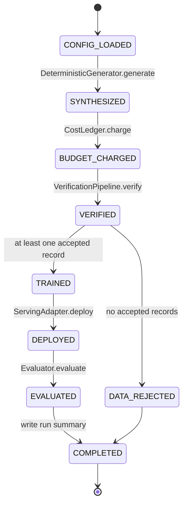
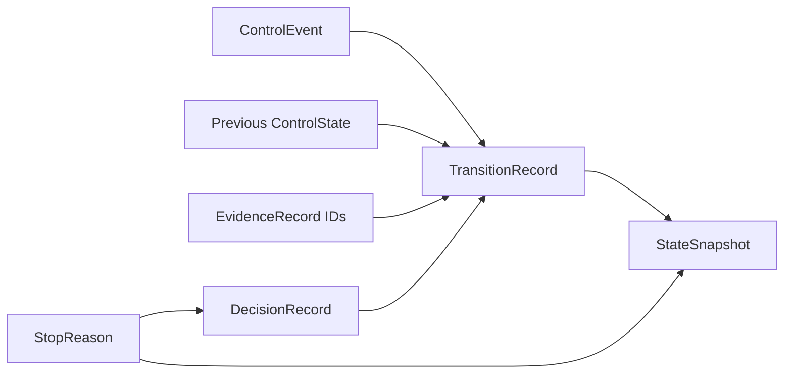
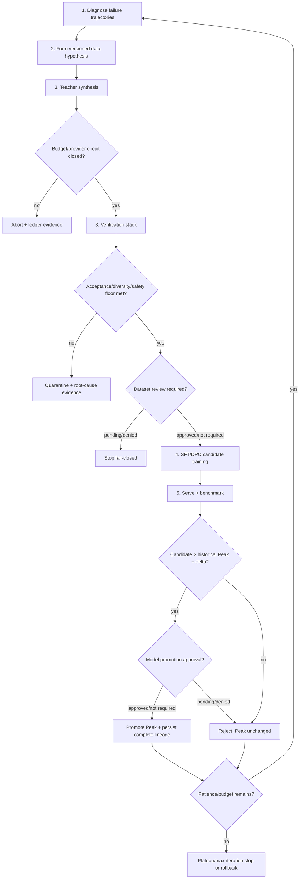
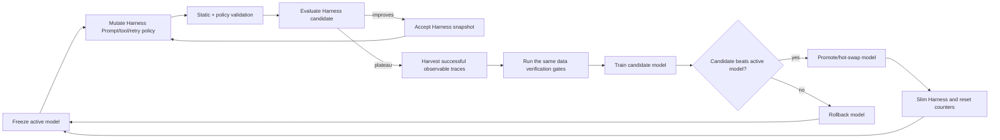
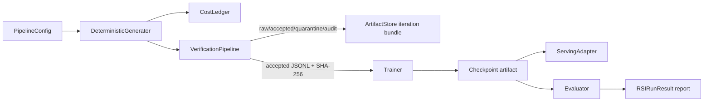
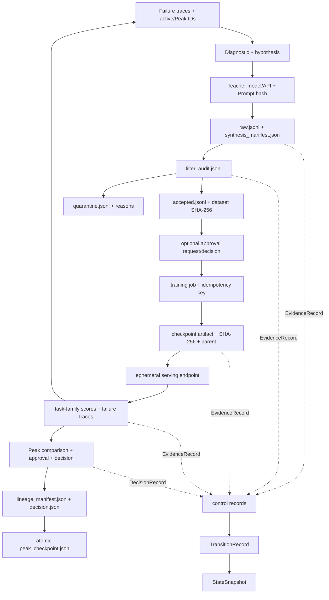

# Post-Training RSI Pipeline

> Evidence-first reference implementation for post-training data design, Recursive Self-Improvement (RSI), and Model/Harness Co-Evolution.

This repository converts the source PDF architecture into executable components and explicit integration contracts. It deliberately separates:

- **current executable truth** — what the checked-in CLI and tests can reach now;
- **contract-only components** — typed records, adapters, or stores that exist but are not selected or emitted by the runtime;
- **target architecture** — the full RSI and Co-Evolution state machines still being integrated.

Start with [`AGENTS.md`](AGENTS.md), then use the [documentation index](docs/README.md).

## Current integration truth

Runtime baseline: `feat/pdf-architecture` at `2fa9a8d9746ae5dccd5ff68d78b3a7d75e7c43be`, package version `0.2.0`. The latest CI run for that baseline is green.

Documentation and contract work is stacked with ordinary GitHub PRs:

```text
PR #1  docs/agent-state-machine-index
└── PR #2  feat/state-domain-contracts
```

PR #2 defines `post-training-rsi.control/v1`, but the supported runtime does not emit those records yet.

| Capability | Status | Current truth |
|---|---|---|
| Deterministic `demo` | Implemented | Executes one synthesis → verify → train → deploy → evaluate pass |
| Verification stack | Implemented | Exact/lexical/semantic/decontamination/safety/AST decisions are reachable |
| Versioned control-plane records | Contract only | States, events, stop reasons, evidence, decisions, snapshots, and transitions are typed and tested; `RSIEngine` does not emit them |
| Budget ledger | Partial | Generation cost is charged; all-stage accounting is not wired |
| External Teacher/trainer/evaluator/serving | Contract only | Protocols/adapters exist; CLI/config does not select them |
| Lineage store/schema | Partial | Iteration bundle is written; checkpoint manifest and Peak pointer are not wired by the engine |
| Recursive RSI | Partial | Config fields exist, but `RSIEngine.run()` performs one hard-coded iteration |
| Peak, rollback, plateau stopping | Planned | Candidate is currently marked promoted without historical comparison |
| `verify`, `audit`, `coevolve` CLI | Planned | Checked-in CLI registers only `demo` |
| Harness mutation/trace harvesting | Planned | `harness/` is currently a placeholder namespace |
| HITL Dataset/Model/Harness approval | Planned | Shared decision/evidence vocabulary exists; no approval store or operational command exists |
| Git Town stack | Not configured | No config, exact version pin, verified parent graph, worktree evidence, or active stack manifest |

The detailed evidence and gap IDs are in [`docs/implementation-status.md`](docs/implementation-status.md). Do not infer completion from the target diagrams or from enum values existing in the contract package.

## Quick start: supported path

```bash
python -m venv .venv
source .venv/bin/activate
python -m pip install -e '.[dev]'

post-training-rsi \
  --config configs/pipeline.example.json \
  --workspace artifacts/demo \
  demo
```

Contract-only control-plane tests:

```bash
python -m pytest tests/test_control_plane.py
```

Development gate:

```bash
make install
make lint
make typecheck
make test
make demo
```

`make coevolve` is a known red target at this baseline because the CLI does not expose `coevolve` yet.

## Current executable state machine



Current flow limitations:

- hypothesis is hard-coded;
- only iteration `1` runs;
- `min_acceptance_rate` is configured but not enforced by the engine;
- parent checkpoint is `None`;
- candidate score is assigned as Peak score without comparison;
- checkpoint manifest and `peak_checkpoint.json` are not written;
- endpoint is not passed into evaluation and is not torn down;
- outcomes use legacy/free-form result fields rather than schema-v1 control records.

## Versioned control-plane contract

PR #2 freezes a provider-neutral vocabulary before the path-disjoint runtime PRs begin:



The exact schema is `post-training-rsi.control/v1` and is implemented under `src/post_training_rsi/control_plane/`:

- `ControlState` covers current runtime states, target five-stage RSI states, and target outer/middle/inner Co-Evolution states;
- `ControlEvent` names facts that may request a transition;
- `StopReason` provides a finite terminal taxonomy;
- `DecisionAction`, `DecisionSubject`, and `EvidenceKind` prevent free-form cross-module semantics;
- `EvidenceRecord`, `DecisionRecord`, `StateSnapshot`, and `TransitionRecord` use exact fields and canonical JSON;
- unknown fields, unsupported schema versions, unsafe IDs, invalid timestamps/hashes/numbers, duplicate evidence IDs, and inconsistent terminal reasons fail closed.

The contract package does **not** decide legal adjacency, score thresholds, promotion, rollback, or persistence. Those responsibilities remain with the planned orchestration and lineage PRs. See [`docs/control-plane-contracts.md`](docs/control-plane-contracts.md).

## Target five-stage RSI state machine

The source architecture requires a closed loop:



The Peak is a stable historical pointer, not an alias for the latest candidate. A rejected candidate must never become the next parent.

## Target Model/Harness Co-Evolution state machine



The current repository does not yet implement this outer/middle/inner loop. Its state and event names are frozen only to prevent sibling PRs from inventing incompatible protocols.

## Directory → State Machine ownership

```text
post-training-rsi-pipeline/
├── AGENTS.md                         repository-wide Agent contract and read order
├── README.md                         current/target State Machines and top-level data flow
├── configs/                          BOOT policy inputs and threshold configuration
│   ├── pipeline.example.json
│   └── rsi_policy_rules.json
├── docs/
│   ├── README.md                     multi-hop documentation index
│   ├── implementation-status.md      exact branch truth and gap registry
│   ├── state-machine.md              transition/guard/evidence contracts
│   ├── control-plane-contracts.md    schema-v1 record and serialization contract
│   ├── traceability-index.md         requirement → code → test → artifact → PR
│   ├── stacked-pr-plan.md            molecular PR graph and Git Town admission
│   ├── architecture.md               target PDF architecture
│   └── productionization.md          real cloud/GPU/sandbox requirements
├── src/post_training_rsi/
│   ├── __main__.py                   BOOT / CLI dispatch; currently only `demo`
│   ├── config.py                     CONFIG_LOADED / CONFIG_REJECTED
│   ├── control_plane/                shared schema; Contract only at this branch
│   │   ├── enums.py                  State/Event/Stop/Action/Subject/Evidence taxonomy
│   │   ├── records.py                Evidence/Decision/Snapshot/Transition records
│   │   └── validation.py             exact fields and canonical JSON validation
│   ├── models.py                     current data/result payloads
│   ├── engine.py                     current transition coordinator
│   ├── generation.py                 current deterministic SYNTHESIZED fixture
│   ├── cost.py                       BUDGET_CHARGED / budget and provider circuits
│   ├── synthesis/                    target SYNTHESIZE provider boundary
│   │   ├── prompts.py                versioned Teacher Prompt construction
│   │   ├── runtime.py                Teacher protocol and SynthesisBatch
│   │   └── teacher.py                mock/OpenAI-compatible Teacher clients
│   ├── verification/                 VERIFIED / QUARANTINED
│   │   ├── lexical.py                entropy, Distinct-N, TTR
│   │   ├── semantic.py               novelty against accepted history
│   │   ├── decontamination.py        Benchmark N-gram/LCS separation
│   │   ├── safety.py                 safety/injection classification
│   │   ├── code.py                   Python AST static checks
│   │   └── pipeline.py               one decision per input record
│   ├── training/                     TRAINED
│   │   └── adapter.py                mock and external command contracts
│   ├── serving/                      DEPLOYED; target SERVE + TEARDOWN
│   │   └── adapter.py
│   ├── evaluation/                   EVALUATED + failure-trace evidence
│   │   └── adapter.py
│   ├── lineage/                      evidence persistence; target Peak transaction
│   │   ├── manifest.py
│   │   └── store.py
│   └── harness/                      target MUTATE_HARNESS / HARVEST_TRACES; placeholder
├── tests/                             deterministic transition and contract evidence
└── .github/workflows/ci.yml          no-network/no-GPU verification gate
```

### Ownership matrix

| Directory/module | State-machine responsibility | Input | Output | Forbidden responsibility |
|---|---|---|---|---|
| `config.py` | validate BOOT policy | JSON/defaults | immutable config | deciding promotion |
| `control_plane/` | shared versioned state/event/evidence language | typed values / strict mappings | canonical records | adjacency, thresholds, SDK calls, persistence side effects |
| `models.py` | current portable data/result payloads | typed values | serializable records | duplicate control taxonomies or external calls |
| `engine.py` | transition order and policy | config + protocols | outcomes/terminal reason | provider-specific SDK logic |
| `generation.py`, `synthesis/` | synthesis | hypothesis | examples + Teacher evidence | model promotion |
| `verification/` | data admission | examples + benchmark/history | accepted/quarantine/records | score-based model decisions |
| `training/` | candidate creation | exact accepted dataset/hash + parent | checkpoint + loss + artifact metadata | benchmark policy |
| `serving/` | endpoint lifecycle | checkpoint | readiness/endpoint/teardown | deciding whether model is better |
| `evaluation/` | benchmark evidence | checkpoint/endpoint/Harness | task scores + failures | updating Peak directly |
| `lineage/` | immutable persistence | all upstream evidence | manifests, pointers, audit lookup | quality policy |
| `harness/` | non-parametric search and trace harvest | failures/tasks/accepted Harness | candidate snapshots/training traces | direct model weight mutation |
| `tests/` | transition/contract proof | deterministic fixtures | assertions | network/API/GPU dependency |

## Data flow and evidence flow

### Current runnable data flow



The schema-v1 contract is currently tested beside this flow, not inserted into it.

### Target complete evidence graph



## Evidence bundle

Current iteration bundle:

```text
<workspace>/
├── iterations/iter-001/
│   ├── raw.jsonl
│   ├── accepted.jsonl
│   ├── quarantine.jsonl
│   ├── filter_audit.jsonl
│   ├── synthesis_manifest.json
│   └── dataset_summary.json
├── checkpoints/<checkpoint-id>/
│   └── weights.mock.json
└── reports/rsi-run-summary.json
```

Target integration additionally persists:

```text
control/evidence/<evidence-id>.json
control/decisions/<decision-id>.json
control/transitions/<transition-id>.json
control/snapshots/<snapshot-id>.json
checkpoints/<checkpoint-id>/checkpoint.json
checkpoints/<checkpoint-id>/lineage_manifest.json
iterations/iter-N/evaluation.json
iterations/iter-N/decision.json
approvals/pending/<request-id>.json
approvals/decisions/<request-id>.json
peak_checkpoint.json
reports/regression-audit-<checkpoint-id>.json
harness/<harness-version>.json
```

These control paths are target persistence paths; PR #2 does not write them.

## Verification order

The order is intentional and cheap checks run first:

1. exact content-hash duplicate;
2. Shannon entropy, Distinct-2, and Type-Token Ratio;
3. semantic novelty against accepted history;
4. Benchmark N-gram overlap and LCS ratio;
5. prompt/role injection and safety checks;
6. optional Python AST import/call allowlist.

Only accepted examples enter semantic history and the accepted-dataset hash.

## Control-plane invariants

- Latest is not Peak.
- No training record lacks a filter decision.
- Rejected candidates never become parents.
- Budget/retry/recursion/wall-time limits fail closed.
- Quarantine and rejection are durable, traceable states.
- Serving teardown occurs even when evaluation fails.
- Human approval is explicit and immutable when enabled.
- Shared cross-module semantics use `post-training-rsi.control/v1`, not free-form duplicate strings.
- Unknown fields and incompatible schema versions fail closed.
- Decisions and transitions reference durable evidence IDs.
- The deterministic CI path never requires network, API keys, GPUs, or production endpoints.
- Generated code is not executed in the core runtime.
- Git changes are never an implicit side effect of Harness optimization.

## Documentation and traceability index

| Need | Document |
|---|---|
| Agent operating contract | [`AGENTS.md`](AGENTS.md) |
| Exact current implementation and gaps | [`docs/implementation-status.md`](docs/implementation-status.md) |
| State guards, transitions, and evidence | [`docs/state-machine.md`](docs/state-machine.md) |
| Versioned control record schema | [`docs/control-plane-contracts.md`](docs/control-plane-contracts.md) |
| PDF requirement mapping | [`docs/traceability-index.md`](docs/traceability-index.md) |
| Molecular implementation/merge plan | [`docs/stacked-pr-plan.md`](docs/stacked-pr-plan.md) |
| Target architecture | [`docs/architecture.md`](docs/architecture.md) |
| Production controls | [`docs/productionization.md`](docs/productionization.md) |

## Git Town and molecular Stack PRs

Git Town is **not admitted** for this repository yet. There is no checked-in configuration, exact version pin, verified parent graph, isolated worktree evidence, dry-run/no-push rehearsal, or active stack manifest. Automation must fail closed rather than infer hierarchy from branch names.

The active ordinary GitHub stack is:

```text
feat/pdf-architecture
└── PR #1  docs/agent-state-machine-index            Draft
    └── PR #2  feat/state-domain-contracts           Draft
```

The complete proposed review graph is:

```text
feat/pdf-architecture
└── PR-01 docs/repository-contracts
    └── PR-02 feat/state-domain-contracts
        ├── PR-03 feat/rsi-loop-policy
        ├── PR-04 feat/lineage-runtime
        ├── PR-05 feat/adapter-runtime
        └── PR-06 feat/hitl-approval
             \__ PR-07 feat/rsi-convergence
                  ├── PR-08 feat/harness-outer-loop
                  └── PR-09 feat/trace-harvesting
                       \__ PR-10 feat/model-inner-loop
                            \__ PR-11 feat/coevolution-convergence
```

Shared interfaces are frozen in PR #2; path-disjoint work remains sibling PRs; PR-07 and PR-11 are explicit convergence PRs. Allowed paths, collision paths, required gates, merge order, and rebase owner are indexed in [`docs/stacked-pr-plan.md`](docs/stacked-pr-plan.md).

## External adapter boundary

Current protocols allow external Teacher, trainer, evaluator, and serving implementations, but the supported CLI does not select them yet. Production adapters must remain behind stable typed or environment/JSON contracts, translate outputs into schema-v1 evidence records, and must not leak provider SDK details into transition policy.

See [`docs/productionization.md`](docs/productionization.md) before enabling real inference, training, code execution, or endpoint mutation.
