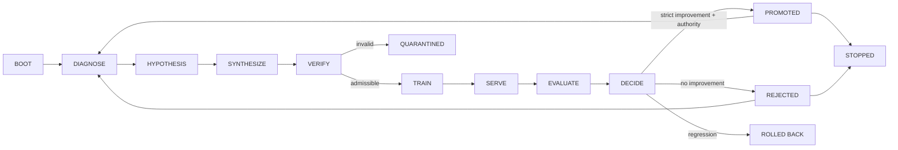

<!-- i18n-key: README; locale: en; reviewed: 2026-08-16 -->
[English](README.md) · [繁體中文](README.zh-TW.md)

# Post-Training RSI Pipeline

[](https://github.com/ed3c/post-training-rsi-pipeline/actions/workflows/ci.yml)
[](LICENSE)
[](pyproject.toml)

**An evidence-first reference pipeline for post-training data, Recursive Self-Improvement (RSI), and Model/Harness Co-Evolution.**

> **Maturity:** alpha reference implementation. The deterministic local path is supported. Real Teacher APIs, GPU training, external serving, production benchmarks, automatic release, and autonomous self-modification are not verified unless an exact run publishes the required evidence.

## Why this project exists

Post-training systems fail when generated data, training, deployment, evaluation, model promotion, Harness changes, and recovery are treated as one opaque loop. A score increase alone cannot prove that data was admissible, a candidate came from the declared parent, a benchmark was comparable, or a promoted artifact can be recovered.

This project makes those transitions explicit:

```text
diagnose
→ form a data hypothesis
→ synthesize candidate data
→ verify and optionally review the dataset
→ train a candidate
→ serve in a bounded adapter lifecycle
→ evaluate against declared benchmarks
→ approve, reject, roll back, or stop
→ persist lineage, decisions, checkpoints, and audit evidence
```

A separate Co-Evolution controller freezes one side while changing the other, captures observable traces, and preserves rollback and stop conditions.

## Core capabilities

| Area | What the repository provides |
|---|---|
| Data contracts | Typed datasets, source identity, verification results, budgets, and immutable control records |
| RSI controller | Resumable multi-iteration State Machine with promotion, rejection, rollback, plateau, and stop rules |
| Lineage | Atomic checkpoint bundles, transactions, parent/Peak continuity, quarantine, and compare-and-swap promotion |
| Human review | Content-addressed dataset/checkpoint requests and immutable approve/deny decisions |
| Provider boundary | Strict mock/command adapters, bounded execution, artifact recomputation, endpoint teardown, and fail-closed preflight |
| Co-Evolution | Frozen-model Harness search, trace harvesting, model inner loop, convergence rules, durable resume, and audit |
| Recovery | Read-only status, integrity audit, forensic bundle, and explicit recovery activation planning |
| Evidence | Exact hashes, run IDs, decisions, transactions, artifacts, pointers, and machine-readable architecture mapping |

The exact supported, component-only, planned, and externally unverified state is maintained in [`docs/implementation-status.md`](docs/implementation-status.md). Historical branches and Pull Requests are delivery records, not the current `main` contract.

## Architecture



Model/Harness Co-Evolution:

```text
FREEZE_MODEL
→ MUTATE_HARNESS
→ HARVEST_TRACES
→ TRAIN_MODEL
→ PROMOTE_MODEL or ROLLBACK_MODEL
→ SLIM_HARNESS
→ next bounded cycle or STOPPED
```

See [`docs/state-machine.md`](docs/state-machine.md), [`docs/rsi-convergence.md`](docs/rsi-convergence.md), and [`docs/coevolution-convergence.md`](docs/coevolution-convergence.md).

## Quick start

### Requirements

- Python 3.11+
- Git
- No cloud or GPU dependency for the deterministic reference path

```bash
git clone https://github.com/ed3c/post-training-rsi-pipeline.git
cd post-training-rsi-pipeline

python -m venv .venv
source .venv/bin/activate
python -m pip install -e '.[dev]'

make lint
make typecheck
make test
make demo
```

Run or resume the deterministic RSI controller:

```bash
post-training-rsi \
  --config configs/pipeline.example.json \
  --workspace artifacts/rsi \
  --run-id run-local-001 \
  rsi
```

Run the deterministic Co-Evolution reference:

```bash
make coevolve
```

### Supported CLI contract

The checked-in parser, implementation status, and owning design documents must remain synchronized for every supported command:

| Command | Responsibility |
|---|---|
| `demo` | One-iteration deterministic compatibility demonstration |
| `rsi` | Run or resume the converged RSI controller |
| `verify` | Verify a candidate Dataset with configured admission gates |
| `audit` | Audit a committed Checkpoint bundle and control transaction |
| `approvals` | List immutable approval requests and current states |
| `review` | Commit one immutable approval or denial decision |
| `provider-preflight` | Run fail-closed provider admission without contacting a provider |
| `coevolve` | Run or resume deterministic Model/Harness Co-Evolution |
| `coevolve-status` | Read the latest durable Co-Evolution status without mutation |
| `coevolve-audit` | Verify the durable Co-Evolution evidence graph |

Discover arguments with:

```bash
post-training-rsi --help
```

Optional extras exist for cloud adapters, semantic models, experiment tracking, LangGraph, and training libraries. Installing an extra does not prove that an external provider, GPU job, serving endpoint, or production benchmark is admitted.

## Evidence and promotion rules

The controller keeps these concepts separate:

```text
generated data
!= verified dataset
!= reviewed dataset
!= trained candidate
!= evaluated candidate
!= qualified candidate
!= approved promotion
!= active Peak
!= production release
```

Key invariants include:

```text
active_checkpoint_id == peak_checkpoint_id
candidate.parent_checkpoint_id == active_checkpoint_id
candidate_score > peak_score + min_improvement
```

Equality at the improvement boundary is rejection. Rejected or rolled-back candidates never become the next parent. Promotion requires a committed decision bound to the exact checkpoint, and worker-reported artifact hashes are recomputed by the controller.

## Provider and data boundary

Before any configured external destination is used, provider preflight checks adapter type, credential **names**, destination policy, command resolution, budgets, approvals, benchmark requirements, and an authorization receipt bound to the exact configuration and origin.

Do not send private training data, proprietary repository content, customer data, model weights, or credentials to a provider without explicit data-and-destination authorization.

## Repository map and State Machine ownership

```text
src/post_training_rsi/
├── control_plane/      states, events, Decisions, Evidence, and durable records
├── orchestration/      RSI and Co-Evolution controllers
│   ├── converged.py    supported multi-iteration RSI composition
│   ├── rsi_policy.py   promotion, rollback, plateau, budget, and stop rules
│   ├── run_state.py    durable run metadata and resume identity
│   └── coevolution.py  bounded Model/Harness Co-Evolution composition
├── adapter_runtime/    provider-neutral execution and lifecycle contracts
├── approval/           immutable HITL requests, sampling, policy, and decisions
├── verification/       Dataset admission and quarantine gates
├── training/           model-training boundary and artifact contracts
├── serving/            deployment lease and teardown boundary
├── evaluation/         benchmark and score evidence
├── lineage/            transactions, checkpoints, Peak CAS, and quarantine
├── harness/            Harness mutation, traces, persistence, and inner loops
├── audit/              read-only status and integrity evidence
├── preflight/          provider/destination/credential admission
└── recovery_bundle/    inactive forensic export and staged-restore evidence

configs/                deterministic policy examples
docs/                   architecture, status, contracts, recovery, and traceability
tests/                  transition, tamper, failure, expiry, and resume coverage
artifacts/              generated local workspaces; never source truth
```

The exact implementation modules are `orchestration/converged.py`, `orchestration/rsi_policy.py`, `orchestration/run_state.py`, and `orchestration/coevolution.py`.

**Git Town is not configured** in this repository. The stacked Pull Request graph is documented in [`docs/stacked-pr-plan.md`](docs/stacked-pr-plan.md), but Git Town commands and metadata remain disabled until repository-owned configuration is explicitly admitted and verified.

## Documentation

- [Documentation index](docs/README.md)
- [Implementation status](docs/implementation-status.md)
- [Architecture](docs/architecture.md)
- [State Machine](docs/state-machine.md)
- [RSI convergence](docs/rsi-convergence.md)
- [Harness outer loop](docs/harness-outer-loop.md)
- [Model inner loop](docs/model-inner-loop.md)
- [Co-Evolution convergence](docs/coevolution-convergence.md)
- [HITL approval](docs/hitl-approval.md)
- [Provider preflight](docs/provider-preflight.md)
- [Recovery and audit](docs/coevolution-audit-recovery.md)
- [Documentation language policy](docs/I18N.md)
- [Open-source readiness checklist](docs/OPEN_SOURCE_CHECKLIST.md)

## Non-goals

This repository does not claim:

- that recursive improvement will continue, converge, or outperform a baseline;
- that synthetic data is correct merely because it was generated;
- that a local or mock run represents a real cloud/GPU run;
- that an automated score authorizes model promotion, release, or deployment;
- that external provider terms, privacy, security, or legal requirements are satisfied automatically.

## Contributing, security, and governance

Read [CONTRIBUTING.md](CONTRIBUTING.md) before changing state, lineage, provider, or evidence semantics. Report vulnerabilities through [SECURITY.md](SECURITY.md). Support and authority boundaries are documented in [SUPPORT.md](SUPPORT.md) and [GOVERNANCE.md](GOVERNANCE.md).

## License

Licensed under the [MIT License](LICENSE). Third-party models, datasets, provider services, and dependencies remain subject to their own terms.
