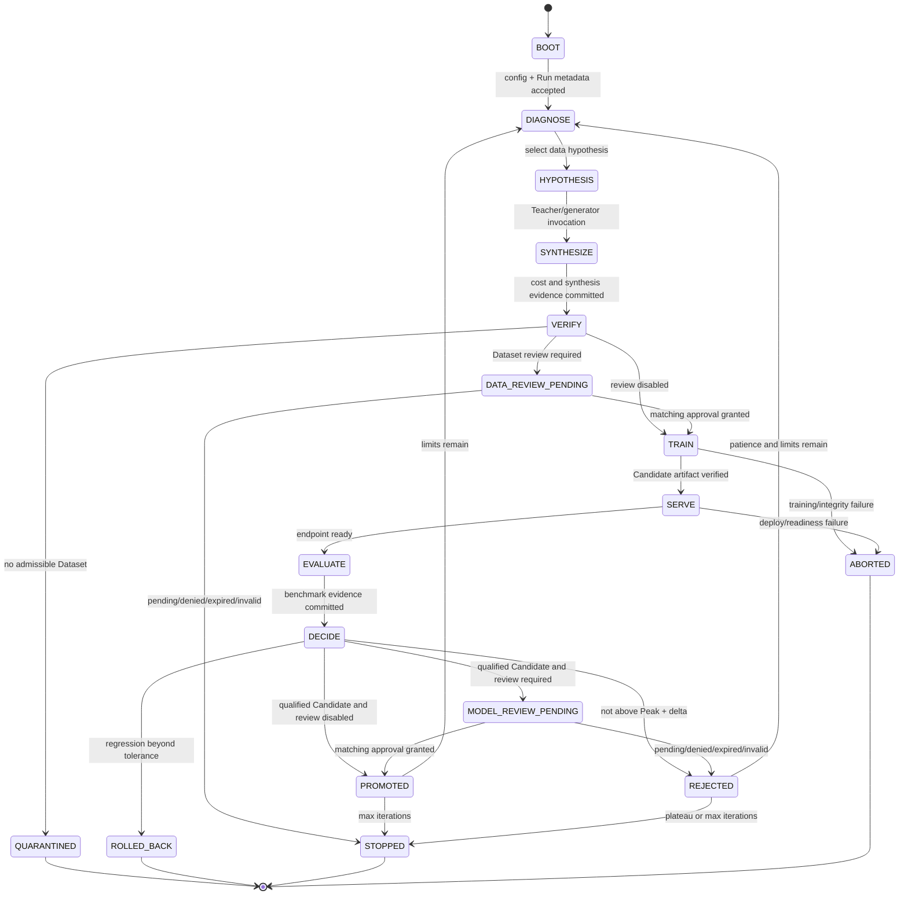
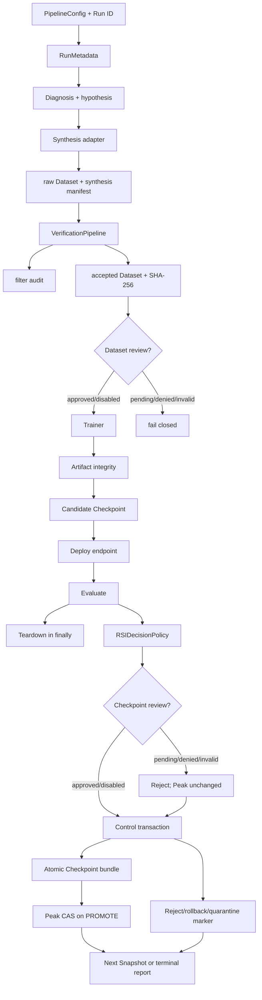

# Post-Training RSI Pipeline

> Evidence-first reference implementation for post-training data design, Recursive Self-Improvement (RSI), and Model/Harness Co-Evolution.

This repository turns the source architecture into executable components, typed control records, immutable evidence, and molecular Pull Requests. It separates three kinds of truth:

- **supported on the current branch** — reachable from a checked-in CLI command and covered by deterministic tests;
- **implemented component** — coded and tested, but not reachable from the supported composition root;
- **target architecture** — planned behavior that still requires an implementation PR and evidence.

Read [`AGENTS.md`](AGENTS.md) before changing code. The document index is in [`docs/README.md`](docs/README.md).

## PR #12 current branch overlay

Current branch: `feat/coevolution-audit-recovery`
Current Draft PR: [#12](https://github.com/ed3c/post-training-rsi-pipeline/pull/12)

The machine-readable source of current directory, State Machine, artifact, command, and PR ownership is [`docs/architecture-manifest.json`](docs/architecture-manifest.json). Where an older PR #7 paragraph below describes Co-Evolution as planned, this PR #12 overlay is the current branch truth.

Supported deterministic local commands on this branch:

```text
`demo`
`rsi`
`verify`
`audit`
`approvals`
`review`
`coevolve`
`coevolve-status`
`coevolve-audit`
```

Co-Evolution composition and audit ownership:

```text
src/post_training_rsi/orchestration/coevolution.py
  FREEZE_MODEL → MUTATE_HARNESS → HARVEST_TRACES
  → TRAIN_MODEL → PROMOTE_MODEL / ROLLBACK_MODEL
  → SLIM_HARNESS → next cycle or STOPPED

src/post_training_rsi/audit/
  durable Run/transaction/pointer/artifact graph
  → read-only status
  → PASS / WARN / FAIL integrity report
  → no automatic repair or pointer mutation
```

Ordinary GitHub successor chain:

```text
PR #7  Durable recursive RSI
└── PR #8   Harness outer loop
    └── PR #9   Observable Trace harvesting
        └── PR #10  Model inner loop
            └── PR #11  Co-Evolution convergence
                └── PR #12  Read-only audit and recovery boundary
```

Git Town is not configured. The graph is documentation, not executable Git Town metadata.

## Current integration truth

Current integration branch: `feat/rsi-convergence`  
Draft integration PR: [#7 — converge RSI runtime contracts](https://github.com/ed3c/post-training-rsi-pipeline/pull/7)  
Validated code head before the latest documentation commits: `ac334be8411f45196d2522c885ff893cb2d44fda`  
Package version: `0.2.0`

PR #7 now composes the State-domain contracts, RSI decision policy, transactional lineage runtime, strict adapters, and immutable HITL approvals into a resumable RSI controller. The branch is not yet merged to `main`.

| Capability | Status on PR #7 | Current truth |
|---|---|---|
| One-pass `demo` | Supported | Dependency-free synthesis → verify → train → deploy → evaluate compatibility path |
| Multi-iteration `rsi` | Supported | Runs or resumes the evidence-first RSI controller with Peak/reject/rollback/stop policy |
| Dataset `verify` | Supported | Writes the standard data bundle and exact accepted-Dataset SHA-256 |
| Checkpoint `audit` | Supported | Reloads and verifies the Checkpoint bundle, transaction, lineage, and Peak relation |
| `approvals` / `review` | Supported | Lists content-addressed requests and commits immutable approve/deny Decisions |
| Control records | Supported | `post-training-rsi.control/v1` records are emitted and transactionally persisted |
| Transactional lineage | Supported | Immutable records, atomic Checkpoint bundles, Peak CAS, and quarantine markers |
| Adapter runtime | Supported by composition | Strict mock/command selection, bounded execution, artifact verification, endpoint teardown |
| HITL Dataset/Checkpoint review | Supported when configured | Missing, pending, denied, expired, unauthorized, or mismatched review fails closed |
| Historical Peak | Supported | Promotion requires strict score improvement and a committed promotion Decision |
| Model/Harness Co-Evolution | Not yet supported | Harness components may exist, but no `coevolve` CLI or converged outer/middle/inner loop |
| Real cloud/GPU execution | Not verified | No claim of real Teacher API, TRL/DeepSpeed job, live serving, or production benchmark run |
| Git Town stack | Not configured | Ordinary GitHub parent/child and sibling PRs only; Git Town remains fail closed |

Detailed status, gaps, and evidence are indexed in [`docs/implementation-status.md`](docs/implementation-status.md) and [`docs/traceability-index.md`](docs/traceability-index.md).

## Quick start

```bash
python -m venv .venv
source .venv/bin/activate
python -m pip install -e '.[dev]'
```

Compatibility demonstration:

```bash
post-training-rsi \
  --config configs/pipeline.example.json \
  --workspace artifacts/demo \
  demo
```

Run or resume the recursive controller:

```bash
post-training-rsi \
  --config configs/pipeline.example.json \
  --workspace artifacts/rsi \
  --run-id run-local-001 \
  rsi
```

Verify a JSONL Dataset:

```bash
post-training-rsi \
  --config configs/pipeline.example.json \
  --workspace artifacts/verify \
  verify \
  --input examples.jsonl \
  --iteration 1
```

Audit a committed Checkpoint:

```bash
post-training-rsi \
  --workspace artifacts/rsi \
  audit \
  --checkpoint-id <checkpoint-id>
```

List and review HITL requests:

```bash
post-training-rsi \
  --config configs/pipeline.example.json \
  --workspace artifacts/rsi \
  approvals

post-training-rsi \
  --config configs/pipeline.example.json \
  --workspace artifacts/rsi \
  review \
  --request-id <request-id> \
  --expected-request-sha256 <sha256> \
  --approve \
  --reviewer reviewer-001 \
  --role release-manager \
  --reason "Evidence and sample reviewed."
```

Development gate:

```bash
make install
make lint
make typecheck
make test
make demo
```

`make coevolve` remains intentionally red until a supported Co-Evolution command lands.

## 1. Supported RSI State Machine



The exact transition guards, durable records, and resume behavior are documented in [`docs/rsi-convergence.md`](docs/rsi-convergence.md) and [`docs/state-machine.md`](docs/state-machine.md).

## 2. State and lineage invariants

```text
active_checkpoint_id == peak_checkpoint_id
candidate.parent_checkpoint_id == active_checkpoint_id
candidate_score > peak_score + min_improvement
```

The following are non-negotiable:

- Equality at the improvement boundary is rejection.
- Rejected or rolled-back Candidates never become the next parent.
- A valid final-iteration improvement is recorded before the max-iteration stop.
- Exact budget limits are allowed; crossing a limit aborts.
- Peak mutation requires a committed `PROMOTE` Decision for the same Checkpoint.
- Peak mutation is compare-and-swap against the expected previous Peak.
- Peak iteration cannot move backward and Peak score must increase strictly.
- Approval is bound to Subject type, Subject ID, and Subject SHA-256.
- Missing or invalid approval is not approval.
- Worker-reported artifact hashes are recomputed by the controller.
- Serving teardown runs in `finally`.
- Cross-Run and future-evidence references fail closed.
- Process memory is not resume truth; durable state is.

## 3. Directory → State Machine ownership

```text
post-training-rsi-pipeline/
├── AGENTS.md                              repository-wide Agent contract
├── README.md                              current State Machines, data flow, PR index
├── configs/
│   ├── pipeline.example.json              BOOT policy and provider defaults
│   └── rsi_policy_rules.json              explicit policy reference values
├── docs/
│   ├── README.md                          multi-hop document index
│   ├── implementation-status.md           exact branch truth and gap registry
│   ├── state-machine.md                   states, guards, events, evidence
│   ├── rsi-convergence.md                 supported controller and resume flow
│   ├── control-plane-contracts.md         `post-training-rsi.control/v1`
│   ├── rsi-loop-policy.md                 strict Candidate decision boundary
│   ├── adapter-runtime.md                 provider/process/lifecycle contract
│   ├── lineage-runtime.md                 transaction, bundle, Peak, quarantine
│   ├── hitl-approval.md                   immutable review authority
│   ├── traceability-index.md              requirement → code → test → artifact → PR
│   ├── stacked-pr-plan.md                 actual and proposed molecular PR graph
│   ├── architecture.md                    target source architecture
│   └── productionization.md               real infrastructure requirements
├── src/post_training_rsi/
│   ├── __main__.py                        CLI dispatch: demo/rsi/verify/audit/approvals/review
│   ├── config.py                          CONFIG_LOADED / CONFIG_REJECTED
│   ├── control_plane/
│   │   ├── enums.py                       State/Event/Stop/Action/Subject/Evidence taxonomy
│   │   ├── records.py                     Evidence/Decision/Transition/Snapshot records
│   │   └── validation.py                  exact schema and canonical JSON
│   ├── orchestration/
│   │   ├── converged.py                   supported multi-stage RSI composition
│   │   ├── rsi_policy.py                  EVALUATE → promote/reject/rollback/stop
│   │   └── run_state.py                   Run identity, deterministic clock, resume metadata
│   ├── adapter_runtime/                   bounded provider execution and evidence translation
│   ├── approval/                          Dataset/Checkpoint/Harness authority boundary
│   ├── synthesis/                         SYNTHESIZE provider boundary
│   ├── verification/                      VERIFY / QUARANTINED data admission
│   ├── training/                          TRAIN Candidate creation
│   ├── serving/                           SERVE endpoint lifecycle
│   ├── evaluation/                        EVALUATE benchmark/failure evidence
│   ├── lineage/                           immutable persistence, bundle, Peak CAS, audit
│   ├── cost.py                            stage cost and circuit accounting
│   ├── models.py                          legacy/current portable payloads
│   ├── engine.py                          one-pass compatibility `demo`
│   └── harness/                           future Co-Evolution components; not CLI-converged
├── tests/                                 deterministic, no-network/no-GPU evidence
└── .github/workflows/ci.yml               compile, lint, type, tests, CLI smoke
```

### Ownership matrix

| Directory/module | State responsibility | Input | Output/evidence | Must not own |
|---|---|---|---|---|
| `config.py` | BOOT validation | JSON/defaults | immutable `PipelineConfig` | transition decisions |
| `control_plane/` | common representation | typed values / exact mappings | canonical records | adjacency, thresholds, SDK calls, persistence |
| `orchestration/rsi_policy.py` | Candidate decision | EVALUATE Snapshot + observation | Decision/Transition/Snapshot | provider or filesystem internals |
| `orchestration/converged.py` | supported sequencing | config, protocols, durable state | resumable Run result | weakening child-component guards |
| `orchestration/run_state.py` | Run identity/resume | Run ID + config hash | immutable Run metadata | quality decisions |
| `adapter_runtime/` | provider boundary | typed invocation | validated result + evidence | Peak or approval decisions |
| `approval/` | human authority | exact Subject + sample/evidence | immutable request/decision | authentication implementation or score policy |
| `verification/` | data admission | examples + history/benchmark | accepted/quarantine/audit | model-quality decisions |
| `training/` | Candidate creation | exact Dataset/hash + parent | Checkpoint + loss/artifact metadata | benchmark policy |
| `serving/` | endpoint lifecycle | Checkpoint | endpoint/readiness/teardown | promotion policy |
| `evaluation/` | benchmark facts | endpoint/Checkpoint/Harness | scores + failure traces | updating Peak directly |
| `lineage/` | immutable persistence | control records and artifacts | transactions, bundles, pointers, markers | deciding whether score is good |
| `cost.py` | budget facts | stage charges | ledger/circuit evidence | quality policy |
| `harness/` | future non-parametric search | failures/tasks/Harness | snapshots/traces | model weight updates |
| `tests/` | deterministic proof | fixtures | assertions and coverage | network/API/GPU dependency |

## 4. Runtime data and evidence flow



The transaction marker is written last. A record file without a committed transaction is an orphan, not evidence.

## 5. Artifact and evidence layout

```text
<workspace>/
├── run/
│   └── run-metadata.json
├── iterations/iter-001/
│   ├── raw.jsonl
│   ├── accepted.jsonl
│   ├── quarantine.jsonl
│   ├── filter_audit.jsonl
│   ├── synthesis_manifest.json
│   └── dataset_summary.json
├── control/
│   ├── evidence/<evidence-id>.json
│   ├── decisions/<decision-id>.json
│   ├── transitions/<transition-id>.json
│   ├── snapshots/<snapshot-id>.json
│   └── transactions/<transaction-id>.json
├── checkpoints/<checkpoint-id>/
│   ├── checkpoint.json
│   ├── lineage_manifest.json
│   └── bundle_manifest.json
├── peak_checkpoint.json
├── peak_history/iter-<N>-<checkpoint-id>.json
├── quarantine/iter-<N>-<subject-type>-<subject-id>.json
├── approvals/
│   ├── samples/
│   ├── requests/
│   └── decisions/
├── adapter-runtime/<adapter>/<idempotency-hash>/
│   ├── request.json
│   ├── response.json
│   ├── output/
│   └── commit.json
└── reports/
    ├── rsi-run-summary.json
    └── regression-audit-<checkpoint-id>.json
```

## 6. Pull Request traceability

Actual ordinary GitHub graph:

```text
PR #1  docs/agent-state-machine-index
└── PR #2  feat/state-domain-contracts
    ├── PR #3  feat/rsi-loop-policy
    ├── PR #4  feat/lineage-runtime
    ├── PR #5  feat/adapter-runtime
    └── PR #6  feat/hitl-approval
         \__ PR #7  feat/rsi-convergence
```

PR #7 is based on PR #3 and contains the sibling implementations through an explicit convergence merge. It is the only owner allowed to synchronize root runtime documentation for the integrated branch.

Proposed successor graph:

```text
PR #7  RSI convergence
├── PR #8  Harness outer-loop mutation and evaluation
├── PR #9  successful-trace harvesting and verification
└── PR #10 model inner-loop training and hot-swap
     \__ PR #11 Co-Evolution convergence and CLI
```

See [`docs/stacked-pr-plan.md`](docs/stacked-pr-plan.md) for allowed paths, dependencies, collision ownership, merge order, rollback subjects, and required gates.

## 7. Git Town status

Git Town is not active for this repository. Do not run `git town propose`, `git town sync`, or `git town ship` until all admission evidence exists:

```text
exact Git Town version pin
repository configuration
verified parent graph
linked-worktree ownership/leases
non-interactive dry run
no-push rehearsal evidence
active stack.tsv
human approval to mutate refs
```

Until then, the PR graph in this README is documentation, not executable Git Town metadata.

## 8. Validation evidence

The repair-and-validation workflow for code head `ac334be8411f45196d2522c885ff893cb2d44fda` passed:

```text
compileall
Ruff
mypy
full pytest with coverage floor
compatibility demo smoke
converged RSI smoke
Checkpoint audit smoke
```

The PR-triggered CI run created by the repair bot required workflow approval and started no jobs. The PR stays Draft until the exact current documentation head receives a normal green check set.

## 9. Remaining gaps

No claim is made that PR #7 has validated:

- real inference-cloud Teacher credentials, quotas, retries, or cost;
- real TRL/DeepSpeed SFT or DPO on a GPU provider;
- live vLLM/SGLang deployment and teardown;
- Inspect AI or lm-eval task suites against a live endpoint;
- DVC, lakeFS, MLflow, or remote object-store transactions;
- distributed locks, multi-region writers, retention, backup, or disaster recovery;
- enterprise identity provider, MFA, reviewer quorum, or separation of duties;
- production secret manager, sandbox, network egress, or policy enforcement;
- complete Model/Harness Co-Evolution.

These are explicit successor requirements, not hidden implementation details.

<!-- PR13_FORENSIC_RECOVERY_INDEX_START -->
## Forensic recovery successor — Draft PR #13

The read-only Co-Evolution audit boundary is followed by a content-addressed, local-only recovery slice:

```text
PR #12  read-only Co-Evolution audit and recovery diagnosis
└── PR #13  deterministic forensic bundle + inactive staged restore
```

PR #13 owns only:

```text
local workspace scan
  → content-addressed blobs
  → canonical recovery manifest
  → exact bundle verification
  → reconstruction into a new directory
  → exact staged-copy verification
  → STAGED_INACTIVE
```

It has no `ACTIVATE` transition and never overwrites the live workspace. See [`docs/forensic-recovery-bundle.md`](docs/forensic-recovery-bundle.md) and the machine-readable [`docs/forensic-recovery-manifest.json`](docs/forensic-recovery-manifest.json).
<!-- PR13_FORENSIC_RECOVERY_INDEX_END -->
