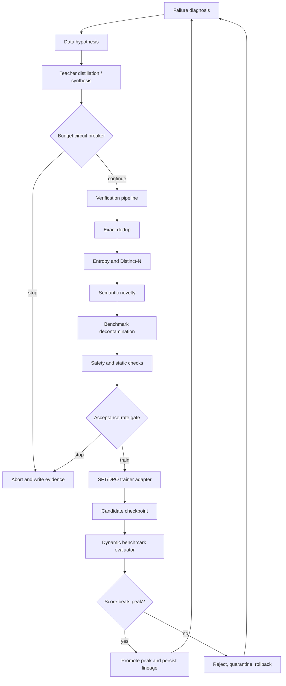
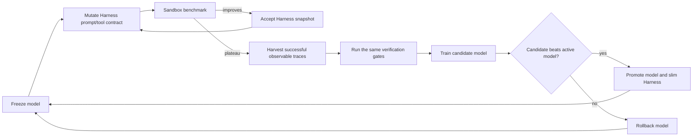

# Post-Training RSI Pipeline

A runnable reference implementation of an evidence-first post-training system that combines:

- synthetic-data generation and teacher distillation;
- deterministic verification, diversity defense, benchmark decontamination, and safety gates;
- SFT/DPO training adapters with peak-checkpoint promotion and rollback;
- recursive self-improvement (RSI) with budget and low-diversity circuit breakers;
- model/Harness co-evolution through an outer prompt/tool loop, trace harvesting, and an inner model-training loop;
- end-to-end lineage from teacher prompt and dataset hash to checkpoint and benchmark score.

The default runtime is dependency-free and uses deterministic mock adapters, so the architecture can be executed in CI without API keys or GPUs. Production systems replace the teacher, trainer, evaluator, semantic index, and serving adapters without changing the control contracts.

## Architecture



The co-evolution controller adds a second optimization loop:



## Quick start

```bash
python -m venv .venv
source .venv/bin/activate
pip install -e '.[dev]'

post-training-rsi \
  --config configs/pipeline.example.json \
  --workspace artifacts/demo \
  demo
```

Run model/Harness co-evolution:

```bash
post-training-rsi \
  --config configs/pipeline.example.json \
  --workspace artifacts/co-evolution \
  coevolve
```

Trace a regressed checkpoint back to its dataset, teacher, prompt, and filter configuration:

```bash
post-training-rsi \
  --workspace artifacts/demo \
  audit \
  --checkpoint-id ckpt-rsi-iter-004-xxxxxxxx \
  --score-drop 0.12
```

## Execution modes

| Capability | Default runtime | Production replacement |
|---|---|---|
| Teacher synthesis | `MockTeacherClient` | OpenAI-compatible endpoint or provider Batch API adapter |
| Semantic diversity | token Jaccard index | Sentence-Transformers/FAISS adapter |
| Training | deterministic checkpoint materialization | `CommandTrainer` invoking TRL/DeepSpeed or a managed GPU job |
| Evaluation | deterministic Agent benchmark | `CommandEvaluator` invoking Inspect AI, lm-eval, or an internal sandbox |
| Serving | local artifact URI | command adapter invoking vLLM/SGLang/managed serving |
| Lineage | immutable JSON/JSONL artifacts | DVC/lakeFS plus optional MLflow tags and artifacts |
| Orchestration | typed dependency-free controllers | optional LangGraph five-stage adapter |

The mock runtime validates state transitions, filters, budget enforcement, lineage, promotion, rollback, and co-evolution. It does **not** perform real gradient updates or launch GPU infrastructure.

## Repository structure

```text
post-training-rsi-pipeline/
├── configs/                         # RSI, diversity, decontamination, co-evolution, ZeRO-3
├── docs/                            # Architecture and adapter contracts
├── scripts/                         # Demo and external-command contract stubs
├── src/post_training_rsi/
│   ├── synthesis/                   # Teacher clients and prompt versioning
│   ├── verification/                # Diversity, decontamination, safety, static gates
│   ├── training/                    # Mock and external trainer adapters
│   ├── evaluation/                  # Deterministic and external benchmark adapters
│   ├── orchestration/               # RSI and co-evolution state machines
│   ├── harness/                     # Trace-driven mutation and trajectory harvesting
│   ├── lineage/                     # Manifests, artifact store, regression audit
│   └── serving/                     # Local and command-based deployment adapters
├── tests/                           # Unit and end-to-end contract tests
└── .github/workflows/ci.yml
```

## Evidence produced per iteration

Every trial writes an auditable bundle under the workspace:

```text
artifacts/demo/
├── iterations/iter-001/
│   ├── raw.jsonl
│   ├── accepted.jsonl
│   ├── quarantine.jsonl
│   ├── filter_audit.jsonl
│   ├── dataset_summary.json
│   └── synthesis_manifest.json
├── checkpoints/<checkpoint-id>/
│   ├── checkpoint.json
│   ├── lineage_manifest.json
│   └── weights.mock.json
├── harness/<harness-version>.json
├── peak_checkpoint.json
└── reports/
```

A lineage manifest binds the checkpoint to the accepted dataset hash, teacher API version, teacher-prompt hash, filter configuration hash, parent checkpoint, final loss, benchmark score, and source-code commit.

## External adapter contracts

The orchestration layer deliberately calls provider-neutral adapters. An external training process receives `RSI_DATASET_PATH`, `RSI_DATASET_HASH`, `RSI_MODEL_ID`, `RSI_PARENT_CHECKPOINT_ID`, and `RSI_OUTPUT_DIR`, then writes `RSI_TRAIN_RESULT_PATH`. The evaluator and serving adapters use comparable environment contracts. See [docs/integration-contracts.md](docs/integration-contracts.md).

## Safety boundaries

The local guardrail catches test fixtures and obvious prompt/role injection; it is not a complete content-safety system. Generated code is only checked statically by the core runtime. Production execution requires an isolated sandbox, restricted network/filesystem access, secret redaction, provider quotas, and human review for high-impact changes.

## Development

```bash
make test
make lint
make demo
make coevolve
```

See [docs/architecture.md](docs/architecture.md) for state transitions and [docs/productionization.md](docs/productionization.md) for the remaining work before real GPU/cloud deployment.
