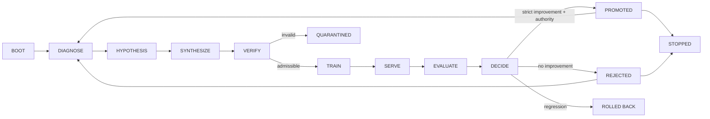

<!-- i18n-key: README; locale: zh-TW; reviewed: 2026-08-15 -->
[English](README.md) · [繁體中文](README.zh-TW.md)

# Post-Training RSI Pipeline

[](https://github.com/ed3c/post-training-rsi-pipeline/actions/workflows/ci.yml)
[](LICENSE)
[](pyproject.toml)

**用於 Post-training data、Recursive Self-Improvement（RSI）與 Model/Harness Co-Evolution 的 Evidence-first reference pipeline。**

> **成熟度：** Alpha reference implementation。支援 Deterministic local path。除非精確 Run 發布必要 Evidence，本 Repository 不會把 Real Teacher API、GPU training、External serving、Production benchmark、Automatic release 或 Autonomous self-modification 描述為已驗證。

## 為什麼需要這個專案

Post-training system 若把 Generated data、Training、Deployment、Evaluation、Model promotion、Harness change 與 Recovery 混成不透明迴圈，通常難以判斷真正失敗位置。單一 Score increase 無法證明 Data admissible、Candidate 來自宣告 Parent、Benchmark 可比較，或 Promoted artifact 可復原。

本專案明確化各個 Transition：

```text
diagnose
→ form a data hypothesis
→ synthesize candidate data
→ verify and optionally review the dataset
→ train a candidate
→ serve in a bounded adapter lifecycle
→ evaluate against declared benchmarks
→ approve, reject, roll back, or stop
→ persist lineage, decisions, checkpoints, and audit evidence
```

另一個 Co-Evolution controller 會在修改一側時凍結另一側，捕捉 Observable trace，並保留 Rollback 與 Stop condition。

## 核心能力

| Area | Repository 提供內容 |
|---|---|
| Data contracts | Typed dataset、Source identity、Verification result、Budget 與 Immutable control record |
| RSI controller | 可 Resume 的 Multi-iteration State Machine，具 Promotion、Rejection、Rollback、Plateau 與 Stop rule |
| Lineage | Atomic checkpoint bundle、Transaction、Parent／Peak continuity、Quarantine 與 Compare-and-swap promotion |
| Human review | Content-addressed Dataset／Checkpoint request 與 Immutable approve／deny decision |
| Provider boundary | Strict mock／command adapter、Bounded execution、Artifact recomputation、Endpoint teardown 與 Fail-closed preflight |
| Co-Evolution | Frozen-model Harness search、Trace harvesting、Model inner loop、Convergence rule、Durable resume 與 Audit |
| Recovery | Read-only status、Integrity audit、Forensic bundle 與 Explicit recovery activation planning |
| Evidence | Exact hash、Run ID、Decision、Transaction、Artifact、Pointer 與 Machine-readable architecture mapping |

精確的 Supported、Component-only、Planned 與 Externally unverified 狀態維護於 [`docs/implementation-status.md`](docs/implementation-status.md)。歷史 Branch 或 Pull Request overlay 是 Delivery record，不是目前 `main` contract。

## 架構



Model/Harness Co-Evolution：

```text
FREEZE_MODEL
→ MUTATE_HARNESS
→ HARVEST_TRACES
→ TRAIN_MODEL
→ PROMOTE_MODEL or ROLLBACK_MODEL
→ SLIM_HARNESS
→ next bounded cycle or STOPPED
```

詳細內容見 [`docs/state-machine.md`](docs/state-machine.md)、[`docs/rsi-convergence.md`](docs/rsi-convergence.md) 與 [`docs/coevolution-convergence.md`](docs/coevolution-convergence.md)。

## Quick start

### Requirements

- Python 3.11+
- Git
- Deterministic reference path 不需要 Cloud 或 GPU dependency

```bash
git clone https://github.com/ed3c/post-training-rsi-pipeline.git
cd post-training-rsi-pipeline

python -m venv .venv
source .venv/bin/activate
python -m pip install -e '.[dev]'

make lint
make typecheck
make test
make demo
```

執行或 Resume Deterministic RSI controller：

```bash
post-training-rsi   --config configs/pipeline.example.json   --workspace artifacts/rsi   --run-id run-local-001   rsi
```

執行 Deterministic Co-Evolution reference：

```bash
make coevolve
```

查看 Command surface：

```bash
post-training-rsi --help
```

可選 Extras 包含 Cloud adapter、Semantic model、Experiment tracking、LangGraph 與 Training libraries。安裝 Extra 不代表 External provider、GPU job、Serving endpoint 或 Production benchmark 已被核准。

## Evidence 與 Promotion rules

Controller 分離以下概念：

```text
generated data
!= verified dataset
!= reviewed dataset
!= trained candidate
!= evaluated candidate
!= qualified candidate
!= approved promotion
!= active Peak
!= production release
```

關鍵 Invariants：

```text
active_checkpoint_id == peak_checkpoint_id
candidate.parent_checkpoint_id == active_checkpoint_id
candidate_score > peak_score + min_improvement
```

Improvement boundary 相等時必須 Reject。Rejected 或 Rolled-back candidate 不會成為下一個 Parent。Promotion 必須有綁定 Exact checkpoint 的 Committed decision，且 Controller 會重新計算 Worker 回報的 Artifact hash。

## Provider 與 Data boundary

使用任何 External destination 前，Provider preflight 會檢查 Adapter type、Credential **name**、Destination policy、Command resolution、Budget、Approval、Benchmark requirement，以及綁定 Exact configuration 與 Origin 的 Authorization receipt。

沒有明確 Data-and-destination authorization 時，不得把 Private training data、Proprietary repository content、Customer data、Model weight 或 Credential 傳送到 Provider。

## Repository map

```text
src/post_training_rsi/
├── orchestration/     RSI and Co-Evolution controllers
├── control/           typed State and decision records
├── lineage/           transactions, checkpoints, Peak and recovery
├── adapters/          synthesis, training, serving and evaluation boundaries
├── approvals/         immutable HITL authority
└── audit/             read-only status and integrity evidence

configs/               deterministic policy examples
docs/                  architecture, status, contracts, recovery and traceability
tests/                 transition, tamper, failure and resume coverage
artifacts/             generated local workspaces; not source truth
```

## 文件

- [文件索引](docs/README.zh-TW.md)
- [Implementation status](docs/implementation-status.md)
- [Architecture](docs/architecture.md)
- [State Machine](docs/state-machine.md)
- [RSI convergence](docs/rsi-convergence.md)
- [Harness outer loop](docs/harness-outer-loop.md)
- [Model inner loop](docs/model-inner-loop.md)
- [Co-Evolution convergence](docs/coevolution-convergence.md)
- [HITL approval](docs/hitl-approval.md)
- [Provider preflight](docs/provider-preflight.md)
- [Recovery and audit](docs/coevolution-audit-recovery.md)
- [文件語言政策](docs/I18N.zh-TW.md)
- [Open-source readiness checklist](docs/OPEN_SOURCE_CHECKLIST.zh-TW.md)

## Non-goals

本 Repository 不宣稱：

- Recursive improvement 必然持續、收斂或優於 Baseline；
- Synthetic data 只因被生成就代表正確；
- Local 或 Mock run 可以代表 Real cloud／GPU run；
- Automated score 可以授權 Model promotion、Release 或 Deployment；
- External provider terms、Privacy、Security 或 Legal requirement 會自動滿足。

## 參與、安全與治理

修改 State、Lineage、Provider 或 Evidence semantics 前，先閱讀 [CONTRIBUTING.zh-TW.md](CONTRIBUTING.zh-TW.md)。漏洞透過 [SECURITY.zh-TW.md](SECURITY.zh-TW.md) 回報。Support 與 Authority boundary 見 [SUPPORT.zh-TW.md](SUPPORT.zh-TW.md) 與 [GOVERNANCE.zh-TW.md](GOVERNANCE.zh-TW.md)。

## License

本專案使用 [MIT License](LICENSE)。Third-party model、Dataset、Provider service 與 Dependency 仍受各自條款約束。
