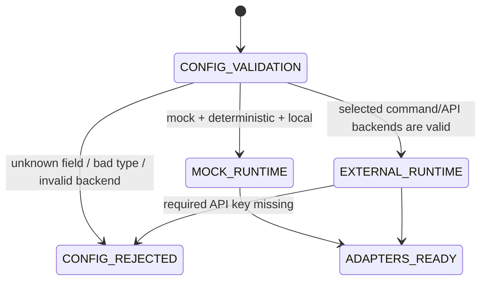
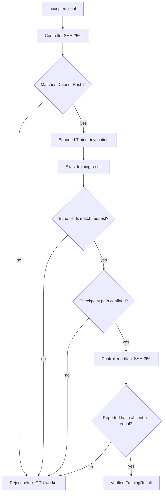
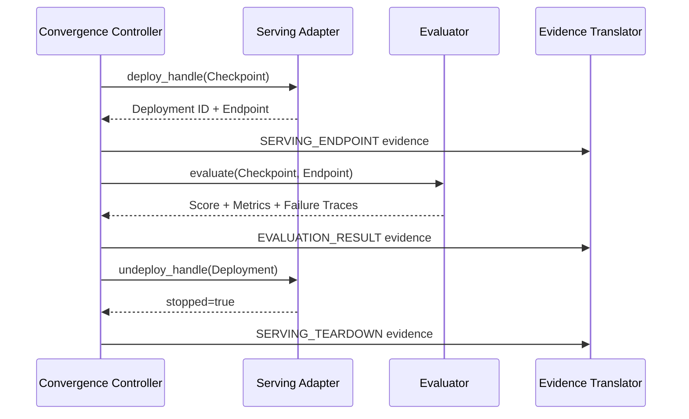
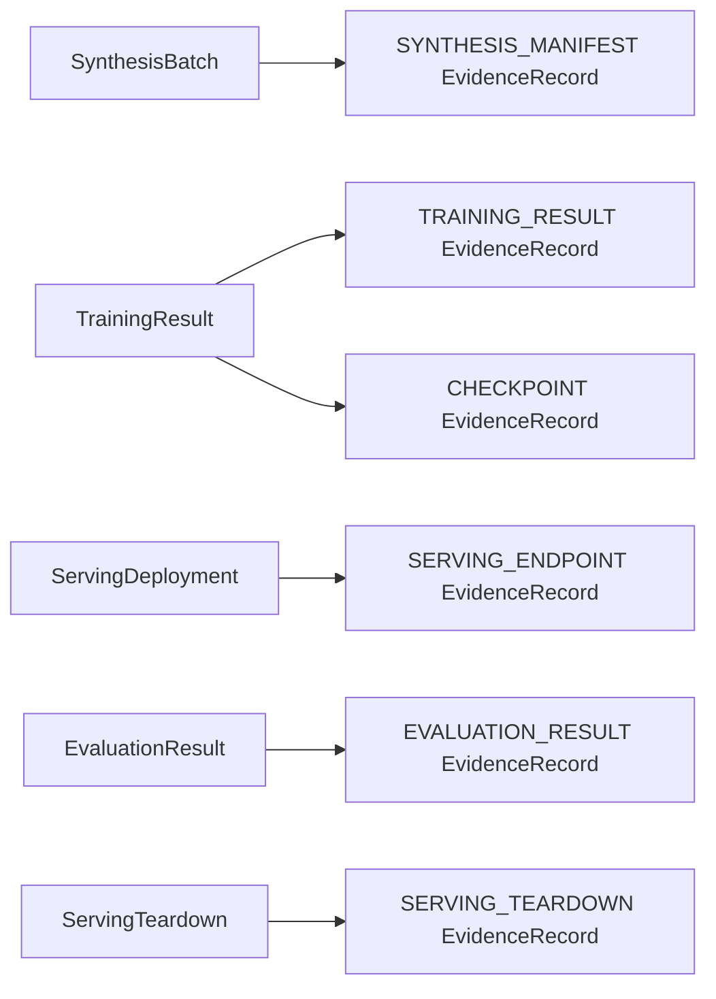

# Adapter runtime — PR #5 integration boundary

## Status

**Implemented component / not yet reachable from the supported CLI.**

This document describes the `feat/adapter-runtime` sibling PR stacked directly on PR #2. It implements strict adapter selection, bounded provider/process execution, artifact integrity, serving lifecycle, and adapter-to-control-evidence translation. It does not modify `RSIEngine`, register a new CLI command, compare Candidate scores, persist Peak state, or grant human approval.

The source architecture requires a hybrid-cloud boundary:

```text
Teacher inference API
  -> verified Dataset
  -> on-demand GPU training
  -> Candidate Checkpoint
  -> ephemeral serving endpoint
  -> dynamic Benchmark
  -> teardown
```

PR #5 turns those external boundaries into deterministic contracts while keeping the default no-network/no-GPU runtime intact.

## Directory and ownership map

```text
src/post_training_rsi/
├── config.py
│   └── strict adapter backend, command, retry, timeout, and score configuration
├── adapter_runtime/
│   ├── AGENTS.md          scoped modification and evidence rules
│   ├── command.py         bounded no-shell command execution and result envelope
│   ├── errors.py          explicit configuration/execution/result/integrity/lifecycle errors
│   ├── evidence.py        adapter result -> post-training-rsi.control/v1 EvidenceRecord
│   ├── factory.py         validated config -> Teacher/Trainer/Evaluator/Serving runtime
│   ├── integrity.py       canonical hash, Dataset/Checkpoint path and byte verification
│   └── lifecycle.py       deploy -> evaluate(endpoint) -> teardown composition
├── synthesis/
│   ├── runtime.py         provider-neutral SynthesisBatch and TeacherClient
│   └── teacher.py         mock and OpenAI-compatible Teacher adapters
├── training/adapter.py    mock and strict external CommandTrainer
├── evaluation/adapter.py  deterministic and strict external CommandEvaluator
└── serving/adapter.py     local and strict deploy/undeploy CommandServingAdapter

tests/
├── test_adapters.py       strict external command happy path and legacy boundary checks
├── test_adapter_runtime.py
│   └── selection, retries, stale results, integrity, endpoint, teardown, evidence
└── test_config.py         exact adapter configuration and fail-closed parsing
```

### Forbidden responsibility

| Owner | Must not decide |
|---|---|
| `config.py` | runtime transition adjacency or model quality |
| `adapter_runtime/` | promotion, rollback, plateau, approval, or Peak persistence |
| `synthesis/` | whether generated records enter training |
| `training/` | whether a Candidate is better than Peak |
| `evaluation/` | direct Peak mutation |
| `serving/` | model promotion or deployment permanence |

PR #3 owns quality policy, PR #4 owns persistence, PR #6 owns approval, and PR #7 owns convergence.

## Adapter selection state



Supported selections:

| Stage | Default | External selection |
|---|---|---|
| Teacher | `mock` | `openai_compatible` |
| Training | `mock` | `command` |
| Evaluation | `deterministic` | `command` |
| Serving | `local` | `command` with deploy **and** undeploy commands |

Unknown fields, string booleans, shell command strings, unsupported backends, incomplete serving lifecycle commands, and mismatched Teacher model IDs fail closed.

## External command result envelope

External trainer, evaluator, deployer, and undeployer results use:

```text
post-training-rsi.adapter/v1
```

Every result file includes:

```json
{
  "schema_version": "post-training-rsi.adapter/v1",
  "result_type": "<stage-specific-type>",
  "idempotency_key": "<controller-computed-key>",
  "...": "stage-specific exact fields"
}
```

The controller:

1. removes a stale result file before every attempt;
2. invokes an argument array directly, never a shell command;
3. applies a finite timeout and finite attempt count;
4. preserves one semantic idempotency key across retries;
5. rejects missing, oversized, malformed, non-object, unknown-field, wrong-schema, wrong-type, and wrong-key results;
6. does not copy subprocess output into evidence by default.

### Training result contract

```text
checkpoint_id
checkpoint_path
model_id
parent_checkpoint_id
dataset_hash
iteration
final_loss
artifact_sha256
metadata
```

The worker must echo Model, Parent, Dataset Hash, and Iteration. The controller recomputes the artifact hash and rejects mismatches.

### Evaluation result contract

```text
checkpoint_id
benchmark_id
iteration
endpoint
score
metrics
failure_traces
estimated_cost_usd
metadata
```

Scores and metrics must be finite. Score bounds are configured and enforced. The returned endpoint must equal the endpoint supplied by the serving stage.

### Serving lifecycle contracts

Deploy result:

```text
checkpoint_id
deployment_id
endpoint
ready
metadata
```

Undeploy result:

```text
checkpoint_id
deployment_id
endpoint
stopped
metadata
```

Command serving is invalid unless both deploy and undeploy commands are configured.

## Data and integrity flow



Integrity rules:

- Dataset and Checkpoint symlinks are rejected.
- Dataset SHA-256 covers the exact bytes handed to the trainer.
- Relative Checkpoint paths resolve under the configured output root.
- External paths require an explicit reviewed opt-in.
- Directory hashes include relative paths and file-byte hashes in deterministic order.
- Empty directories have a deterministic digest.
- Worker-reported artifact hashes are advisory until they match the controller-computed digest.

## Serving/evaluation lifecycle



Teardown is attempted after both successful and failed evaluation. If evaluation and teardown both fail, `AdapterLifecycleError` preserves both stage failures rather than hiding one.

## Teacher inference boundary

The OpenAI-compatible Teacher adapter:

- constructs a versioned Teacher Prompt and SHA-256;
- sends one idempotency key per requested example;
- retries only explicitly retriable transport failures;
- uses the same key across retries;
- requires one structured JSON object with exact fields:
  `prompt`, `response`, `code`, `metadata`;
- records provider request IDs, token usage, API version, Prompt Hash, and estimated cost;
- never writes the API key or Authorization header into manifests or control evidence.

The transport is injectable, so deterministic tests do not access a network.

## Adapter-to-control evidence flow



Evidence uses `post-training-rsi.control/v1`. Metadata contains identifiers, counts, scores, hashes, request IDs, and failure codes. Credentials, full hidden Benchmark bodies, and model weights are excluded.

PR #4 will persist these records. PR #7 will compose their IDs into State Snapshots, Decisions, Transitions, and complete Checkpoint lineage.

## Deterministic verification matrix

```text
config:
  default selection
  exact round trip
  unknown top-level/nested fields
  command string rejection
  string boolean rejection
  missing serving teardown command
  missing Teacher URL or secret

Teacher:
  structured response
  retriable transport failure
  stable idempotency key
  token/cost accounting
  secret exclusion

command boundary:
  stale result deletion
  bounded non-zero retry
  exact schema/type/key/fields

training:
  Dataset Hash mismatch
  output path escape
  artifact hash mismatch
  controller-computed artifact hash

serving/evaluation:
  endpoint handoff
  teardown after success
  teardown after evaluation failure
  combined evaluation + teardown failure
  schema-v1 evidence translation
```

## Remaining convergence work

PR #5 does **not** make external adapters reachable from the supported `demo` command. PR #7 must still:

1. replace the current hard-coded dependency construction with `build_adapter_runtime`;
2. connect Teacher synthesis to verification and cost accounting;
3. persist translated evidence through PR #4;
4. connect PR #3 Candidate policy and PR #6 approvals;
5. emit complete State/Decision/Transition records;
6. register and smoke-test supported operational commands;
7. update root README, implementation status, state-machine, traceability, and active PR index from one convergence owner.

Git Town remains unconfigured and fail closed. This PR is an ordinary GitHub sibling of PR #3 and PR #4 from the verified PR #2 parent.
