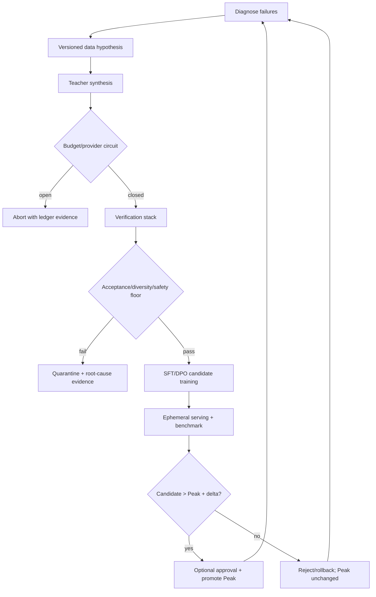
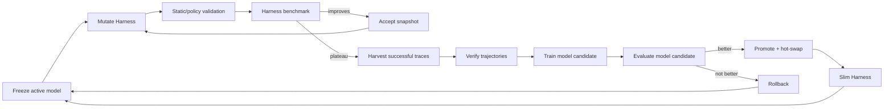

# Target architecture derived from the source PDF

> This document describes the intended architecture. Reachability and completion status live in [`implementation-status.md`](implementation-status.md). Transition details live in [`state-machine.md`](state-machine.md).

## Five-stage RSI loop

1. **Diagnose** the active/peak checkpoint using benchmark failure trajectories.
2. **Form a data hypothesis** that targets a measurable capability gap.
3. **Synthesize and verify** versioned Teacher data through diversity, decontamination, safety, and deterministic correctness gates.
4. **Train** a candidate through a provider-neutral SFT/DPO adapter.
5. **Evaluate and decide** whether to promote, reject, quarantine, roll back, or stop.

The historical Peak must remain separate from the latest candidate. This directly addresses the source PDF's warning that continued search after a peak frequently ends below the historical best.



## Verification order

Cheap deterministic checks run first:

1. exact content-hash duplicate;
2. Shannon entropy, Distinct-2, Type-Token Ratio, and loop signals;
3. semantic novelty against accepted history;
4. Benchmark N-gram overlap and LCS separation;
5. prompt/role injection and safety classification;
6. optional Python AST import/call allowlist;
7. optional domain-specific deterministic verifier or sandbox result.

Only accepted records are added to semantic history and the immutable accepted-dataset hash.

## Model/Harness Co-Evolution

The target system uses three connected loops:

- **Outer loop — Harness optimization:** freeze model weights; mutate Prompt, tool contracts, retry/context policy; validate and benchmark candidates; keep only improved Harness snapshots.
- **Middle loop — trajectory harvesting:** on Harness plateau, collect successful observable traces and run them through the same data gates.
- **Inner loop — model optimization:** train and evaluate a candidate model from verified traces; promote only if it beats the active model; otherwise roll back.

A promoted model triggers Harness slimming and restarts the outer loop.



## Evidence and lineage

Every promotion decision should be reconstructible from:

```text
Teacher model/API + Teacher prompt hash + hypothesis
                             |
                             v
raw records -> per-record filter decisions -> accepted dataset bytes/hash
                                                  |
                                                  v
parent checkpoint -> training job -> candidate artifact hash
                                                  |
                                                  v
serving endpoint -> benchmark/task-family scores/failure traces
                                                  |
                                                  v
peak comparison + approval + decision + stop counters
```

The local manifest is the control-plane source of truth. DVC/lakeFS and MLflow are mirrors, not hidden decision makers.

## Control-plane invariants

- The latest checkpoint is not automatically the Peak.
- A rejected candidate never becomes a future parent.
- Every training record has one explicit admission decision.
- Every terminal path writes a reason, ledger snapshot, and relevant lineage.
- Adapter retries and recursive loops are bounded.
- Generated code is never executed inside the core runtime.
- External serving is always torn down after evaluation.
- Dataset, Model, and Harness approvals fail closed when enabled.
- Git mutation is not part of the default Harness optimizer; accepted snapshots are artifacts first, reviewed Git changes second.
