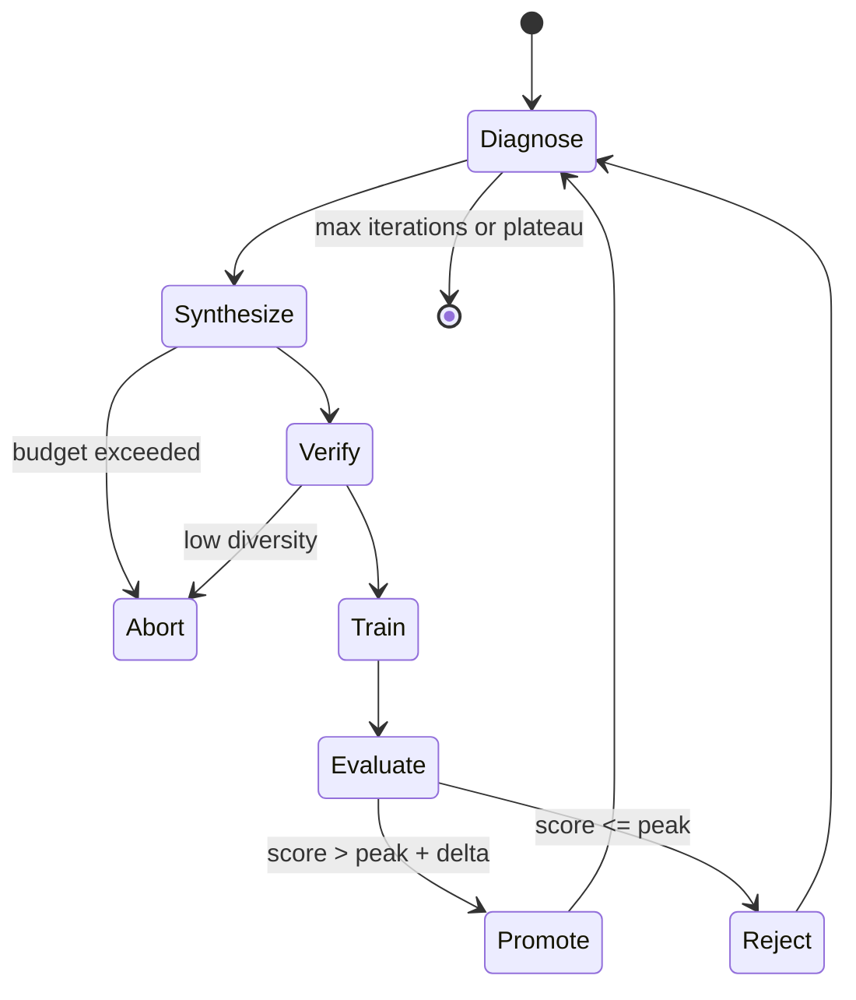

# Architecture

## Five-stage RSI loop

1. **Diagnose** the active checkpoint from benchmark failure traces.
2. **Synthesize** targeted examples with a versioned teacher prompt.
3. **Verify** exact uniqueness, lexical diversity, semantic novelty, benchmark separation, safety, and optional Python static checks.
4. **Train** a candidate checkpoint through a provider-neutral trainer adapter.
5. **Evaluate and decide** whether to promote the candidate, keep the historical peak, quarantine a regressed dataset, or stop.

Every state transition emits JSON/JSONL evidence. The controller never treats the latest checkpoint as the best checkpoint automatically.



## Data verification order

The order is intentional:

1. exact duplicate rejection;
2. Shannon entropy and Distinct-2/TTR checks;
3. semantic novelty against accepted history;
4. benchmark N-gram overlap and LCS checks;
5. prompt/role injection checks;
6. optional Python static allowlist checks.

Only accepted examples are appended to semantic history and included in the dataset hash.

## Model/Harness co-evolution

The controller freezes the model while searching Harness candidates. When Harness improvement plateaus, it harvests successful observable traces, runs them through the same verification gates, and trains a candidate model. The model is promoted only when it beats the active model under the accepted Harness. A promoted model causes the Harness prompt to be slimmed and the outer loop to restart.

## Lineage graph

```text
teacher API version
       +
teacher prompt hash
       |
       v
raw examples -> filter audit -> accepted dataset hash -> candidate checkpoint
                                                      |
                                                      v
                                          benchmark score + decision
                                                      |
                           +--------------------------+------------------+
                           |                                             |
                         PEAK                                    REJECTED/QUARANTINED
```

A checkpoint manifest records its parent checkpoint, dataset hash, teacher API version, teacher-prompt hash, filter-policy hash, training loss, benchmark score, code commit, and promotion state.

## Control-plane invariants

- API cost cannot exceed the per-trial or total run limit.
- Data cannot enter training without a deterministic filter decision.
- A candidate cannot replace the active checkpoint unless it beats the peak by `min_delta`.
- A rejected candidate never becomes the parent of the next trial.
- Regressed datasets are marked `DIRTY` and remain traceable.
- Harness mutation is candidate-based; rejected Harness versions do not replace the accepted snapshot.
- The default runtime does not mutate Git or launch infrastructure implicitly.
