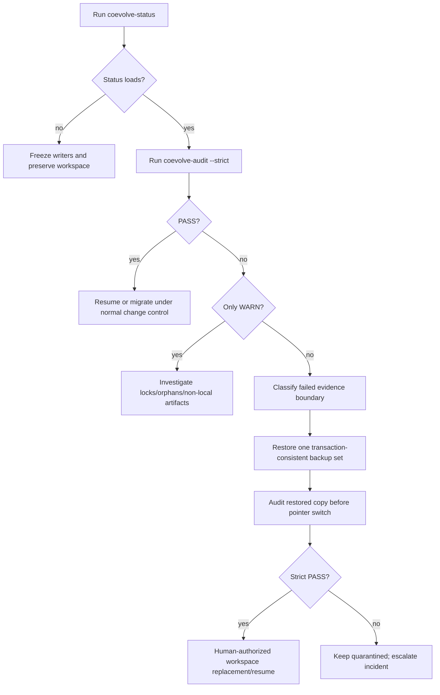

# Co-Evolution audit and human recovery playbook

Status: **Implemented read-only component on PR #12; no automatic recovery**

Branch: `feat/coevolution-audit-recovery`  
Parent: `feat/coevolution-convergence` / PR #11

This slice adds read-only status and integrity verification for the durable local Model/Harness Co-Evolution evidence graph. It may write one explicit report, but it never edits pointers, manifests, transactions, approvals, Datasets, artifacts, locks, or accepted state.

## 1. Commands

```bash
post-training-rsi \
  --workspace artifacts/coevolution \
  coevolve-status
```

```bash
post-training-rsi \
  --workspace artifacts/coevolution \
  coevolve-audit
```

Strict mode converts any warning into a failing overall result:

```bash
post-training-rsi \
  --workspace artifacts/coevolution \
  coevolve-audit \
  --strict
```

Optional identity assertions:

```bash
post-training-rsi \
  --workspace artifacts/coevolution \
  coevolve-audit \
  --expect-run-id reference-coevolution \
  --expect-config-sha256 <64-lowercase-hex>
```

## 2. Exit codes

```text
0  PASS
0  WARN in non-strict mode
2  FAIL
2  WARN promoted to FAIL by --strict
```

The lightweight status command returns `2` when it cannot safely link Run metadata, the latest transaction, and the latest StateSnapshot.

## 3. Schemas

```text
post-training-rsi.coevolution-status/v1
post-training-rsi.coevolution-audit/v1
```

The audit report is written to:

```text
<workspace>/reports/coevolution-audit.json
```

No other path may be created, updated, deleted, renamed, or repaired by the auditor.

## 4. Status view

The status command links:

```text
coevolution/run.json
  → immutable Run revision
  → latest control transaction
  → latest StateSnapshot
```

It returns:

```text
Run ID
runtime status and State
revision
current and completed cycles
active model Checkpoint and score
active Harness and score
latest Snapshot and transaction
cumulative cost
pending approval Request and Subject
```

Status is not a full integrity audit. Use `coevolve-audit` before recovery, release, migration, or incident closure.

## 5. Audit checks

### 5.1 Run and control graph

```text
workspace exists
Run pointer == immutable revision bytes
expected Run/config identity when supplied
latest transaction exists and verifies
latest Snapshot is committed by that transaction
Run pointer fields == latest Snapshot fields
all transaction manifests verify every referenced record hash
uncommitted control record files are inventoried
```

Orphan immutable records are `WARN`, not deleted. They may be evidence from an interrupted writer.

### 5.2 Peak and Checkpoint graph

```text
Peak pointer exists
Peak Run/Checkpoint/score == Run active model fields
Peak PROMOTE Decision is committed
Checkpoint bundle metadata and LineageManifest verify
bundle hash == Peak pointer hash
local artifact bytes == bundle SHA-256
all discovered Checkpoint bundles verify
```

A non-local artifact URI is `WARN` unless a configured verifier can read the bytes. Metadata-only verification is not represented as full artifact verification.

### 5.3 Harness graph

```text
active Harness pointer exists
Harness Run/ID/score == Run active Harness fields
committed ACCEPT Decision targets the exact Harness
snapshot manifest and exact Harness content hash verify
all discovered Harness snapshots verify
```

### 5.4 Trace Dataset graph

Each bundle must contain:

```text
raw.jsonl
accepted.jsonl
quarantine.jsonl
filter_audit.jsonl
harvest_manifest.json
dataset_summary.json
```

The auditor verifies JSONL object rows, declared counts when present, and the exact accepted JSONL SHA-256 against manifest/summary declarations.

A failed Trace Dataset bundle must be quarantined as a whole. Never repair selected rows and continue training under the original Dataset ID.

### 5.5 Approval graph

```text
Sample and Request integrity
Decision integrity when present
Decision.request_sha256 == exact Request bytes
Run pending Request ID/SHA-256 == stored immutable Request
unresolved Requests not referenced by the Run pointer are inventoried
```

A Decision may already exist while the Run pointer still reports a pending approval. That is valid resumable evidence: the controller has not consumed the Decision yet.

### 5.6 Quarantine and locks

```text
quarantine marker == committed REJECT/ROLLBACK/QUARANTINE Decision
marker Run/iteration/Subject/reason/evidence all agree
retained *.lock files are inventoried
```

A lock is always `WARN`. The auditor never removes it and never infers staleness from modification time alone.

## 6. Status semantics

```text
PASS  required identities, transactions, and hashes agree
WARN  incomplete verification or human investigation needed; no proven conflict
FAIL  required evidence is missing, malformed, substituted, or hash-invalid
```

Examples:

| Condition | Result |
|---|---|
| Clean completed local reference workspace | `PASS` |
| Non-local artifact bytes cannot be read | `WARN` |
| Orphan immutable record | `WARN` |
| Retained lock | `WARN` |
| Missing Trace Dataset bundle before Trace stage | `WARN` |
| Run pointer/history mismatch | `FAIL` |
| Control record hash tamper | `FAIL` |
| Peak/Harness pointer mismatch | `FAIL` |
| Local artifact SHA mismatch | `FAIL` |
| Approval Request/Decision hash mismatch | `FAIL` |
| Trace Dataset missing file/count/hash mismatch | `FAIL` |

## 7. Human recovery decision tree



## 8. Recovery rules by failure class

### Run pointer or revision mismatch

Restore together:

```text
coevolution/run.json
matching coevolution/history/revision-<N>.json
referenced latest transaction
referenced latest Snapshot
```

Do not decrement/increment `revision`, change `config_sha256`, or point to an uncommitted Snapshot manually.

### Control transaction or record tamper

Restore the transaction marker and every referenced record from the same backup generation. A transaction marker written last is the commit point. Do not rewrite a hash in the marker to match corrupted bytes.

### Peak or Checkpoint failure

Restore together:

```text
peak_checkpoint.json
matching peak_history entry
PROMOTE Decision transaction
Checkpoint bundle directory
model artifact bytes
```

Never select “the newest” Checkpoint by filename or iteration. The accepted Peak is the verified pointer, not the latest artifact.

### Harness pointer or snapshot failure

Restore together:

```text
active_harness.json
matching Harness history entry
ACCEPT Decision transaction
Harness snapshot directory
```

Do not regenerate a Harness ID from edited content and reuse the old pointer.

### Trace Dataset failure

Quarantine the full Dataset bundle and every training Candidate derived from its original SHA-256. Restore an exact immutable bundle or create a new Dataset identity and rerun approval/training.

### Approval failure

Restore exact immutable Sample, Request, and Decision bytes. A reconstructed or modified Request needs a new review; it cannot inherit authority from the old Request ID or reviewer Decision.

### Retained lock

Human steps:

1. identify the expected writer and storage lease;
2. confirm no active process, job, or network filesystem lease owns the lock;
3. preserve a copy of the lock and relevant logs;
4. run the strict audit on a copy;
5. remove the lock only under an explicit incident/change record;
6. rerun the strict audit before resume.

Timestamp age alone is not proof of staleness.

## 9. Backup and restore unit

A recoverable backup must preserve one consistent generation of:

```text
coevolution/
control/
checkpoints/
peak_checkpoint.json
peak_history/
harness/snapshots/
harness/history/
active_harness.json
trace-datasets/
model-artifacts/
model-candidates/
approvals/
quarantine/
reports/
```

A partial copy can produce valid individual JSON files with an invalid cross-object graph.

Recommended procedure:

```text
pause writers
snapshot the full workspace atomically
copy to an isolated restore location
run coevolve-audit --strict on the copy
verify expected Run/config identity
verify application-level benchmark/change records
human-authorize pointer switch or resume
retain the failed workspace for forensics
```

## 10. Test matrix

```text
clean completed workspace PASS
status fields match durable Run/Snapshot
report is the only written file
Run revision tamper FAIL
control record tamper FAIL
Peak artifact tamper FAIL
Harness content tamper FAIL
Trace Dataset missing file/hash mismatch FAIL
approval Request tamper FAIL
orphan record WARN
retained lock WARN and remains present
strict WARN exit 2
fixed-clock deterministic report
missing workspace FAIL without creation
CLI JSON and exit-code behavior
parent demo/rsi/coevolve compatibility
```

## 11. Explicit non-claims

A local `PASS` proves only internal consistency of the inspected local evidence graph at audit time. It does not prove:

- real provider correctness;
- real SFT/DPO gradient correctness;
- model or Harness quality;
- production benchmark validity;
- absence of benchmark overfitting;
- production Trace privacy or representativeness;
- enterprise authentication, RBAC, MFA, or reviewer quorum;
- distributed lock/storage correctness;
- backup restorability until a drill succeeds;
- DVC/lakeFS/MLflow integration;
- Git Town configuration;
- production readiness.
