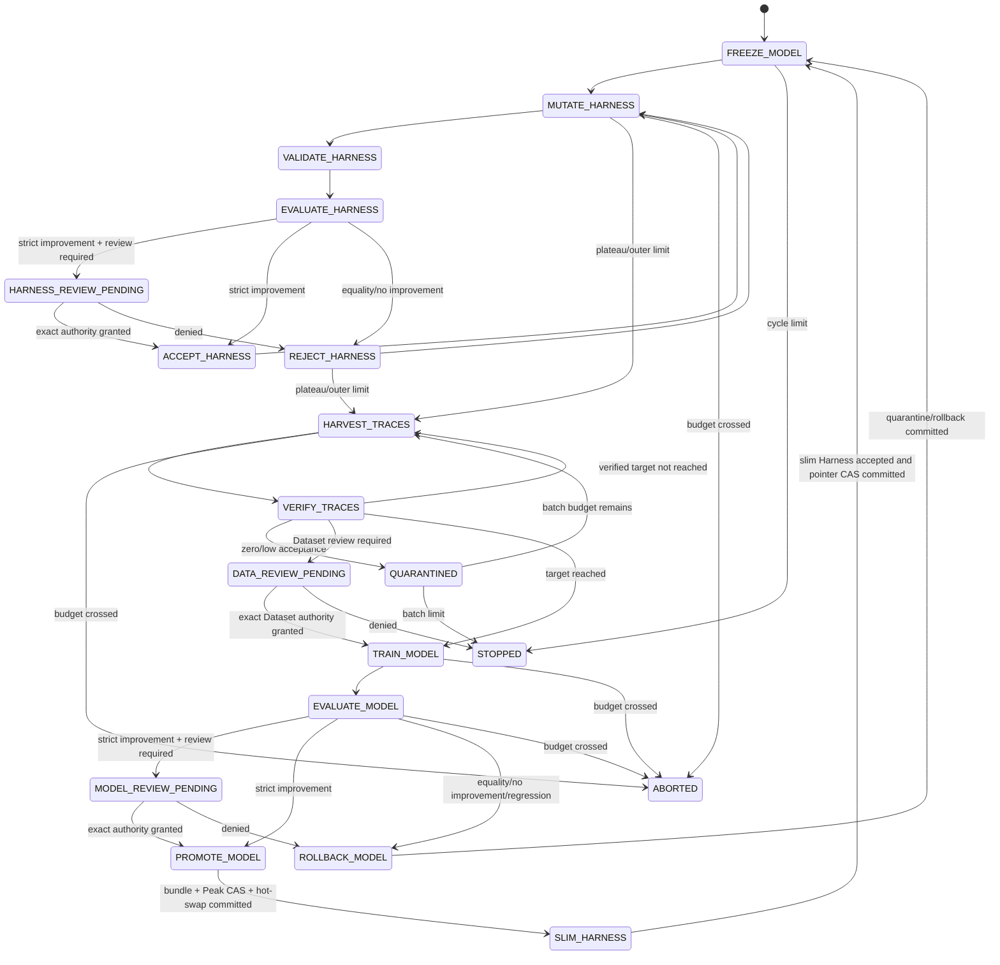
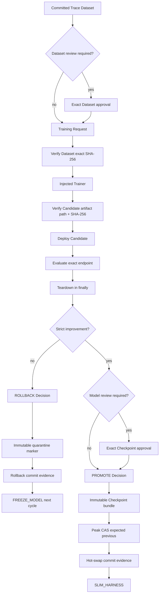

# Durable Model/Harness Co-Evolution convergence

Status: **Draft integration on PR #11; deterministic reference runtime only**

Branch: `feat/coevolution-convergence`  
Parent: `feat/model-inner-loop` / PR #10  
Stack ancestors: PR #8 Harness outer loop → PR #9 observable Trace harvesting → PR #10 model inner loop

This integration composes the three independently tested Co-Evolution components with transactional control records, immutable Checkpoint/Harness bundles, Peak and active-Harness compare-and-swap pointers, optional Dataset/Checkpoint/Harness review boundaries, durable Run metadata, deterministic resume, and a bounded local reference runtime.

It is designed to prove the architecture and evidence contracts without network access, API keys, GPU jobs, production endpoints, hidden chain-of-thought, or claims about production benchmark quality.

## 1. Converged State Machine



## 2. Directory ownership

```text
src/post_training_rsi/harness/
├── outer_loop/              PR #8 frozen-model Harness search
├── trace_harvesting/        PR #9 observable success Trace verification
├── model_inner_loop/        PR #10 Candidate model execution and policy
├── persistence.py           immutable Harness snapshots + active pointer CAS
├── coevolution_store.py     durable Run revision pointer and resume metadata
└── reference_runtime.py     deterministic tasks, traces, trainer, serving, evaluator

src/post_training_rsi/orchestration/
└── coevolution.py           PR #11 composition root and state dispatcher
```

The convergence controller owns composition and transaction order. It does not redefine component thresholds or provider contracts.

## 3. Durable Run metadata

Schema:

```text
post-training-rsi.coevolution-run/v1
```

Mutable pointer:

```text
<workspace>/coevolution/run.json
```

Immutable history:

```text
<workspace>/coevolution/history/revision-000000.json
<workspace>/coevolution/history/revision-000001.json
...
```

Each revision binds:

```text
Run ID
immutable PipelineConfig SHA-256
revision
current State/cycle/completed cycles
active model Checkpoint + score
active Harness + score
latest StateSnapshot and control transaction
pending approval Request ID/SHA-256/Subject
status
created/updated timestamps
```

Updates use bounded fail-closed compare-and-swap. Run ID, configuration hash, creation timestamp, cycle, and completed-cycle counts cannot be silently substituted or moved backward.

The pointer is updated only after its referenced control Snapshot has been committed. Exact resume reloads the pointer, verifies Run/config identity, loads the committed Snapshot, and dispatches from that State.

## 4. Bootstrap transaction

The local reference bootstrap creates:

```text
reference model artifact
  → CHECKPOINT + EVALUATION_RESULT EvidenceRecords
  → PROMOTE Decision
  → immutable Checkpoint bundle
  → PeakPointer CAS(previous=None)

reference Harness
  → HARNESS_SNAPSHOT EvidenceRecord
  → ACCEPT Decision
  → immutable Harness snapshot
  → HarnessPointer CAS(previous=None)

Peak + Harness pointer evidence
  → FREEZE_MODEL
  → MUTATE_HARNESS
  → Run revision 0
```

The bootstrap model and Harness are accepted only through the same typed Decision and immutable bundle/pointer mechanisms used by later cycles.

## 5. Harness persistence

Schema:

```text
post-training-rsi.harness/v1
```

Snapshot bundle:

```text
<workspace>/harness/snapshots/<harness-id>/
├── harness.json
└── snapshot_manifest.json
```

Manifest binds:

```text
Harness ID and parent
Run/cycle
exact Harness SHA-256
benchmark score
status
control transaction ID
created timestamp
```

Active pointer:

```text
<workspace>/active_harness.json
```

History:

```text
<workspace>/harness/history/cycle-<N>-<harness-id>.json
```

Pointer CAS verifies:

```text
expected previous Harness ID
committed ACCEPT Decision
Decision subject == exact Harness
snapshot transaction and manifest hash
Run/cycle identity
strict score increase
non-decreasing cycle
```

Stale writers, non-ACCEPT Decisions, score regression/equality, subject substitution, and snapshot/hash mismatch fail closed.

## 6. Observable Trace evidence

The reference runtime produces only externally observable task events:

```text
TASK_INPUT
TOOL_CALL
TOOL_RESULT
STATE_OBSERVATION
FINAL_OUTPUT
ERROR
```

It does not request or persist hidden chain-of-thought. The PR #9 recursive metadata guard remains active.

Every cycle writes:

```text
reference-traces/cycle-<N>.jsonl
trace-datasets/<batch-id>/raw.jsonl
trace-datasets/<batch-id>/accepted.jsonl
trace-datasets/<batch-id>/quarantine.jsonl
trace-datasets/<batch-id>/filter_audit.jsonl
trace-datasets/<batch-id>/harvest_manifest.json
trace-datasets/<batch-id>/dataset_summary.json
```

The accepted JSONL exact bytes are bound to a Trace Dataset ID and SHA-256. The same `VerificationPipeline` gates diversity, novelty, benchmark overlap, safety, and Python static constraints.

## 7. Model transaction order



A PROMOTE Decision is not considered a completed side effect. Active/Peak Checkpoint IDs change only after Checkpoint bundle integrity, committed Decision, expected previous pointer, strict score, and Peak CAS all verify.

A rollback keeps the accepted model active and records the rejected Candidate through the immutable quarantine store before advancing the cycle.

## 8. Harness slimming

After a model promotion, the reference controller:

1. preserves the system prompt whole, including every rule a mutation appendix added;
2. creates a content-addressed child Harness;
3. records prompt size before and after, which are equal in the reference runtime;
4. evaluates it under the promoted model;
5. commits an ACCEPT Decision and immutable snapshot;
6. performs active-Harness CAS;
7. advances to `FREEZE_MODEL` for the next cycle.

Only the retry budget narrows. The control-plane text contract rejects control characters, so a system prompt is always single-line and mutation appends with a space rather than a paragraph break; there is no appendix boundary the reference runtime can cut on without a rule-level Harness representation, which this slice does not introduce. Slimming is therefore ordering and provenance only — it is **not** a prompt-size reduction.

The reference score must strictly improve, so equal-score pointer replacement remains disallowed. Production convergence may later use a formally versioned multi-objective policy, but it must not weaken the current pointer silently.

## 9. Approval integration

Existing immutable HITL storage is used for:

```text
Harness → ACCEPT
Dataset → ACCEPT
Checkpoint → PROMOTE
```

The Run pointer records:

```text
Request ID
canonical Request SHA-256
Subject
pending status
```

Resume verifies the immutable Request and Decision bytes, Run, iteration, Subject, action, Request hash, reviewer, role, and deadline semantics before creating component review observations.

Pending or expired authority does not execute the gated side effect. Denied Dataset authority stops training. Denied Harness or Checkpoint authority follows the component rejection/rollback path and leaves the accepted pointer unchanged.

Authentication, enterprise RBAC, MFA, reviewer quorum, and ticket-system integration remain production human-owned controls.

## 10. Deterministic reference behavior

Default local behavior is deliberately bounded:

```text
cycle 1
  Harness Candidate strictly improves
  later Harness Candidate plateaus
  observable Trace target is verified
  Candidate model strictly improves
  Checkpoint bundle + Peak CAS commit
  Harness is slimmed and accepted

cycle 2
  Harness Candidate strictly improves then plateaus
  observable Trace target is verified
  Candidate model does not improve
  Candidate is rolled back/quarantined

cycle limit
  STOPPED(CYCLE_LIMIT)
```

The reference trainer writes deterministic local bytes. The serving endpoint is a `memory://` URI. The evaluator uses deterministic scores. These are evidence-contract fixtures, not real model gradient updates or serving benchmarks.

## 11. Artifact graph

```text
<workspace>/
├── coevolution/run.json
├── coevolution/history/*.json
├── control/{evidence,decisions,transitions,snapshots,transactions}/
├── checkpoints/<checkpoint-id>/{checkpoint,lineage_manifest,bundle_manifest}.json
├── peak_checkpoint.json
├── peak_history/*.json
├── active_harness.json
├── harness/snapshots/<harness-id>/{harness,snapshot_manifest}.json
├── harness/history/*.json
├── harness/candidates/*.json
├── harness/validation/*.json
├── harness/evaluations/*.json
├── harness/slim/*.json
├── reference-traces/*.jsonl
├── trace-datasets/<batch-id>/*
├── model-artifacts/*
├── model-candidates/*.json
├── approvals/{samples,requests,decisions}/*
├── quarantine/*.json
└── reports/coevolution-run-summary.json
```

## 12. Resume and idempotency

The controller is bounded to 256 dispatch steps per invocation. Each macro-step uses deterministic IDs and immutable-or-equal artifacts.

Exact rerun:

```text
load Run pointer
verify Run ID and config SHA-256
load committed Snapshot
verify Peak and Harness pointers when used
replay immutable artifacts/transactions
continue only from the durable State
```

Changed Run ID or PipelineConfig in the same workspace fails closed. Immutable ID/path conflicts, stale pointer expectations, missing transaction dependencies, and hash mutation fail closed.

## 13. Validation matrix

`tests/test_coevolution.py` covers:

```text
cycle-1 model promotion
cycle-2 model rollback
cycle-limit stop
exact completed-run resume
Run/config substitution rejection
Peak/Checkpoint/Harness/Trace persistence
Trace Dataset/audit artifacts across cycles
rejected Candidate absent from accepted parent chain
serving endpoint/teardown EvidenceKinds
model/Harness pointer identity
quarantine marker evidence
```

The complete branch also retains the focused PR #8, #9, and #10 test matrices and the parent RSI tests.

The exact-branch workflow runs:

```text
Python 3.11 / 3.12
compileall
Ruff
mypy
focused Co-Evolution tests
full pytest with coverage floor
compatibility demo
converged RSI
Checkpoint audit
```

## 14. CLI boundary

PR #11 will expose:

```text
post-training-rsi --workspace <path> --run-id <id> coevolve
```

The command runs or resumes the deterministic reference controller. Existing `approvals` and `review` commands operate on the same workspace for a paused HITL run.

The run result and its report carry `stop_reason`, because a completed run and a run a reviewer denied both report `STOPPED`:

```text
CYCLE_LIMIT                    all configured cycles completed
APPROVAL_NOT_GRANTED           a reviewer denied a required gate
PER_ITERATION_BUDGET_EXCEEDED  status ABORTED
TOTAL_BUDGET_EXCEEDED          status ABORTED
```

Treating a denial as a completed run would defeat the fail-closed approval contract, so callers must branch on `stop_reason`, not on `status` alone.

The CLI must label this path as a deterministic reference runtime and must not imply real provider, GPU, or production benchmark execution.

## 15. Explicit non-claims

This convergence does not prove:

- real Teacher API execution;
- real SFT/DPO gradient updates;
- managed GPU orchestration;
- live vLLM/SGLang serving;
- production benchmark validity or absence of overfitting;
- production Trace privacy or representativeness;
- enterprise identity/RBAC/MFA/quorum;
- distributed/multi-writer storage correctness beyond the local CAS contracts;
- DVC/lakeFS/MLflow service integration;
- Git Town configuration;
- production readiness.

## 16. Remaining production work

```text
real provider adapters and secret provisioning
sandboxed task execution
production Trace privacy/redaction policy
Inspect AI/lm-eval or equivalent benchmark integration
managed GPU training and serving lifecycle
remote immutable artifact/version store
distributed locks and disaster recovery
enterprise reviewer identity and quorum
cost telemetry and quota integration
canary deployment and rollback drills
security review and threat model
```
