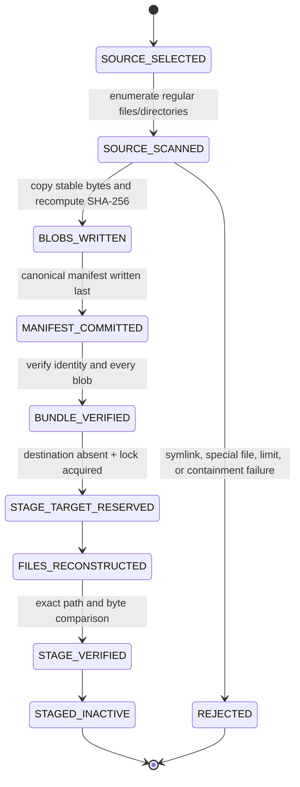

# Forensic recovery bundle and staged restore

Status: **Implemented component / no automatic activation**  
Proposed slice: **PR-13**  
Parent: `feat/coevolution-audit-recovery` / PR-12  
Branch: `feat/forensic-recovery-bundle`

This slice converts the human recovery playbook into a deterministic, content-addressed export and inactive restore-stage mechanism. It can preserve one local evidence workspace, verify the exported bytes, reconstruct them in a new directory, and verify the reconstructed copy.

It does not decide that the copy is safe to activate, does not overwrite the live workspace, and does not delete or repair forensic evidence.

## 1. Directory ownership

```text
src/post_training_rsi/recovery_bundle/
├── AGENTS.md       scoped safety, privacy, and ownership rules
├── __init__.py     public library contract
├── __main__.py     package-local create/verify/stage CLI
└── bundle.py       scan, content-address, manifest, verify, and stage

tests/
└── test_recovery_bundle.py

docs/
└── forensic-recovery-bundle.md
```

| Module | State responsibility | Input | Output | Must not own |
|---|---|---|---|---|
| `bundle.py:create_bundle` | `SOURCE_SELECTED → MANIFEST_COMMITTED` | local workspace directory | immutable bundle directory | live pointer mutation |
| `bundle.py:verify_bundle` | `MANIFEST_COMMITTED → BUNDLE_VERIFIED` | bundle directory | verification report | semantic Run/Peak approval |
| `bundle.py:stage_bundle` | `BUNDLE_VERIFIED → STAGED_INACTIVE` | verified bundle + absent destination | reconstructed directory | activation or overwrite |
| `bundle.py:verify_staged_directory` | staged-copy byte check | bundle + staged directory | verification report | production readiness |
| `__main__.py` | structured operator interface | explicit paths | JSON and exit code | hidden retries or repair |

## 2. State Machine



There is deliberately no transition from `STAGED_INACTIVE` to `ACTIVE`.

## 3. Data flow

```mermaid
flowchart TD
    W[Local evidence workspace] --> S[Deterministic scan]
    S --> G{Regular file or directory?}
    G -- no --> X[Fail closed]
    G -- yes --> H[Read with no-follow policy]
    H --> C[Controller SHA-256 + size]
    C --> B[blobs/sha256]
    B --> M[Canonical manifest identity payload]
    M --> I[bundle_id = SHA-256(payload)]
    I --> F[manifest.json written last]
    F --> V[Full bundle verification]
    V --> R[New staging directory]
    R --> E[Reconstruct exact paths and bytes]
    E --> Q[Exact staged-copy verification]
    Q --> O[Operator receives activated=false]
```

The bundle implementation performs no network request and contains no remote destination selection.

## 4. Bundle layout

```text
<bundle>/
├── manifest.json
└── blobs/
    ├── <sha256-a>
    ├── <sha256-b>
    └── ...
```

Identical source files share one content-addressed blob. Empty directories remain explicit manifest entries.

Manifest schema:

```text
post-training-rsi.recovery-bundle/v1
```

Exact fields:

```text
schema_version
record_type
bundle_id
source_label
entries
file_count
directory_count
total_bytes
```

Each entry contains:

```text
path        canonical relative POSIX path
kind        file | directory
size        exact byte count; zero for a directory
mode        permission bits only
sha256      lowercase SHA-256 for a file; null for a directory
```

`bundle_id` is computed from the canonical manifest identity payload before `bundle_id` is added. Two scans of unchanged bytes, paths, modes, and the same source label produce the same identity.

## 5. Create contract

```bash
python -m post_training_rsi.recovery_bundle create \
  --source artifacts/coevolution \
  --bundle recovery/coevolution-generation-001 \
  --source-label coevolution-generation-001
```

Create rejects:

- an absent or non-directory source;
- a bundle destination inside the source;
- an existing bundle destination;
- a retained create lock;
- a symbolic link anywhere encountered by the scan;
- sockets, FIFOs, devices, or other non-regular entries;
- file-count or byte-budget overflow;
- a source file whose identity changes while it is read;
- a conflicting pre-existing content-addressed blob.

For every regular file, the controller opens the file with a no-follow flag where supported, reads and hashes the same descriptor, compares pre/post file identity, writes a temporary blob, fsyncs it, and only then publishes the SHA-256-named blob.

`manifest.json` is written after all blobs and the staging directory is renamed into place. A retained lock is never automatically removed.

## 6. Verify contract

```bash
python -m post_training_rsi.recovery_bundle verify \
  --bundle recovery/coevolution-generation-001
```

Verification recomputes:

```text
canonical manifest bytes
manifest bundle_id
entry uniqueness and ordering
all blob SHA-256 values
all blob sizes
referenced blob set
```

Unknown fields, non-canonical JSON, path traversal, missing blobs, extra blobs, symlinks, and byte changes fail closed.

A successful report proves only that the local bundle bytes match its manifest. It does not prove that the original Run, Peak, approval, or business outcome was semantically valid. Run/Lineage semantics remain the responsibility of the Co-Evolution auditor.

## 7. Inactive stage contract

```bash
python -m post_training_rsi.recovery_bundle stage \
  --bundle recovery/coevolution-generation-001 \
  --destination recovery-stage/coevolution-generation-001
```

The destination must not exist. The implementation reconstructs files in a private temporary sibling directory, verifies the complete path set and every file hash, then renames the verified staging directory into the requested destination.

Successful output includes:

```json
{
  "status": "staged",
  "activated": false
}
```

A second command can independently compare a staged copy with the bundle:

```bash
python -m post_training_rsi.recovery_bundle verify-stage \
  --bundle recovery/coevolution-generation-001 \
  --destination recovery-stage/coevolution-generation-001
```

The stage operation never:

- overwrites the live workspace;
- changes `run.json`, Peak, Harness, approval, or serving pointers;
- deletes the source;
- removes a retained lock;
- retries a provider;
- activates a restored model or Harness.

## 8. Human-authorized activation boundary

A future activation procedure must be a separate transaction. Minimum evidence:

```text
1. freeze all writers;
2. preserve the failed workspace unchanged;
3. verify the bundle;
4. stage into a new directory;
5. run strict Co-Evolution audit against the staged copy;
6. bind bundle_id and staged audit result to an authorized recovery ticket;
7. compare expected live generation;
8. atomically switch one external pointer;
9. retain a rollback pointer;
10. run post-switch audit before resuming writers.
```

This PR implements steps 3 and 4 only. It intentionally cannot execute steps 6–10.

## 9. Exit codes

The package-local CLI uses:

```text
0  create / verify / stage / verify-stage succeeded
2  integrity, conflict, containment, or contract failure
```

Failures are emitted as structured JSON without printing private blob bytes.

## 10. Test matrix

`tests/test_recovery_bundle.py` covers:

```text
deterministic identity
content-addressed deduplication
exact round-trip staging
activated=false
executable mode preservation
existing destination rejection
blob tamper detection
unknown manifest fields
path traversal rejection
source symlink rejection
source/output containment
retained create/stage locks
staged-file mutation detection
```

Required repository gate:

```text
python -m compileall -q src tests
ruff check src tests
mypy src
python -m pytest -q tests/test_recovery_bundle.py
python -m pytest --cov=post_training_rsi --cov-fail-under=75
```

No test requires a network, cloud account, API key, GPU, Docker daemon, or production service.

## 11. Stack metadata

```yaml
pr: 13
branch: feat/forensic-recovery-bundle
parent_branch: feat/coevolution-audit-recovery
parent_pr: 12
status: draft
allowed_paths:
  - src/post_training_rsi/recovery_bundle/**
  - tests/test_recovery_bundle.py
  - docs/forensic-recovery-bundle.md
excluded_paths:
  - live runtime pointer mutation
  - automatic recovery
  - provider credentials
  - production storage policy
  - Git Town configuration
rollback_subject: remove the recovery_bundle package, focused tests, and this document
human_owned_operations:
  - retained-lock investigation
  - storage destination authorization
  - encryption key management
  - retention and legal hold
  - staged-copy audit
  - production pointer activation
  - rollback and writer resume
```

Git Town remains unconfigured and fail closed. This is an ordinary GitHub child PR, not an executable Git Town Stack.

## 12. Non-claims

This component does not establish:

- encrypted-at-rest storage;
- authenticated remote backup;
- remote retention or legal hold;
- distributed writer exclusion;
- a disaster-recovery RPO or RTO;
- production identity correctness;
- automatic repair;
- production readiness.
