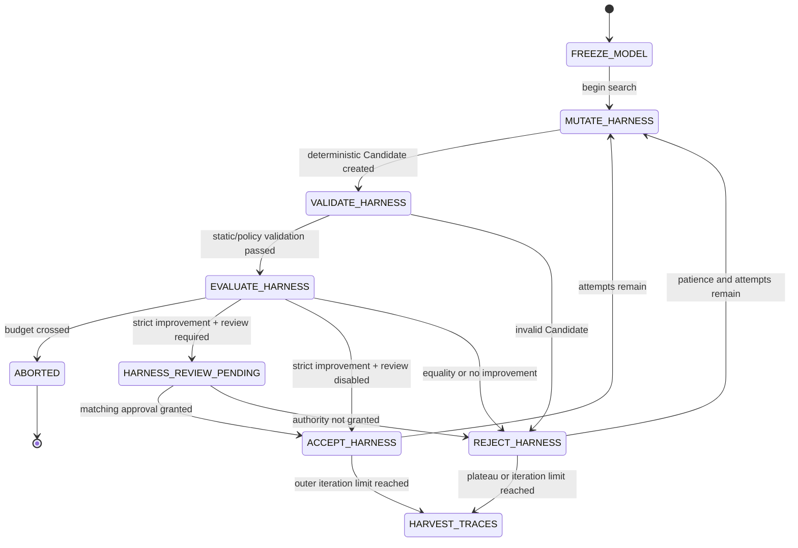
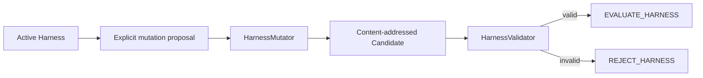

# Harness outer-loop component

Status: **Implemented component on PR #8; not wired to a supported CLI**

Branch: `feat/harness-outer-loop`  
Parent: `feat/rsi-convergence` / Draft PR #7  
Planned integration owner: PR #11

This component freezes the accepted model and searches non-parametric Harness changes under a fixed task suite. It owns mutation, validation, evaluation aggregation, strict Harness acceptance, optional review-pending state, budget guards, plateau detection, and the handoff to successful-trace harvesting.

It does not train model weights, persist control records, execute production providers, authenticate reviewers, harvest traces, or expose `coevolve`.

## 1. Directory ownership

```text
src/post_training_rsi/harness/outer_loop/
├── AGENTS.md       scoped ownership, invariants, and evidence rules
├── contracts.py    Harness/mutation/task/validation/benchmark/review values
├── mutation.py     deterministic mutation and static/policy validation
├── evaluation.py   weighted task and task-family aggregation
├── policy.py       frozen-model State Machine and control records
└── __init__.py     component API
```

| Module | State responsibility | Input | Output | Must not own |
|---|---|---|---|---|
| `contracts.py` | immutable boundary values | exact typed values | canonical Harness and observation objects | persistence or transitions |
| `mutation.py` | `MUTATE_HARNESS`, pre-evaluation admission | active Harness + explicit proposal | content-addressed Candidate + validation result | score/approval policy |
| `evaluation.py` | `EVALUATE_HARNESS` fact aggregation | fixed Harness + fixed task suite + observable runner results | weighted score, family scores, task results | accept/reject decision |
| `policy.py` | outer-loop adjacency and Decisions | current Snapshot + evidence-backed observations | Decisions, Transitions, Snapshots | provider, persistence, trace/model loop |

## 2. State Machine



`HARVEST_TRACES` is a handoff State, not an implemented trace-harvesting loop. PR #9 owns the next edge.

## 3. Frozen-model invariants

During one outer-loop cycle:

```text
active_checkpoint_id == peak_checkpoint_id
active model Checkpoint never changes
candidate.parent_harness_id == active_harness_id
candidate_score > active_harness_score + min_improvement
```

Consequences:

- model weights cannot improve while comparing Harness Candidates;
- threshold equality is rejection;
- rejected, invalid, or denied Harness never becomes active;
- accepted Harness becomes the next mutation parent and resets plateau count;
- ordinary rejection increments plateau count;
- plateau or iteration limit hands off to trace harvesting;
- exact budget limits are allowed; only crossing aborts.

The policy uses `StateSnapshot.peak_score` as the accepted Harness score inside this frozen-model component. `active_checkpoint_id` and `peak_checkpoint_id` remain the same accepted model ID.

## 4. Harness contract

A Harness snapshot contains:

```text
harness_id
version
parent_harness_id
system_prompt
tools
retry_policy
timeout_seconds
max_steps
metadata
```

`HarnessSpec.content_sha256` is computed from canonical JSON. Candidate identity is derived deterministically from:

```text
parent Harness
new version
resulting Prompt
resulting tool list
retry policy
timeout
step bound
merged metadata including mutation identity
```

A Candidate cannot name itself as parent, repeat tools, use non-finite limits, or use invalid IDs.

## 5. Mutation flow



An explicit proposal may:

```text
append a Prompt instruction
add tools
remove tools
change max retry attempts
change timeout
change max steps
add non-secret metadata
```

The same parent and proposal produce the same Candidate ID and content. A proposal declaring a different parent fails closed.

## 6. Static and policy validation

Default checks include:

```text
Candidate has a parent
Prompt length bound
forbidden Prompt directive fragments
tool count bound
tool allowlist when configured
retry-attempt bound
timeout bound
step bound
```

Invalid Candidate produces a `REJECT` Decision with exact reason codes and never reaches evaluation.

This validator is a reference guard, not a complete production security policy. A future production Harness PR may add AST/schema checks, tool-capability policy, sandbox preflight, and signed tool registry evidence without moving acceptance policy out of `policy.py`.

## 7. Evaluation contract

`DeterministicHarnessEvaluator` receives:

```text
one immutable Harness
a fixed task sequence
a deterministic/injected task runner
evaluation timestamp
evidence IDs
bounded cost
```

Each task result contains only observable facts:

```text
task ID
task family
score
success flag
failure code
optional observable trace URI
non-secret metadata
```

It does not request or store hidden chain-of-thought.

Aggregate score:

```text
sum(task_score × task_weight) / sum(task_weight)
```

Task-family scores use the same weighted formula within each family. The evaluator rejects task-ID or task-family substitution by the runner. It returns evidence-backed facts; it does not accept or reject a Harness.

## 8. Decision policy

Evaluation precedence:

```text
1. per-iteration budget crossed → ABORTED
2. total budget crossed         → ABORTED
3. Candidate > active + delta   → review pending or ACCEPT_HARNESS
4. otherwise                    → REJECT_HARNESS
5. after accept/reject:
   a. plateau reached           → HARVEST_TRACES
   b. outer iteration limit     → HARVEST_TRACES
   c. otherwise                 → MUTATE_HARNESS next attempt
```

Every edge produces:

```text
DecisionRecord
TransitionRecord
StateSnapshot
```

Record IDs and idempotency keys are deterministic from Run, cycle, attempt, destination phase, and Harness identity. Every edge requires non-empty evidence IDs.

## 9. Review-pending boundary

When `approval_required=true`, a strictly improved Candidate enters:

```text
HARNESS_REVIEW_PENDING
DecisionAction.REQUEST_APPROVAL
DecisionSubject.HARNESS
```

`review_completed` consumes an evidence-backed observation for the exact Candidate:

```text
request ID
Candidate Harness ID
approved/denied
reviewer ID
reviewer role
decision evidence IDs
decision timestamp
```

This component does not authenticate the reviewer or read the approval store. PR #11 must connect the existing immutable approval service and call `require_approved` with exact Subject type, ID, SHA-256, Run, iteration, action, and Request hash before producing the policy observation.

A pending Snapshot is not authority. Candidate substitution fails closed.

## 10. Budget and handoff semantics

Per-attempt evaluation cost and accumulated outer-loop cost are recorded on Snapshots.

```text
cost == limit     allowed
cost > limit      ABORTED
```

Plateau and attempt exhaustion do not pretend that the Harness search completed the whole Co-Evolution cycle. They produce a non-terminal handoff:

```text
HARVEST_TRACES
metadata.handoff = trace_harvesting
```

PR #9 must consume that handoff, harvest only successful observable traces, pass them through the same data gates, and produce an exact trace-Dataset hash.

## 11. Test matrix

`tests/test_harness_outer_loop.py` covers:

```text
Harness exact round trip and SHA-256
mutation determinism and content identity
parent mismatch
empty/ambiguous mutation rejection
safe validation
forbidden Prompt/tool/retry/timeout/step rejection
weighted aggregate and task-family scores
task identity substitution
model freeze and first mutation State
strict acceptance
threshold equality rejection
invalid Candidate never evaluated
approval pending/approved/denied
review Candidate substitution
exact budget allowed
per-iteration budget abort
total budget abort
outer iteration handoff
active/Peak and parent invariants
deterministic paired control records
observable trace URI without hidden reasoning
```

All tests are deterministic and require no network, API key, GPU, Docker daemon, or cloud account.

## 12. Integration obligations for PR #11

PR #11 must:

1. persist Harness content and control records through the transactional lineage store;
2. bind the existing immutable Harness approval service, not a boolean shortcut;
3. evaluate the Candidate and active Harness under the same frozen model, task suite, seed, and budget;
4. commit evaluation evidence before policy records reference it;
5. preserve strict improvement and model-freeze invariants;
6. hand `HARVEST_TRACES` to PR #9 without inventing trace data;
7. preserve observable-only trace policy;
8. resume from durable Harness State and idempotency records;
9. expose `coevolve` only after PR #8–#10 converge;
10. update root README/AGENTS/status/state/traceability/stack documents;
11. add end-to-end approval, plateau, budget, rollback, resume, and teardown tests.

Until those obligations are met, PR #8 is an Implemented component, not a supported Co-Evolution runtime.

## 13. Remaining non-claims

This component does not prove:

- real Agent task execution;
- real Harness improvement on a production benchmark;
- production Prompt/tool security;
- reviewer authentication;
- durable Harness storage;
- trace quality;
- model training or hot-swap;
- complete Model/Harness Co-Evolution;
- production readiness.
