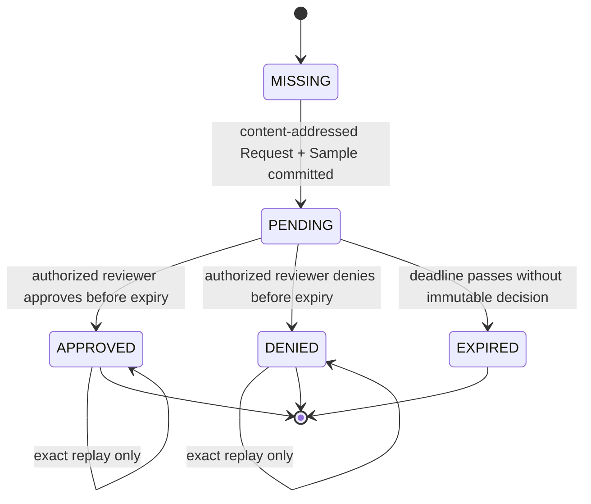
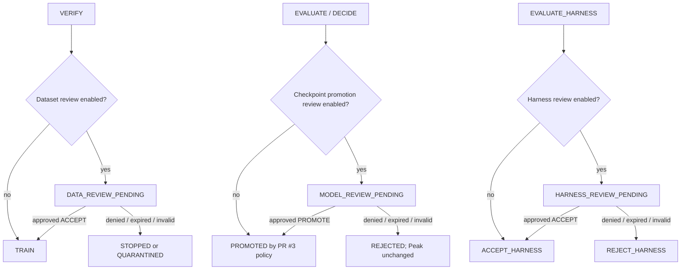
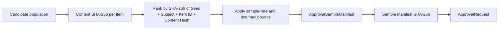
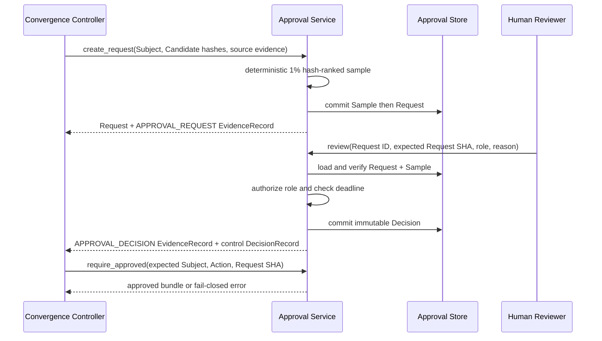

# Human-in-the-Loop approval — PR #6 integration boundary

## Status

**Implemented component / not yet reachable from the supported CLI.**

This document describes the `feat/hitl-approval` sibling PR stacked directly on PR #2. It implements deterministic review sampling, exact approval requests, immutable decisions, reviewer-role checks, finite deadlines, and fail-closed authority checks for Dataset acceptance, Checkpoint promotion, and Harness acceptance.

It does not modify `RSIEngine`, register interactive commands, decide Candidate quality, persist general Lineage/Peak transactions, call providers, or mutate production resources. PR #7 remains responsible for convergence.

The source architecture calls for Human-in-the-Loop review because automated RSI can over-search beyond the historical Peak, and recommends small random review samples before high-impact Dataset and Model/Harness decisions. This implementation converts that boundary into content-addressed, replayable records rather than an informal checkbox.

## Directory and ownership map

```text
src/post_training_rsi/approval/
├── AGENTS.md       scoped Agent, ownership, and evidence contract
├── __init__.py     public component exports
├── contracts.py    exact schema-v1 Sample, Request, and Decision records
├── errors.py       fail-closed state and error taxonomy
├── policy.py       enabled Subjects, sample bounds, TTL, reviewer roles
├── sampling.py     deterministic SHA-256-ranked review sampling
├── service.py      create, review, status, and require-approved operations
└── store.py        immutable request/sample/decision persistence

tests/
└── test_approval.py
    └── sample, replay, approve, deny, pending, expiry, tamper, substitution
```

### Directory responsibilities

| Owner | Input | Output | Must not decide |
|---|---|---|---|
| `contracts.py` | typed values or exact JSON mappings | canonical `post-training-rsi.approval/v1` records | policy thresholds or file mutation |
| `policy.py` | repository/organization review policy | Subject enablement, requested Action, sample and TTL bounds | whether a particular Candidate is better |
| `sampling.py` | content-hashed candidates and a seed | deterministic sample manifest | approval outcome |
| `store.py` | exact Sample, Request, Decision records | immutable local evidence files | reviewer authorization or score policy |
| `service.py` | policy, store, reviewer facts, expected hashes | status, approval gate, control Evidence and Decision records | Training, Serving, Peak, or Git operations |

PR #3 owns model-quality policy, PR #4 owns Lineage and Peak persistence, PR #5 owns provider execution, and PR #7 owns composition.

## Approval state machine



A conflicting second decision is not a transition. It raises an immutable-history conflict.

### Fail-closed authority table

| Store/record state | `require_approved` result |
|---|---|
| request absent | reject as `MISSING` |
| malformed or tampered request/sample/decision | integrity error; no authority |
| request exists, no decision, before deadline | reject as `PENDING` |
| request exists, no decision, after deadline | reject as `EXPIRED` |
| immutable denied decision | reject as `DENIED` |
| approved decision bound to another SHA/Subject/Action | integrity error; no authority |
| exact approved decision bound to expected SHA/Subject/Action | return approval bundle |

Missing, pending, denied, expired, malformed, and mismatched records are never treated as implicit approval.

## RSI and Co-Evolution insertion points



This PR implements the approval subsystem used at those edges. It does not add those edges to the supported controller.

## Exact approval schema

Approval records use:

```text
post-training-rsi.approval/v1
```

### `ApprovalSampleManifest`

```text
request_id
run_id
iteration
subject_type
subject_id
selection_algorithm
selection_seed
sample_rate
population_count
selected_count
items[]: item_id + content_sha256 + JSON metadata
created_at
metadata
```

The sample carries hashes and review metadata. It does not embed raw private Dataset records, hidden Benchmark bodies, model weights, or unrestricted traces.

### `ApprovalRequest`

```text
request_id
run_id
iteration
subject_type
subject_id
requested_action
policy_id
requested_at
expires_at
source_evidence_ids
sample_uri
sample_sha256
sample_count
metadata
```

Allowed Subject/Action pairs are exact:

| Subject | Requested Action |
|---|---|
| `DATASET` | `ACCEPT` |
| `CHECKPOINT` | `PROMOTE` |
| `HARNESS` | `ACCEPT` |

### `ApprovalDecision`

```text
decision_id
request_id
request_sha256
run_id
iteration
subject_type
subject_id
requested_action
approved
reviewer_id
reviewer_role
reason
decided_at
evidence_ids
metadata
```

The decision is bound to the exact Request SHA-256. Cross-Run, cross-Iteration, cross-Subject, cross-Action, expired, and unauthorized decisions fail closed.

## Deterministic sampling flow



Defaults support a 1% review sample while guaranteeing at least one item and enforcing a finite maximum. The same candidate set, seed, Subject, policy, and timestamps produce the same ranked sample and content-addressed request ID regardless of input ordering.

## Immutable persistence layout

```text
<workspace>/approvals/
├── samples/<request-id>.json
├── requests/<request-id>.json
└── decisions/<request-id>.json
```

Commit rules:

1. validate schema and all cross-record links;
2. write canonical JSON to a temporary file;
3. `fsync` the file;
4. publish with an atomic no-overwrite hard link;
5. `fsync` the directory;
6. accept only byte-identical retries;
7. reject a different record at an existing immutable path.

The Request binds the Sample URI and Sample SHA-256. The Decision binds the Request SHA-256. Loading revalidates both links and filenames.

## Request and decision data flow



The expected Request SHA parameter prevents a stale UI, copied Request ID, or Subject substitution from authorizing a different operation.

## Control-plane evidence translation

The approval subsystem produces `post-training-rsi.control/v1` records:

```text
ApprovalRequest
  -> EvidenceKind.APPROVAL_REQUEST

ApprovalDecision
  -> EvidenceKind.APPROVAL_DECISION

approved Dataset/Harness
  -> DecisionAction.ACCEPT

approved Checkpoint
  -> DecisionAction.PROMOTE

denied Subject
  -> DecisionAction.REJECT
     + StopReason.APPROVAL_NOT_GRANTED
```

Decision evidence references upstream Dataset/Checkpoint/Harness evidence, the approval request evidence, any reviewer evidence IDs, and the approval decision evidence. Reviewer identity and role are recorded, but secrets and raw private content are not.

## Reviewer authority boundary

Reviewer authorization is configured as an explicit role allowlist. The default component policy includes example roles only; production organizations must map authenticated identities to reviewed roles outside this repository.

Human-owned operations include:

- identity-provider integration and reviewer-role assignment;
- selecting which Subjects require review;
- changing sample rates, review deadlines, and maximum samples;
- deciding whether a production approval UI may display raw content;
- production Model, Dataset, Harness, GPU, Endpoint, or Git mutations after approval.

This component records authority. It does not execute the approved side effect.

## Deterministic verification matrix

```text
request:
  content-addressed ID
  deterministic sample independent of input ordering
  exact replay
  conflicting replay
  Sample URI and SHA binding

review:
  approve Dataset
  deny Checkpoint
  authorized and unauthorized reviewer roles
  expected Request SHA match/mismatch
  exact Decision replay
  conflicting second Decision

fail closed:
  missing
  pending
  expired
  denied
  malformed record
  sample tamper
  Subject substitution
  Action substitution
  disabled review policy

control evidence:
  APPROVAL_REQUEST
  APPROVAL_DECISION
  approved ACCEPT/PROMOTE
  denied REJECT + APPROVAL_NOT_GRANTED
```

All tests use deterministic clocks, content hashes, identities, and temporary local stores. They require no network, GPU, identity provider, or production endpoint.

## Remaining convergence work

PR #6 does **not** make approval operational through the supported CLI. PR #7 must still:

1. add review settings to the converged strict configuration without losing PR #5 adapter settings;
2. pause the RSI controller at Dataset and Checkpoint review states;
3. persist approval Evidence/Decision records through PR #4;
4. connect approved Model promotion to PR #3 without allowing approval to bypass score policy;
5. add approval list/review/resume CLI commands or another supported operator interface;
6. add deterministic end-to-end pause, approve, deny, expire, and resume tests;
7. update shared README, Agent instructions, implementation status, State Machine, traceability, and active PR index from one convergence owner;
8. reuse the same subsystem for Harness review in the later Co-Evolution convergence.

Git Town remains unconfigured and fail closed. This PR is an ordinary GitHub sibling of PR #3, PR #4, and PR #5 from the verified PR #2 parent.
