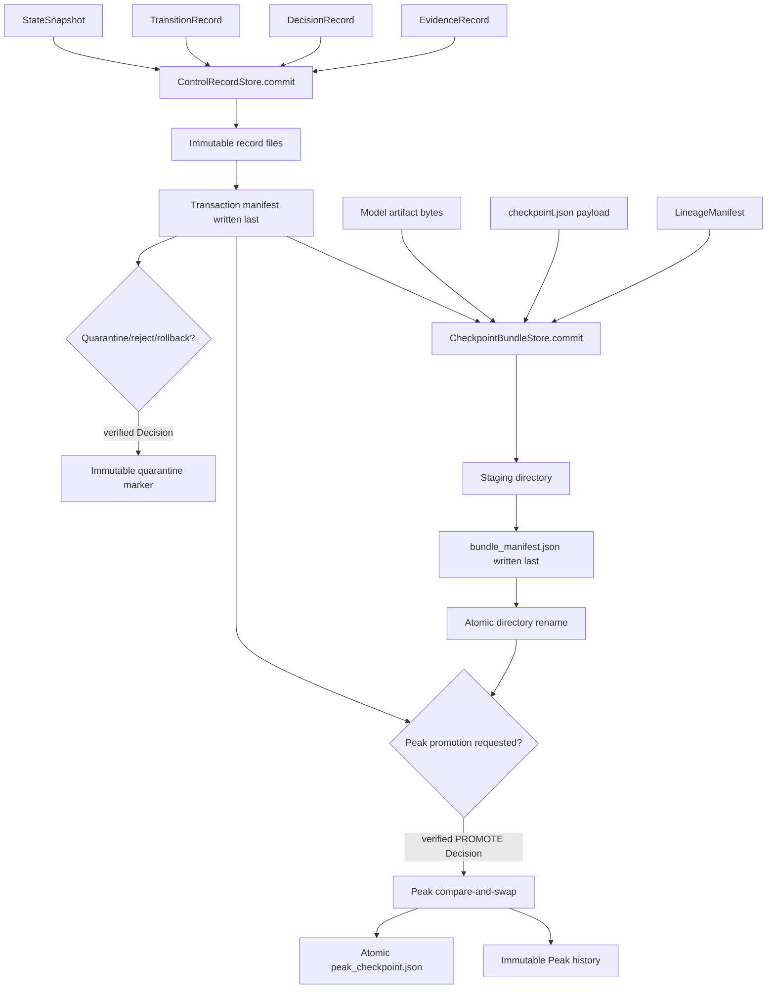
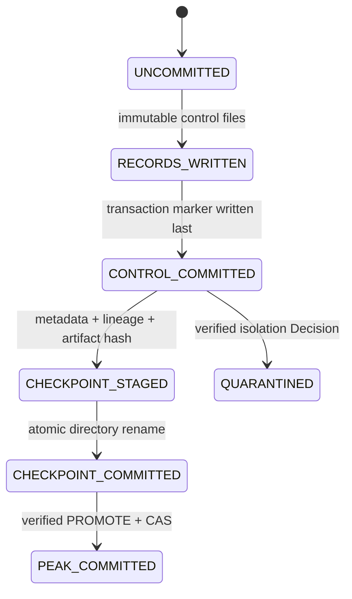

# Transactional lineage runtime

Status: **Implemented component / not wired to the supported runtime** on the `feat/lineage-runtime` sibling branch.

This component persists the `post-training-rsi.control/v1` records from PR #2 and binds them to Checkpoint metadata, `LineageManifest`, artifact integrity, the accepted Peak pointer, and quarantine history. It does not change `RSIEngine`, the CLI, provider adapters, approval policy, or score thresholds.

## Directory ownership

```text
src/post_training_rsi/lineage/
├── AGENTS.md                scoped persistence invariants
├── _io.py                   canonical bytes, hashes, atomic replace, fail-closed locks
├── control_store.py         immutable control records and commit-last transactions
├── checkpoint_store.py      atomic Checkpoint + lineage bundle commit
├── peak_store.py            verified monotonic Peak compare-and-swap
├── quarantine_store.py      immutable evidence-backed isolation markers
├── manifest.py              existing Checkpoint lineage schema
├── store.py                 existing iteration artifact store
└── __init__.py              public lineage runtime exports
```

The new persistence schema identifier is:

```text
post-training-rsi.lineage/v1
```

It is separate from the control-record schema:

```text
post-training-rsi.control/v1
```

The lineage schema wraps and indexes control records; it does not reinterpret them.

## End-to-end persistence flow



## 1. Control-record transactions

`ControlRecordStore` persists the four schema-v1 records under:

```text
<workspace>/control/
├── evidence/<evidence-id>.json
├── decisions/<decision-id>.json
├── transitions/<transition-id>.json
├── snapshots/<snapshot-id>.json
└── transactions/<transaction-id>.json
```

Commit sequence:

```text
validate exact schema and Run ownership
  → validate evidence/Decision dependencies
  → write immutable record files
  → write transaction manifest last
  → reload and verify every recorded SHA-256 and schema
```

A record file without a transaction marker is an orphan, not committed evidence. This allows an interrupted transaction to retry without treating a partially written batch as complete.

Exact idempotent retry succeeds. Reusing an immutable ID or transaction ID with different canonical bytes raises `LineageConflictError`.

## 2. Checkpoint bundles

`CheckpointBundleStore` commits one directory:

```text
<workspace>/checkpoints/<checkpoint-id>/
├── checkpoint.json
├── lineage_manifest.json
└── bundle_manifest.json
```

The bundle requires:

- a committed control transaction for the same Run and iteration;
- a payload whose `checkpoint_id` matches the directory ID;
- a `LineageManifest` whose Checkpoint and iteration match;
- a Candidate that is not its own lineage parent;
- a deterministic SHA-256 over the model artifact file or directory;
- optional payload artifact hash matching the actual bytes.

All files are staged first. `bundle_manifest.json` is written last inside staging, then the complete directory becomes visible through one atomic rename. Loading revalidates metadata hashes, lineage fields, the referenced control transaction, and—when the caller supplies the artifact path—the actual artifact bytes.

## 3. Peak pointer transaction

`PeakPointerStore` owns:

```text
<workspace>/peak_checkpoint.json
<workspace>/peak_history/iter-<N>-<checkpoint-id>.json
```

The pointer is accepted only when all checks pass:

```text
current Peak == caller expected previous Checkpoint
pointer.previous_checkpoint_id == expected previous Checkpoint
new iteration does not move backwards
new score is strictly greater than the current Peak score
referenced transaction is committed for the same Run/iteration
referenced Decision is PROMOTE for the same Checkpoint
referenced Checkpoint bundle matches transaction, model, score, and manifest hash
```

An exact retry returns the existing pointer even though the caller’s original expected previous value is now stale. A different update with a stale expected value fails compare-and-swap.

Peak history is immutable. The active pointer is atomically replaced only after the history record and all references are verified.

## 4. Quarantine markers

`QuarantineStore` persists:

```text
<workspace>/quarantine/
└── iter-<N>-<subject-type>-<subject-id>.json
```

A marker must reference one committed control transaction and a Decision whose:

- action is `QUARANTINE`, `REJECT`, or `ROLLBACK`;
- Run and iteration match;
- subject type and subject ID match;
- reason code matches;
- evidence IDs match exactly.

Markers are immutable. An exact replay succeeds; conflicting forensic history fails.

## 5. Integrity and failure model

### Canonical bytes

All repository-owned JSON uses sorted keys, compact separators, UTF-8, and one trailing newline. Hashes cover these exact bytes.

### Artifact hashing

Files use direct SHA-256. Directories use a deterministic stream of relative path length/path and content length/content. Symlinks are rejected rather than followed.

### Locks

Local write paths use `O_CREAT | O_EXCL` locks with bounded timeout. Stale-lock deletion is intentionally not automatic because the system cannot prove whether another writer is alive. Recovery is human-owned.

### Fail-closed errors

- `LineageConflictError`: an immutable ID or compare-and-swap expectation conflicts.
- `LineageIntegrityError`: hashes, schemas, IDs, subjects, parents, Decisions, or artifacts do not match.
- `LineageLockTimeout`: the writer cannot acquire exclusive ownership within the configured boundary.

The store does not repair or overwrite corrupted evidence.

## 6. State Machine responsibility



These are persistence phases, not new `ControlState` enum values. The lineage layer verifies and commits facts selected by orchestration; it does not choose promotion or rollback policy.

## 7. Test evidence

`tests/test_lineage_runtime.py` and the focused Peak monotonicity tests cover:

```text
control transaction round trip
exact retry and conflicting retry
uncommitted Evidence/Decision dependencies
orphan records
record hash tampering
lock timeout
Checkpoint bundle atomic round trip
Checkpoint payload/lineage/artifact mismatch
Checkpoint self-parent and unknown transaction
artifact and metadata tampering
Peak compare-and-swap and exact replay
stale Peak update
non-PROMOTE Peak attempt
invalid bundle hash and score
non-monotonic Peak score/iteration
quarantine round trip, conflict, and wrong Decision action
```

The supported `demo` does not call these stores yet. PR-07 must compose the PR #3 Decision policy, this persistence layer, adapter evidence, and approval state into one deterministic end-to-end RSI path before the lineage runtime can be labelled Integrated.
