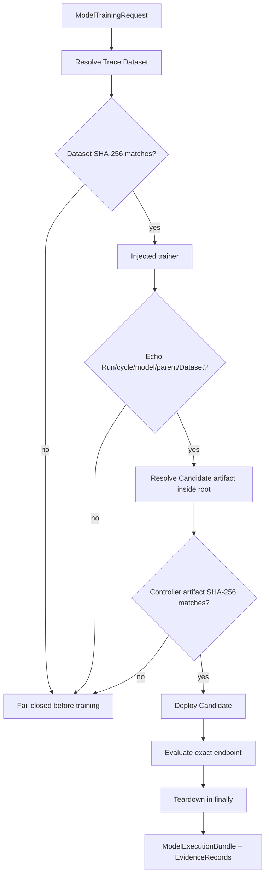

# Model inner-loop component

Status: **Implemented component on PR #10; not wired to a supported CLI**

Branch: `feat/model-inner-loop`  
Parent: `feat/trace-harvesting` / PR #9  
Planned convergence owner: PR #11

This component consumes the verified observable Trace Dataset from PR #9, verifies its exact bytes, creates a Candidate model through an injected trainer, verifies the Candidate artifact, deploys it to an ephemeral endpoint, evaluates the exact endpoint, tears it down in all paths, compares the Candidate against the accepted model score, and emits promotion or rollback handoffs.

It does not persist control transactions, update the Peak pointer, authenticate reviewers, slim the Harness, expose `coevolve`, run real GPU training, or claim production model improvement.

## 1. Directory ownership

```text
src/post_training_rsi/harness/model_inner_loop/
├── AGENTS.md       scoped lineage, integrity, decision, and non-claim rules
├── contracts.py    request/Candidate/serving/evaluation/review/commit values
├── execution.py    Dataset/artifact integrity and train/deploy/evaluate/teardown
├── policy.py       budget/review/promote/rollback and successor handoffs
└── __init__.py     component API
```

| Module | State responsibility | Input | Output | Must not own |
|---|---|---|---|---|
| `contracts.py` | exact model-loop facts | Trace Dataset and provider observations | content-addressed request/Candidate and typed results | persistence or State adjacency |
| `execution.py` | training and serving lifecycle facts | request + injected providers | verified execution bundle + EvidenceRecords | promotion/rollback decision |
| `policy.py` | model-loop adjacency and Decisions | StateSnapshot + evidence-backed observations | Decisions/Transitions/Snapshots | provider calls, Peak CAS, approval identity |

## 2. Model inner-loop State Machine

```mermaid
stateDiagram-v2
    TRAIN_MODEL --> ABORTED: training budget crossed
    TRAIN_MODEL --> EVALUATE_MODEL: Candidate trained + artifact verified
    EVALUATE_MODEL --> ABORTED: evaluation budget crossed
    EVALUATE_MODEL --> MODEL_REVIEW_PENDING: strict improvement + review required
    EVALUATE_MODEL --> PROMOTE_MODEL: strict improvement + review disabled
    EVALUATE_MODEL --> ROLLBACK_MODEL: equality/no improvement/regression
    MODEL_REVIEW_PENDING --> PROMOTE_MODEL: exact approval granted
    MODEL_REVIEW_PENDING --> ROLLBACK_MODEL: authority not granted
    PROMOTE_MODEL --> SLIM_HARNESS: promotion bundle + Peak CAS + hot-swap committed
    ROLLBACK_MODEL --> FREEZE_MODEL: reject/quarantine committed; old model remains active
```



`SLIM_HARNESS` and `FREEZE_MODEL` are typed handoffs. PR #11 owns Harness slimming, full cycle reset, persistence, and resume.

## 3. Training request contract

A `ModelTrainingRequest` binds:

```text
Run ID
cycle
model ID
accepted parent Checkpoint ID
Trace Dataset ID
Trace Dataset path
exact Dataset SHA-256
accepted example count
SFT or DPO algorithm
request timestamp
upstream evidence IDs
non-secret metadata
```

The Request ID is content-addressed:

```text
model-train-request-<SHA-256 prefix>
```

A changed parent, Dataset hash, algorithm, timestamp, evidence, or metadata creates a different request identity.

The contract rejects zero accepted examples and secret-bearing metadata keys such as API keys, credentials, passwords, private keys, secrets, tokens, and Authorization values.

## 4. Candidate artifact contract

A `ModelCandidateArtifact` binds:

```text
content-addressed Candidate Checkpoint ID
training Request ID
Run/cycle/model
parent Checkpoint
Trace Dataset ID and SHA-256
artifact path and SHA-256
training loss and cost
training timestamp
provider evidence IDs
safe metadata
```

The Candidate ID is content-addressed over all those facts:

```text
model-candidate-<SHA-256 prefix>
```

The Candidate cannot be its own parent. Training loss must be finite and non-negative. The artifact SHA-256 is not trusted until the controller recomputes it.

## 5. Integrity-first execution



### Dataset guards

```text
path exists
path is a regular file
path is not a symlink
path is inside configured Dataset root when configured
SHA-256(exact bytes) == request.dataset_sha256
```

### Trainer echo guards

```text
request ID
Run ID
cycle
model ID
parent Checkpoint ID
Trace Dataset ID
Trace Dataset SHA-256
```

### Artifact guards

```text
artifact exists
artifact path is not a symlink
artifact stays inside configured artifact root
file/directory hash is recomputed by the controller
controller hash == Candidate artifact_sha256
```

The implementation reuses the PR #5 deterministic path hashing contract.

## 6. Serving lifecycle

The injected deployer returns:

```text
deployment ID
Candidate Checkpoint ID
endpoint
deployment timestamp
evidence IDs
```

The evaluator must return the same Candidate, parent, Run, cycle, and exact endpoint. Teardown must return the same deployment and Checkpoint identities with `torn_down=true`.

Teardown always runs after deployment:

- success → teardown;
- evaluation exception → teardown then rethrow evaluation exception;
- evaluation and teardown fail → preserve evaluation exception and add teardown failure note;
- teardown-only failure → propagate teardown failure;
- deploy failure → no fictitious teardown evidence.

## 7. Execution evidence

A successful execution produces controller records:

| Fact | EvidenceKind |
|---|---|
| training result | `TRAINING_RESULT` |
| Candidate artifact | `CHECKPOINT` |
| deployed endpoint | `SERVING_ENDPOINT` |
| benchmark result | `EVALUATION_RESULT` |
| teardown | `SERVING_TEARDOWN` |

The records bind Candidate/parent/Dataset/artifact hashes, loss, costs, benchmark, task-family scores, failure-trace URIs, endpoint, and deployment identity.

These records are still in memory. PR #11 must persist them before policy records or external side effects rely on them.

## 8. Snapshot score semantics

The wider Harness cycle may already use `StateSnapshot.peak_score` for its accepted Harness score. This component therefore requires the accepted model score explicitly at:

```text
Snapshot.metadata.active_model_score
```

The value must be finite and in `[0, 1]`.

Model comparison is:

```text
candidate_model_score > active_model_score + min_improvement
```

The component does not silently reinterpret `peak_score`.

## 9. Policy precedence

At `TRAIN_MODEL`:

```text
1. per-stage training budget crossed → ABORTED
2. total budget crossed              → ABORTED
3. otherwise                         → EVALUATE_MODEL
```

At `EVALUATE_MODEL`:

```text
1. per-stage evaluation budget crossed → ABORTED
2. total budget crossed                → ABORTED
3. Candidate > active + delta           → review pending or PROMOTE_MODEL
4. regression > tolerance               → ROLLBACK_MODEL + REGRESSION_ROLLBACK evidence
5. equality/no strict improvement       → ROLLBACK_MODEL
```

Exact budget equality is allowed. Threshold equality is rollback.

## 10. Review-pending boundary

When review is required, strict improvement produces:

```text
MODEL_REVIEW_PENDING
DecisionAction.REQUEST_APPROVAL
DecisionSubject.CHECKPOINT
```

A `ModelReviewObservation` contains:

```text
Request ID
Candidate Checkpoint ID
approved/denied
reviewer ID and role
decision timestamp
evidence IDs
```

The component verifies Candidate identity and re-checks strict improvement before accepting review output. It does not authenticate the reviewer or query the approval store. PR #11 must bind the existing immutable Checkpoint approval service to exact Request SHA-256, Run, cycle, Checkpoint ID/hash, action, role, and deadline.

A pending or approved-looking boolean is not enough.

## 11. Promotion transaction boundary

`PROMOTE_MODEL` is a Decision, not a completed side effect. Active/Peak Checkpoint IDs remain unchanged until `promotion_committed` consumes:

```text
Candidate Checkpoint ID
expected previous Checkpoint ID
exact Candidate score
Checkpoint bundle SHA-256
commit timestamp
committed evidence IDs
```

The observation must represent successful:

```text
control transaction
Checkpoint bundle
PROMOTE Decision
Peak compare-and-swap
model hot-swap
```

Only then does the Snapshot move to:

```text
SLIM_HARNESS
active_checkpoint_id = Candidate
peak_checkpoint_id = Candidate
metadata.active_model_score = Candidate score
```

PR #11 must create this observation from verified PR #4 persistence, not from a caller-provided boolean.

## 12. Rollback transaction boundary

`ROLLBACK_MODEL` keeps the accepted model active. `rollback_committed` requires:

```text
rejected Candidate Checkpoint ID
unchanged active Checkpoint ID
completion timestamp
committed quarantine/rollback evidence IDs
```

Only then does the component hand off:

```text
FREEZE_MODEL
cycle = previous cycle + 1
iteration = 0
active/Peak Checkpoint unchanged
Candidate cleared
```

## 13. Test matrix

`tests/test_model_inner_loop.py` covers:

```text
training Request and Candidate content identity
secret metadata rejection
Dataset SHA-256 mismatch before training
Trainer echo substitution
artifact SHA-256 mismatch
artifact-root escape
serving Checkpoint substitution
evaluation endpoint substitution
teardown after evaluation failure
dual evaluation/teardown failure preservation
teardown-only failure
execution EvidenceKind mapping
TRAIN_MODEL → EVALUATE_MODEL
strict promotion and delayed active/Peak mutation
PROMOTE_MODEL → SLIM_HARNESS after commit evidence
threshold equality rollback
regression rollback evidence
ROLLBACK_MODEL → FREEZE_MODEL after commit evidence
approval pending/approved/denied/Candidate substitution
exact/crossed per-stage budget
total budget crossing
active/Peak, parent, Dataset, evaluation, and active-score guards
promotion/rollback commit identity and score guards
deterministic paired control records
```

Tests require no network, API key, GPU, Docker daemon, cloud account, or production endpoint.

## 14. PR #11 convergence obligations

PR #11 must:

1. create training requests only from committed PR #9 Trace Dataset evidence;
2. bind required Dataset approval before the training side effect;
3. adapt PR #5 trainer/serving/evaluator contracts into the injected protocols;
4. persist all execution EvidenceRecords before policy Decisions reference them;
5. commit Candidate bundle and policy records through PR #4 lineage;
6. bind immutable Checkpoint approval before promotion;
7. execute verified Peak compare-and-swap using the exact previous Checkpoint;
8. create promotion/rollback commit observations only from persisted evidence;
9. slim and persist the accepted Harness after promotion;
10. reset counters and begin the next cycle under the correct model/Harness pair;
11. resume from committed control/Checkpoint/Harness/Dataset state;
12. expose `coevolve` only after full outer/middle/inner integration;
13. add interruption, denial, corruption, stale-writer, teardown, budget, rollback, and resume tests;
14. update root README/AGENTS/status/state/traceability/stack documents.

## 15. Explicit non-claims

This component does not prove:

- real GPU SFT/DPO correctness;
- production Trace Dataset quality;
- live serving performance;
- production benchmark validity;
- immutable Dataset or Checkpoint approval was granted;
- Peak CAS or hot-swap actually occurred without commit evidence;
- Harness slimming;
- complete Model/Harness Co-Evolution;
- production readiness.
