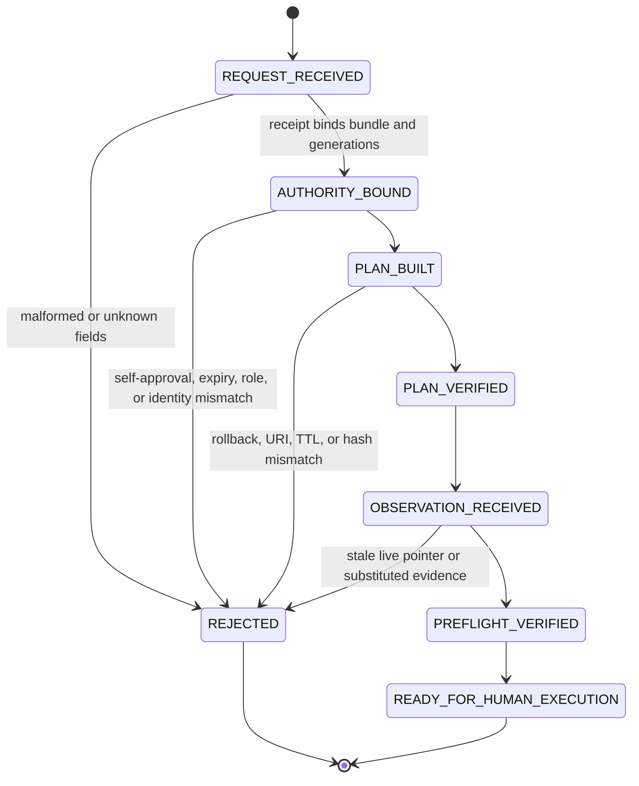
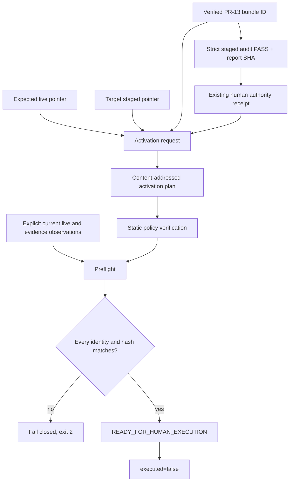

# Recovery activation plan and preflight

Status: **Implemented component / no activation side effect**  
Proposed slice: **PR-14**  
Parent: `feat/forensic-recovery-bundle` / PR-13  
Branch: `feat/recovery-activation-plan`

PR-13 can preserve a local evidence generation and reconstruct it into a new inactive directory. PR-14 adds the next safety boundary: an immutable activation plan that binds the expected live generation, audited staged generation, rollback pointer, approval decision, finite validity period, and explicit preflight observations.

This slice can report `READY_FOR_HUMAN_EXECUTION`. It cannot execute a live pointer change.

## 1. Directory ownership

```text
src/post_training_rsi/recovery_activation/
├── AGENTS.md       scoped authority and non-execution rules
├── __init__.py     public plan/preflight API
├── __main__.py     package-local build/verify/preflight CLI
├── contracts.py    exact schemas and content-bound records
└── planner.py      static policy verification and observation preflight

tests/
├── test_recovery_activation.py
└── test_recovery_activation_cli.py

docs/
└── recovery-activation-plan.md
```

| Module | State responsibility | Input | Output | Must not own |
|---|---|---|---|---|
| `contracts.py` | freeze plan, authority, pointer, evidence, and observation identity | strict JSON or typed values | immutable records | authentication or pointer mutation |
| `planner.py:verify_plan` | static authority/TTL/target checks | plan + local policy | verified plan | observing live state |
| `planner.py:run_preflight` | exact observation comparison | verified plan + explicit observations | `READY_FOR_HUMAN_EXECUTION` | activation |
| `__main__.py` | operator-facing plan-only commands | local JSON files | structured JSON and exit code | `activate`, `apply`, `switch`, or `resume` |

## 2. State Machine



There is deliberately no `ACTIVATE`, `APPLY`, `SWITCH`, `RESUME`, or `ACTIVE` state.

## 3. Data flow



The preflight result is evidence for a later human operation. It is not the operation itself.

## 4. Schemas

```text
post-training-rsi.recovery-activation-request/v1
post-training-rsi.recovery-authority-receipt/v1
post-training-rsi.recovery-activation-plan/v1
post-training-rsi.recovery-preflight/v1
post-training-rsi.recovery-preflight-report/v1
```

### Expected live, target, and rollback pointers

Each `RecoveryPointer` contains:

```text
generation_id
pointer_sha256
workspace_uri
```

The plan requires:

```text
target generation != expected live generation
rollback pointer == expected live pointer
target workspace URI == audited staged root URI
target workspace URI != expected live workspace URI
target pointer SHA != expected live pointer SHA
```

The reference contract accepts explicit non-network URIs such as `file://` or an organization-defined local scheme. It rejects `http://` and `https://` so the planning CLI cannot silently select a remote destination.

### Staged evidence

`StagedRecoveryEvidence` binds:

```text
bundle_id
bundle_verification_sha256
staged_root_uri
staged_audit_status == PASS
staged_audit_report_sha256
```

A bundle hash alone is insufficient. The exact staged copy must also have a strict semantic/integrity audit report.

### Authority receipt

`RecoveryAuthorityReceipt` represents an already-existing authority decision:

```text
request_id
decision_id
decision_sha256
recovery_ticket_id
requester_id
reviewer_id
reviewer_role
approved_bundle_id
expected_live_generation_id
target_generation_id
approved_at
expires_at
receipt_id
```

Hard rules:

```text
requester_id != reviewer_id
receipt_id == hash(canonical receipt identity payload)
approved bundle == staged bundle
expected/target generation IDs == plan expected/target IDs
approved_at < expires_at
plan creation does not predate approval
plan validity does not outlive the receipt
```

The package does not authenticate these identities. Production identity-provider, organization role, MFA, quorum, and ticket controls remain external and human-owned.

### Activation plan

The plan additionally binds:

```text
run_id
expected_live
target
rollback
staged_evidence
authority
created_at
valid_until
reason
non-secret metadata
plan_id
```

`plan_id` is deterministic over canonical identity bytes. Any pointer, evidence, authority, timestamp, reason, or metadata change creates a different plan identity.

## 5. Local policy

`RecoveryActivationPolicy` provides a local fail-closed layer:

```text
allowed reviewer-role set
maximum plan TTL
```

Defaults:

```text
reviewer roles:
  recovery-admin
  recovery-operator

maximum plan TTL:
  3600 seconds
```

The TTL policy is bounded to at most 24 hours in the reference implementation. A deployment may choose a shorter limit.

## 6. CLI

### Build a plan from an authorized request

```bash
python -m post_training_rsi.recovery_activation build \
  --request recovery/activation-request.json \
  --output recovery/activation-plan.json
```

The output file must not exist. The command writes it with create-exclusive semantics and never overwrites an earlier plan.

### Verify the static plan

```bash
python -m post_training_rsi.recovery_activation verify \
  --plan recovery/activation-plan.json
```

### Run preflight against explicit observations

```bash
python -m post_training_rsi.recovery_activation preflight \
  --plan recovery/activation-plan.json \
  --observation recovery/preflight-observation.json
```

Successful output contains:

```json
{
  "status": "READY_FOR_HUMAN_EXECUTION",
  "executed": false
}
```

The CLI has no `activate` command.

### Override local policy

```bash
python -m post_training_rsi.recovery_activation verify \
  --plan recovery/activation-plan.json \
  --allowed-reviewer-role recovery-admin \
  --max-plan-ttl-seconds 900
```

Supplying one or more `--allowed-reviewer-role` values replaces the default local allowlist for that invocation.

## 7. Preflight comparisons

`run_preflight` checks:

```text
observation.plan_id == plan.plan_id
created_at <= observation.as_of < valid_until
observation.as_of < authority.expires_at
current live pointer == expected live pointer
observed bundle ID == approved/staged bundle ID
observed bundle verification SHA == plan SHA
observed staged root URI == plan URI
observed strict audit report SHA == plan SHA
observed approval decision SHA == receipt decision SHA
observed target pointer SHA == target pointer SHA
```

Any mismatch fails closed. In particular, another writer advancing the live generation invalidates the plan through the expected-live compare-and-swap check.

## 8. Structured results and exit codes

```text
0  plan built, plan verified, or preflight ready
2  schema, authority, expiry, role, stale-pointer, evidence, or output conflict
```

Every success path reports `executed=false`. Errors are structured JSON and do not include artifact bytes.

## 9. Security and privacy boundary

Plan metadata rejects keys containing secret-like fragments such as:

```text
secret
token
password
credential
private_key
api_key
```

The plan must not contain:

- API keys or credentials;
- private model weights;
- raw private traces;
- hidden reasoning;
- encryption keys;
- remote destination credentials.

Plan files may still expose internal paths, generation IDs, reviewer IDs, and incident references. Do not transmit them to another provider without explicit data-and-destination authorization.

## 10. Human execution contract

A future, separate PR may consume a successful preflight report. That execution boundary must require at least:

```text
exact plan_id and plan SHA-256
exact authority receipt and immutable decision SHA-256
fresh expected-live compare-and-swap
single atomic external pointer update
immutable activation receipt
rollback pointer retention
strict post-switch audit
explicit writer-resume authorization
```

It must not reuse this package's CLI namespace to smuggle in a side effect. `READY_FOR_HUMAN_EXECUTION` remains a terminal state here.

## 11. Test matrix

```text
plan and receipt deterministic identity
exact JSON round trip
requester/reviewer separation
bundle and generation binding
rollback equality
reviewer-role policy
maximum TTL
staged URI binding
secret-like metadata rejection
network URI rejection
unknown-field and content tamper rejection
stale live pointer rejection
bundle/audit/decision/target substitution rejection
expiry
exclusive output preservation
structured exit code 2
absence of activate command
executed=false
```

Tests require no network, API key, cloud account, GPU, Docker daemon, identity provider, or mutable production service.

## 12. Stack metadata

```yaml
pr: 14
branch: feat/recovery-activation-plan
parent_pr: 13
parent_branch: feat/forensic-recovery-bundle
status: draft implemented component
allowed_paths:
  - src/post_training_rsi/recovery_activation/**
  - tests/test_recovery_activation.py
  - tests/test_recovery_activation_cli.py
  - tests/test_recovery_activation_manifest.py
  - docs/recovery-activation-plan.md
  - docs/recovery-activation-manifest.json
  - .github/workflows/recovery-activation-plan.yml
excluded_paths:
  - live pointer mutation
  - activate/apply/switch/resume commands
  - automatic recovery
  - approval decision creation
  - identity-provider integration
  - remote storage/encryption/retention
  - Git Town configuration
rollback_subject: remove the activation planning package, tests, workflow, and documentation
human_owned_operations:
  - approval identity authentication
  - recovery ticket authorization
  - strict staged audit
  - live compare-and-swap execution
  - activation receipt publication
  - rollback and writer resume
```

```text
PR #12  read-only audit/recovery diagnosis
└── PR #13  deterministic bundle and inactive staging
    └── PR #14  content-bound activation plan and preflight
```

Git Town remains unconfigured and fail closed.

## 13. Non-claims

This component does not establish:

- production activation;
- automatic repair or recovery;
- authenticated human identity;
- reviewer quorum or MFA;
- remote backup, encryption, retention, or legal hold;
- distributed writer exclusion;
- production RPO or RTO;
- production readiness.
