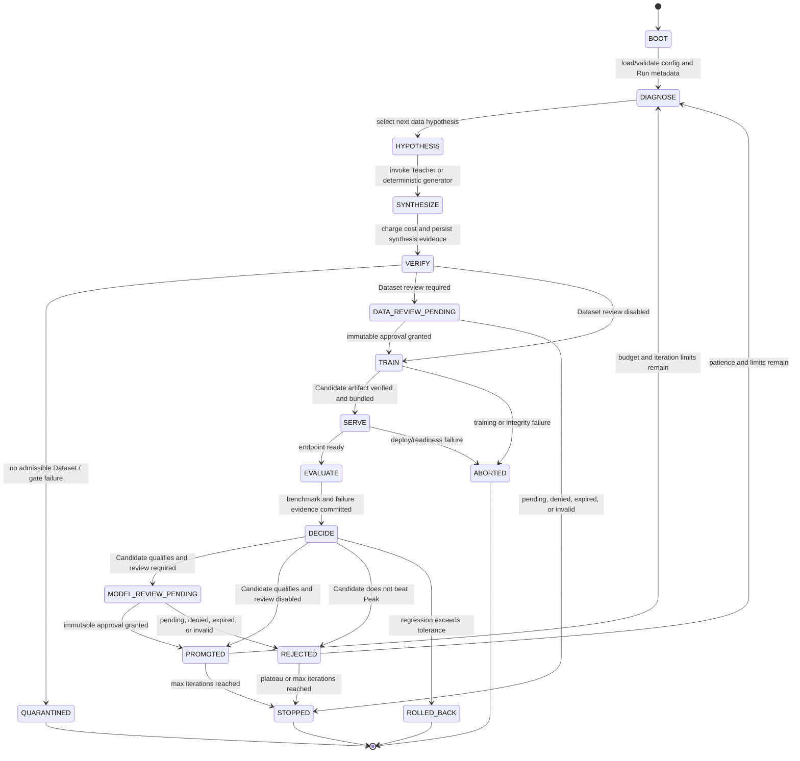
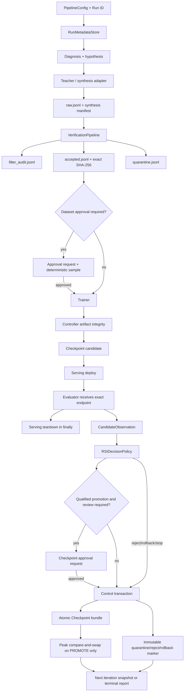

# Converged RSI runtime

Status: **supported on Draft PR #7 branch; not yet merged to `main`**

Branch: `feat/rsi-convergence`  
PR: `#7 feat: converge RSI runtime contracts`  
Validated code head before this documentation update: `ac334be8411f45196d2522c885ff893cb2d44fda`

This document describes the runtime composition that joins the independent control-plane, decision-policy, lineage, adapter, and approval components. It is the operational contract for the `rsi`, `verify`, `audit`, `approvals`, and `review` CLI paths on PR #7.

## 1. Composition boundary

PR #7 composes the following ownership domains without moving their policy responsibilities:

| Component | Owner | Convergence responsibility |
|---|---|---|
| Stable State/Event/Evidence schema | `control_plane/` | carry typed facts between stages |
| Peak/reject/rollback/stop policy | `orchestration/rsi_policy.py` | decide from an evaluated Candidate and current Peak |
| Runtime sequencing and resume | `orchestration/converged.py`, `run_state.py` | invoke stages, persist records, resume from durable state |
| Provider selection and lifecycle | `adapter_runtime/`, `synthesis/`, `training/`, `serving/`, `evaluation/` | execute bounded operations and return evidence |
| Dataset/Checkpoint/Harness review | `approval/` | require immutable, subject-bound human authority when enabled |
| Immutable records and artifacts | `lineage/` | commit control transactions, Checkpoint bundles, Peak CAS, quarantine |
| Data admission | `verification/` | accept or quarantine examples; never decide model quality |
| Cost accounting | `cost.py` | charge bounded stage cost; never promote a model |

The composition root must not reinterpret child-component semantics. For example, it may call the RSI decision policy, but it cannot weaken strict promotion from `>` to `>=`, bypass an approval, or update the Peak before the promotion transaction is durable.

## 2. Supported state machine



The state names come from `post-training-rsi.control/v1`. A state name existing in the enum is not by itself evidence that the runtime reached it; durable `TransitionRecord` and `StateSnapshot` records are the proof.

## 3. End-to-end data and evidence flow



Every policy-relevant edge must be backed by evidence that was committed before the edge references it. The control transaction marker is written last. Orphan record files left by an interrupted write are not considered committed.

## 4. Runtime invariants

The following invariants are release blockers:

```text
active_checkpoint_id == peak_checkpoint_id
candidate.parent_checkpoint_id == active_checkpoint_id
candidate_score > peak_score + min_improvement
```

Additional invariants:

- Equality at the improvement threshold is rejection.
- Rejected or rolled-back Candidates never become the next parent.
- A valid final-iteration improvement updates the Peak before the max-iteration stop record.
- Exact budget limits are allowed; crossing a limit aborts.
- Peak updates require a committed `PROMOTE` Decision targeting the same Checkpoint.
- Peak updates use compare-and-swap against the expected previous Checkpoint.
- Peak iteration cannot move backward and Peak score must increase strictly.
- Worker-reported artifact hashes are claims; the controller recomputes file or directory SHA-256.
- Dataset, Checkpoint, and Harness approvals are bound to Subject type, Subject ID, and Subject SHA-256.
- Missing, pending, denied, expired, malformed, unauthorized, or mismatched approvals fail closed.
- Serving teardown runs in `finally`; evaluation success does not hide teardown failure.
- A control record may not reference evidence from another Run or from a future iteration.
- Resume uses durable Run metadata, control transactions, StateSnapshots, and Peak state; process memory is not the source of truth.

## 5. CLI operations

### Compatibility demonstration

```bash
post-training-rsi \
  --config configs/pipeline.example.json \
  --workspace artifacts/demo \
  demo
```

This preserves the dependency-free one-pass demonstration. It is not the recursive controller.

### Run or resume RSI

```bash
post-training-rsi \
  --config configs/pipeline.example.json \
  --workspace artifacts/rsi \
  --run-id run-local-001 \
  rsi
```

Reusing the same `workspace` and `run-id` requests a deterministic resume. A mismatched immutable Run configuration fails closed rather than silently continuing a different experiment under the same identity.

### Verify a Dataset

```bash
post-training-rsi \
  --config configs/pipeline.example.json \
  --workspace artifacts/verify \
  verify \
  --input examples.jsonl \
  --iteration 1
```

The command writes the standard iteration bundle and returns accepted count, rejected count, rejection reasons, exact accepted-Dataset hash, and filter-config hash.

### Audit a Checkpoint

```bash
post-training-rsi \
  --workspace artifacts/rsi \
  audit \
  --checkpoint-id <checkpoint-id>
```

The audit reloads and verifies the Checkpoint bundle, referenced control transaction, lineage manifest, and current Peak relationship, then writes a regression-audit report.

### List approval requests

```bash
post-training-rsi \
  --config configs/pipeline.example.json \
  --workspace artifacts/rsi \
  approvals
```

Include completed requests:

```bash
post-training-rsi \
  --config configs/pipeline.example.json \
  --workspace artifacts/rsi \
  approvals \
  --include-decided
```

### Review an immutable request

```bash
post-training-rsi \
  --config configs/pipeline.example.json \
  --workspace artifacts/rsi \
  review \
  --request-id <request-id> \
  --expected-request-sha256 <sha256> \
  --approve \
  --reviewer reviewer-001 \
  --role release-manager \
  --reason "Sample, verification evidence, and task-family scores reviewed."
```

Use `--deny` instead of `--approve` for a rejection. A second decision with different bytes conflicts; an exact replay is idempotent.

## 6. Artifact layout

```text
<workspace>/
├── run/
│   └── run-metadata.json
├── iterations/
│   └── iter-001/
│       ├── raw.jsonl
│       ├── accepted.jsonl
│       ├── quarantine.jsonl
│       ├── filter_audit.jsonl
│       ├── synthesis_manifest.json
│       └── dataset_summary.json
├── control/
│   ├── evidence/<evidence-id>.json
│   ├── decisions/<decision-id>.json
│   ├── transitions/<transition-id>.json
│   ├── snapshots/<snapshot-id>.json
│   └── transactions/<transaction-id>.json
├── checkpoints/
│   └── <checkpoint-id>/
│       ├── checkpoint.json
│       ├── lineage_manifest.json
│       └── bundle_manifest.json
├── peak_checkpoint.json
├── peak_history/
│   └── iter-<N>-<checkpoint-id>.json
├── quarantine/
│   └── iter-<N>-<subject-type>-<subject-id>.json
├── approvals/
│   ├── samples/
│   ├── requests/
│   └── decisions/
├── adapter-runtime/
│   └── <adapter>/<idempotency-hash>/
│       ├── request.json
│       ├── response.json
│       ├── output/
│       └── commit.json
└── reports/
    ├── rsi-run-summary.json
    └── regression-audit-<checkpoint-id>.json
```

Some subdirectory names are owned by their component schemas. Agents must inspect the component store before changing a path and update migration, documentation, and tests in the same PR.

## 7. Failure and resume semantics

| Failure | Durable result | Resume behavior |
|---|---|---|
| No accepted data | verification/quarantine evidence and terminal reason | does not train |
| Dataset approval pending | immutable request and pending state | resumes only after a matching Decision exists |
| Training failure | provider/integrity evidence and abort reason | does not invent a Checkpoint |
| Serving failure | deploy evidence/failure; teardown attempted when applicable | does not evaluate or promote |
| Evaluation failure | evaluation failure evidence; teardown attempted | does not call promotion policy with missing score |
| Candidate rejection | Decision, Transition, Snapshot, quarantine marker | Peak and parent remain unchanged |
| Regression rollback | rollback Decision and marker | accepted Peak remains active; run terminates according to policy |
| Checkpoint approval pending/denied | immutable approval evidence | Candidate cannot update Peak |
| Interrupted record write | possible immutable orphan files, no transaction marker | orphan files are not committed evidence |
| Stale writer Peak update | compare-and-swap conflict | caller reloads current Peak; no overwrite |
| Configuration mismatch on resume | fail-closed error | requires a new Run ID or explicit human migration |

Stale-lock recovery, reviewer identity integration, production credential provisioning, and destructive artifact retention are human-owned operations.

## 8. Validation evidence

The repair-and-validation workflow for code head `ac334be8411f45196d2522c885ff893cb2d44fda` completed:

```text
compileall
Ruff
mypy
full pytest with coverage gate
compatibility demo smoke
converged RSI smoke
Checkpoint audit smoke
```

The ordinary PR CI run created by a bot-authored repair commit required workflow approval and started no jobs. This is an Actions permission state, not proof of code failure. A later human/connector-authored documentation commit should trigger a normal PR run; the PR remains Draft until the exact current head has a normal green check set.

## 9. Remaining production gaps

PR #7 does not claim that the following have been run or production-certified:

- real Teacher API credentials or rate-limit behavior;
- real TRL/DeepSpeed SFT or DPO on a GPU provider;
- real vLLM/SGLang deployment and teardown;
- Inspect AI or lm-eval task suites against a live endpoint;
- remote DVC, lakeFS, MLflow, or object-store transactions;
- distributed locks, multi-region writers, disaster recovery, or retention enforcement;
- enterprise identity provider, MFA, reviewer quorum, or separation of duties;
- production secret manager and network egress policy;
- Model/Harness Co-Evolution outer/middle/inner loop convergence.

Those gaps belong to later molecular PRs. They must not be hidden behind a generic “production ready” label.
