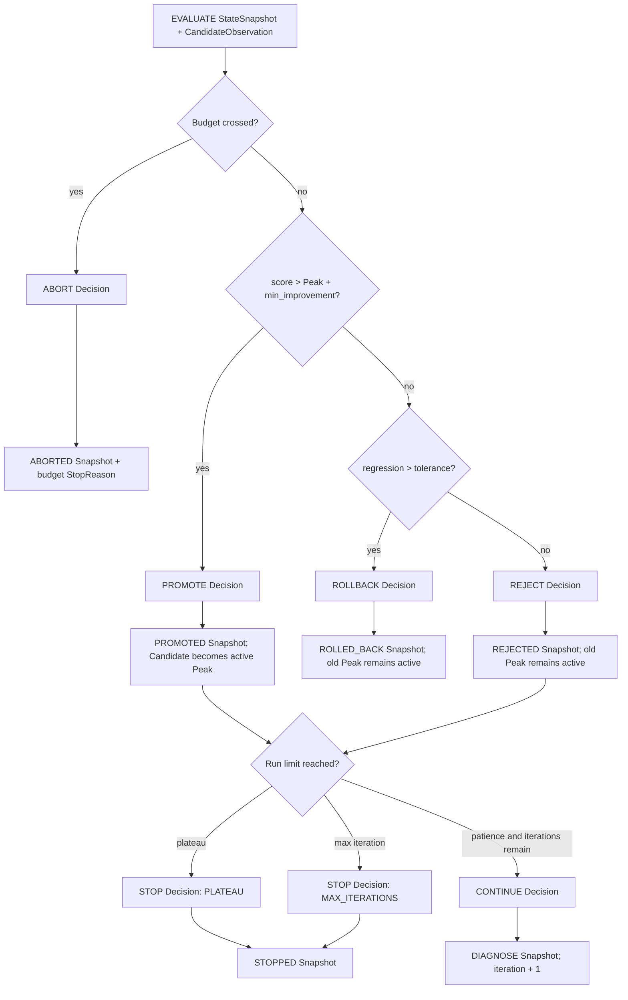

# RSI candidate decision policy

Status: **Implemented component / not wired to the supported runtime** on PR #3.

`src/post_training_rsi/orchestration/rsi_policy.py` implements the pure decision boundary after a Candidate Checkpoint has been trained, served, and evaluated. It consumes a schema-v1 `StateSnapshot` in `EVALUATE`, a `CandidateObservation`, and hard policy limits. It emits ordered schema-v1 Decisions, Transitions, and Snapshots without calling providers or mutating persistence.

## Ownership boundary

```text
Evaluator / cost evidence
        ↓
CandidateObservation
        ↓
RSIDecisionPolicy
        ├── DecisionRecord
        ├── TransitionRecord
        └── StateSnapshot
        ↓
PR-04 persistence / PR-07 runtime convergence
```

This component owns:

- strict historical Peak comparison;
- parent and active-Peak invariants;
- promotion, rejection, and regression rollback Decisions;
- plateau and maximum-iteration termination;
- per-iteration and total-budget termination;
- Candidate-scoped deterministic IDs for idempotent replay;
- one paired Decision, Transition, and Snapshot per policy edge.

It does not own:

- diagnose, hypothesis, synthesis, verification, training, serving, or evaluation execution;
- provider selection or retry transport;
- approval storage or reviewer authority;
- artifact/control-record persistence;
- CLI commands;
- Harness mutation or trace harvesting.

## Input contracts

### `RSIPolicyLimits`

```text
max_iterations
plateau_patience
min_improvement
regression_tolerance
per_iteration_budget_usd
total_budget_usd
```

Iteration/patience and budgets are positive. Numeric values are finite and non-negative where applicable. Per-iteration budget cannot exceed total budget. `from_config()` maps existing `RSIConfig` and `BudgetConfig` values while accepting explicit regression tolerance.

### `CandidateObservation`

```text
checkpoint_id
parent_checkpoint_id
iteration
score
iteration_cost_usd
evaluated_at
evidence_ids
```

The observation requires finite score/cost values, timezone-aware time, safe IDs, at least one evidence ID, and a Candidate that is not its own parent.

### Required `StateSnapshot`

The input Snapshot must:

- be in `ControlState.EVALUATE`;
- have the same iteration as the observation;
- have `active_checkpoint_id == peak_checkpoint_id`;
- identify the same Candidate Checkpoint when already populated;
- have a finite existing `peak_score`;
- identify the Candidate parent as the active accepted Checkpoint.

Any mismatch raises `PolicyInvariantError`; policy does not guess or repair lineage.

## Decision precedence

The policy applies these checks in order:

1. per-iteration budget crossing;
2. total-budget crossing;
3. strict Peak improvement;
4. regression beyond tolerance;
5. ordinary rejection;
6. plateau stop after the Candidate Decision;
7. maximum-iteration stop after the Candidate Decision;
8. continue to the next `DIAGNOSE` iteration.

Budget crossing aborts before promotion policy. Regression rollback is terminal. Plateau takes precedence over maximum iteration when both become true on one rejected trial.

## State and evidence flow



## Strict Peak rule

```text
candidate_score > peak_score + min_improvement
```

Equality is rejection. This preserves the requirement that the latest Checkpoint is not automatically the Peak.

A final-iteration Candidate may first update the Peak and then emit a separate maximum-iteration stop record. Both facts remain auditable.

## Parent invariant

```text
candidate.parent_checkpoint_id == current.active_checkpoint_id
current.active_checkpoint_id == current.peak_checkpoint_id
```

A rejected Candidate never becomes active or a future parent. A rollback Snapshot retains the previous active/Peak identifiers and records the regressed Candidate separately.

## Budget semantics

Exact limits are allowed. The policy aborts only after crossing a boundary by more than the numeric tolerance shared with `CostLedger`:

```text
iteration_cost > per_iteration_limit + epsilon
run_total > total_limit + epsilon
```

The terminal Snapshot records the observed attempted total and explicit per-iteration or total-budget `StopReason`. Upstream adapters and the ledger remain responsible for preventing avoidable spend before this post-evaluation boundary.

## Record pairing and replay

Every policy edge has a one-to-one record triple:

```text
DecisionRecord.decision_id
  == TransitionRecord.decision_id
  == StateSnapshot.metadata.decision_id
```

All three records share one Run ID. Invalid pairings fail during `RSIPolicyStep` construction.

Decision, Transition, Snapshot, and idempotency IDs are derived from:

```text
run_id + iteration + target phase + record type + candidate checkpoint identity
```

The same validated input produces identical records. Different Candidates in the same iteration produce different IDs, preventing accidental idempotency collisions. PR-04 must still enforce atomic, immutable persistence and replay comparison.

## Test matrix

`tests/test_rsi_policy.py` covers:

```text
strict promote boundary
boundary equality rejection
reject + plateau increment
plateau stop
final-iteration promote then stop
regression rollback
per-iteration budget abort
total-budget abort
exact budget allowed
Candidate-parent invariant
active-is-Peak invariant
State/iteration mismatch
canonical record round trip
Candidate-scoped record/idempotency identity
invalid limits, missing evidence, and self-parent inputs
```

The supported `demo` still uses `RSIEngine` and does not call this policy. PR-07 owns runtime composition after lineage, adapter, and approval siblings converge.
