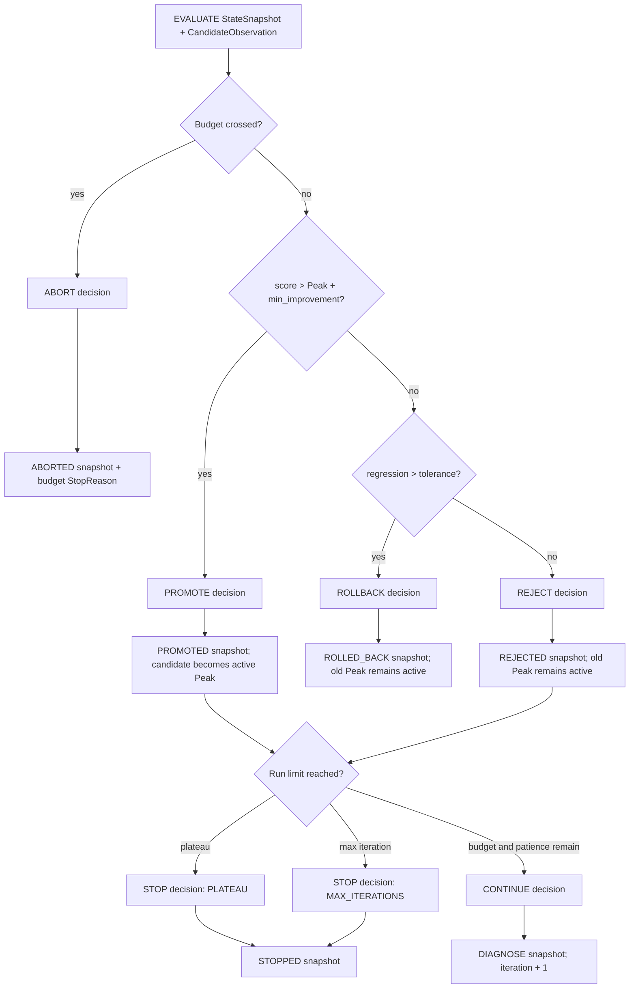

# RSI candidate decision policy

Status: **Implemented component / not wired to the supported runtime** on PR #3.

`src/post_training_rsi/orchestration/rsi_policy.py` implements the pure decision boundary after a candidate Checkpoint has been trained, served, and evaluated. It consumes a schema-v1 `StateSnapshot` in `EVALUATE`, a `CandidateObservation`, and hard policy limits. It emits ordered schema-v1 decisions, transitions, and snapshots without calling providers or mutating persistence.

## Ownership boundary

```text
Evaluator / cost evidence
        ↓
CandidateObservation
        ↓
RSIDecisionPolicy
        ├── DecisionRecord
        ├── TransitionRecord
        └── StateSnapshot
        ↓
PR-04 persistence / PR-07 runtime convergence
```

This component owns:

- strict historical Peak comparison;
- parent and active-Peak invariants;
- promotion, rejection, and regression rollback decisions;
- plateau and maximum-iteration termination;
- per-iteration and total-budget termination;
- deterministic record IDs for idempotent replay;
- one decision, transition, and snapshot per policy edge.

It does not own:

- diagnose, hypothesis, synthesis, verification, training, serving, or evaluation execution;
- provider selection or retries;
- approval storage or reviewer authority;
- artifact/control-record persistence;
- CLI commands;
- Harness mutation or trace harvesting.

## Input contracts

### `RSIPolicyLimits`

```text
max_iterations
plateau_patience
min_improvement
regression_tolerance
per_iteration_budget_usd
total_budget_usd
```

All limits are finite and non-negative where applicable. Iteration/patience and budgets are positive; the per-iteration budget cannot exceed the total budget. `from_config()` maps the existing `RSIConfig` and `BudgetConfig` values while accepting an explicit regression tolerance.

### `CandidateObservation`

```text
checkpoint_id
parent_checkpoint_id
iteration
score
iteration_cost_usd
evaluated_at
evidence_ids
```

The observation requires finite score/cost values, a timezone-aware timestamp, safe IDs, at least one evidence ID, and a candidate that is not its own parent.

### Required `StateSnapshot`

The input snapshot must:

- be in `ControlState.EVALUATE`;
- have the same iteration as the observation;
- have `active_checkpoint_id == peak_checkpoint_id`;
- identify the same candidate Checkpoint when the snapshot already carries one;
- have a finite existing `peak_score`;
- identify the candidate parent as the active accepted Checkpoint.

Any mismatch raises `PolicyInvariantError`; policy does not guess or repair lineage.

## Decision precedence

The policy applies these checks in order:

1. per-iteration budget crossing;
2. total budget crossing;
3. strict Peak improvement;
4. regression beyond tolerance;
5. ordinary rejection;
6. plateau stop after the candidate decision;
7. maximum-iteration stop after the candidate decision;
8. continue to the next `DIAGNOSE` iteration.

Budget crossing aborts before promotion policy. Regression rollback is terminal. Plateau takes precedence over the maximum-iteration reason when both become true on the same rejected trial.

## State and evidence flow



## Strict Peak rule

Promotion is intentionally strict:

```text
candidate_score > peak_score + min_improvement
```

Equality is rejection. This prevents floating-point boundary ambiguity and preserves the architecture requirement that the latest Checkpoint is not automatically the Peak.

A final-iteration candidate may first update the Peak and then emit a separate maximum-iteration stop record. This preserves both facts instead of discarding a valid improvement merely because the run boundary was reached.

## Parent invariant

```text
candidate.parent_checkpoint_id == current.active_checkpoint_id
current.active_checkpoint_id == current.peak_checkpoint_id
```

A rejected candidate never becomes active and never becomes a future parent. A rollback snapshot retains the previous active/Peak identifiers and records the regressed candidate separately.

## Budget semantics

Exact limits are allowed. The policy aborts only when a boundary is crossed by more than a small numeric tolerance aligned with `CostLedger`:

```text
iteration_cost > per_iteration_limit + epsilon
run_total > total_limit + epsilon
```

The terminal snapshot records the observed attempted total and the explicit per-iteration or total-budget `StopReason`.

## Determinism and replay

Decision, transition, state-snapshot, and idempotency IDs are derived from:

```text
run_id + iteration + target phase + record type
```

The same validated input produces identical records. This makes controller retries compare/replay safe; PR-04 must still enforce atomic, immutable persistence.

## Test matrix

`tests/test_rsi_policy.py` covers:

```text
strict promote boundary
reject + plateau increment
plateau stop
final-iteration promote then stop
regression rollback
per-iteration budget abort
total budget abort
exact budget allowed
candidate-parent invariant
active-is-Peak invariant
state/iteration mismatch
canonical record round trip
invalid limit and observation inputs
```

The supported `demo` still uses `RSIEngine` and does not call this policy. PR-07 is responsible for runtime composition after lineage, adapter, and approval siblings converge.
