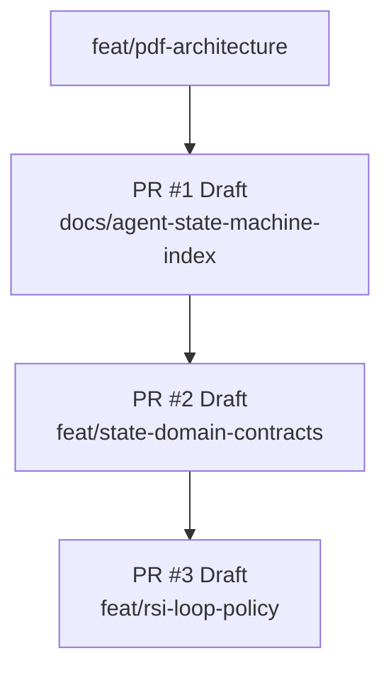
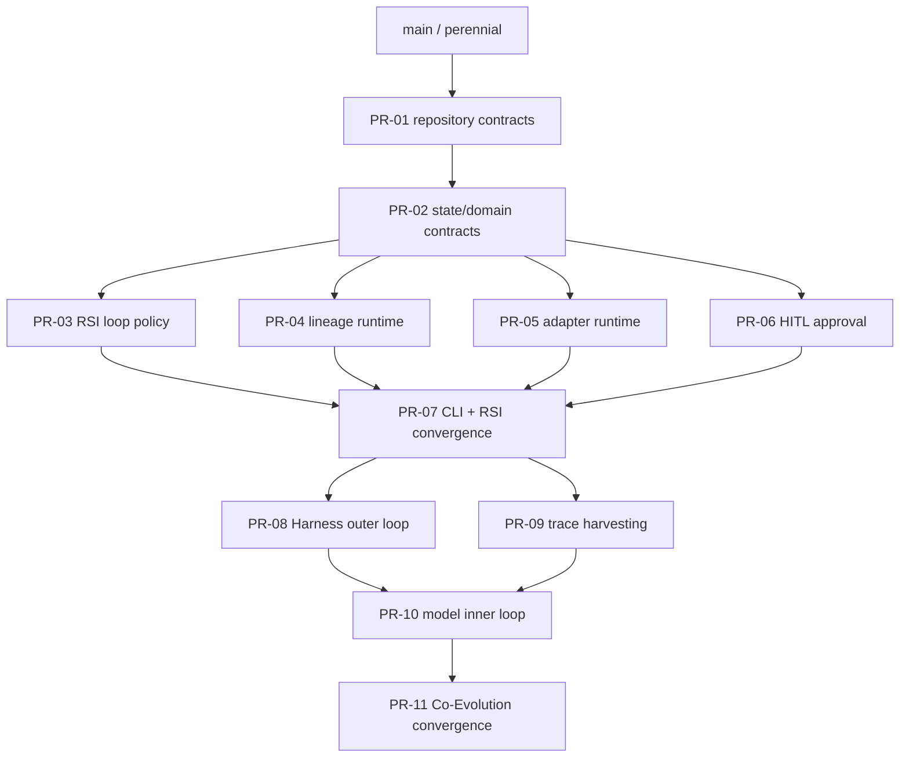

# Molecular stacked PR plan

## Git Town admission status

**State: NOT CONFIGURED / FAIL CLOSED.**

No Git Town repository configuration, exact version pin, complete verified parent graph, isolated worktree evidence, dry-run rehearsal, or active stack manifest exists. The branches below are ordinary GitHub parent/child PRs plus a review/merge plan, not an executable Git Town stack.

Git Town may be enabled only after all gates pass:

- exact Git Town version is pinned and recorded;
- repository config is committed and reviewed;
- perennial branch and every parent relationship are verified, not inferred;
- each branch has an isolated linked worktree and an owner lease;
- automation is non-interactive and cannot auto-resolve conflicts;
- a dry-run/no-push rehearsal succeeds;
- `stack.tsv` contains real verified rows rather than guessed hierarchy;
- semantic conflicts stop for human resolution.

Until then, agents use ordinary Git/GitHub operations and keep stack metadata descriptive only.

## Active ordinary GitHub stack



| PR | Base | Head | Status | Outcome |
|---|---|---|---|---|
| `#1` | `feat/pdf-architecture` | `docs/agent-state-machine-index` | Draft | Agent contracts, Current/Target separation, directory/state/data-flow map, traceability, molecular plan |
| `#2` | `docs/agent-state-machine-index` | `feat/state-domain-contracts` | Draft | Freeze `post-training-rsi.control/v1` State/Event/Stop/Decision/Evidence records and strict schema tests |
| `#3` | `feat/state-domain-contracts` | `feat/rsi-loop-policy` | Draft | Pure strict-Peak candidate policy: promote/reject/rollback/plateau/max-iteration/budget with schema-v1 records |

These parent relationships are verified for ordinary GitHub review. They do not satisfy the remaining Git Town admission gates.

## Preferred full graph



PR-04, PR-05, and PR-06 should branch from PR #2, not PR #3, because they are path-disjoint siblings. PR-07 and PR-11 are convergence PRs with one owner each.

## Frozen foundation from PR #2

Successor PRs import and preserve:

```text
post-training-rsi.control/v1
ControlState
ControlEvent
StopReason
DecisionAction
DecisionSubject
EvidenceKind
EvidenceRecord
DecisionRecord
StateSnapshot
TransitionRecord
```

PR #2 owns representation and strict serialization only. It does not own adjacency, score thresholds, approval storage, persistence, providers, CLI composition, or Harness behavior.

## Implemented policy boundary from PR #3

PR #3 owns only the evaluated-candidate boundary:

```text
EVALUATE
  -> PROMOTED -> DIAGNOSE | STOPPED(MAX_ITERATIONS)
  -> REJECTED -> DIAGNOSE | STOPPED(PLATEAU/MAX_ITERATIONS)
  -> ROLLED_BACK(REGRESSION_ROLLBACK)
  -> ABORTED(PER_ITERATION_BUDGET_EXCEEDED/TOTAL_BUDGET_EXCEEDED)
```

Frozen PR #3 semantics:

- strict promotion: `candidate_score > peak_score + min_improvement`;
- equality is rejection;
- active accepted Checkpoint equals historical Peak;
- candidate parent equals active accepted Checkpoint;
- rejected/rolled-back candidates never replace active or Peak;
- regression tolerance is explicit input;
- exact budget limits are allowed; crossing aborts;
- plateau precedes max-iteration reason when both arise on one rejected trial;
- a valid final-iteration improvement is recorded before the stop record;
- every edge emits one Decision, Transition, and State Snapshot with evidence IDs;
- no provider, persistence, approval, CLI, or Harness side effect occurs in the policy module.

PR-04 persists these records; PR-05 produces upstream adapter evidence; PR-06 may interpose approval states; PR-07 composes the full supported loop.

## PR index

| PR ID / branch | Base | Independently reviewable outcome | Allowed paths | Required gates | Merge dependency |
|---|---|---|---|---|---|
| `PR-01` `docs/agent-state-machine-index` | `feat/pdf-architecture` | Add AGENTS, current truth, state/data-flow map, traceability, fail-closed plan | `AGENTS.md`, `README.md`, `docs/**`, scoped AGENTS | links, claims match code/CLI, CI | none |
| `PR-02` `feat/state-domain-contracts` | `PR-01` | Freeze schema-v1 State/Event/Stop/Decision/Evidence/Snapshot/Transition facts | `control_plane/**`, `test_control_plane.py`, AGENTS/README/docs | canonical/fail-closed schema tests, Ruff, full CI | PR-01 |
| `PR-03` `feat/rsi-loop-policy` | `PR-02` | Implement pure strict-Peak candidate decision and bounded continuation/termination policy | `orchestration/**`, `test_rsi_policy.py`, synchronized AGENTS/README/docs | promote/reject/rollback/plateau/max/budget/parent/round-trip matrix | PR-02 |
| `PR-04` `feat/lineage-runtime` | `PR-02` | Persist schema-v1 records plus checkpoint/manifest/Peak/quarantine atomically | `lineage/**`, store tests, scoped docs | record/artifact round-trip, parent/hash/atomicity/replay invariants | PR-02 |
| `PR-05` `feat/adapter-runtime` | `PR-02` | Strict adapter selection, idempotency, artifact integrity, endpoint handoff/teardown, adapter-to-evidence translation | config + synthesis/training/evaluation/serving + tests | stale/mismatch/path-escape/timeout/teardown fixtures | PR-02 |
| `PR-06` `feat/hitl-approval` | `PR-02` | Immutable fail-closed Dataset/Model/Harness approval request/decision store | approval module/config/tests | pending/deny/malformed/replay/path/evidence tests | PR-02 |
| `PR-07` `feat/rsi-convergence` | `PR-03` plus merged siblings | Wire supported `verify`, `audit`, and RSI commands; reconcile policy, persistence, adapters, approval | CLI/runtime composition, E2E tests, docs | full CI + smoke + exact control/evidence assertions | PR-03/04/05/06 |
| `PR-08` `feat/harness-outer-loop` | `PR-07` | Trace-driven candidate mutation, static validation, benchmark selection, plateau | Harness mutation tests/docs | accept/reject/plateau and no implicit Git mutation | PR-07 |
| `PR-09` `feat/trace-harvesting` | `PR-07` | Convert successful observable traces into verified training records | trace/verification adapters/tests | target-count, rejection, dataset-hash/evidence tests | PR-07 |
| `PR-10` `feat/model-inner-loop` | `PR-08` plus `PR-09` | Train/evaluate model from harvested traces; promote or rollback | Co-Evolution controller/tests | model comparison, parent/lineage/control records, rollback | PR-08/09 |
| `PR-11` `feat/coevolution-convergence` | `PR-10` | Add `coevolve`, hot-swap/slim/reset, bounded cycles, complete evidence graph | CLI/runtime integration/docs/E2E | full CI, cycle stop, teardown, HITL gates | PR-10 |

## Parallelism and collision rules

- PR #2 owns shared schemas. Descendants consume but do not redefine them.
- PR #3 owns evaluated-candidate policy and must not absorb persistence/provider/approval code.
- PR-04 owns persistence mechanics but not model-quality decisions.
- PR-05 owns provider transport and evidence translation but not orchestration policy.
- PR-06 owns approval storage/validation but not score thresholds.
- PR-04 through PR-06 branch from PR #2 and may proceed as path-disjoint siblings while PR #3 remains its own child.
- PR-07 is the sole RSI convergence owner.
- PR-08 owns Harness mutation/selection; PR-09 owns trace extraction/verification.
- PR-11 is the sole outer/middle/inner convergence owner.

High-collision files require one named owner per convergence window:

```text
AGENTS.md
README.md
docs/README.md
docs/implementation-status.md
docs/state-machine.md
docs/control-plane-contracts.md
docs/rsi-loop-policy.md
docs/traceability-index.md
docs/stacked-pr-plan.md
src/post_training_rsi/__main__.py
src/post_training_rsi/config.py
```

Sibling implementation PRs should avoid editing shared docs concurrently where possible. They may add scoped evidence documents; the convergence owner performs the final synchronized rewrite.

## Required PR metadata

Every PR body includes:

```text
Parent:
Children:
Merge order:
Allowed paths:
Excluded paths:
Collision paths:
Rebase owner:
Required evals:
Evidence produced:
Evidence boundary:
Rollback subject:
Human-owned operations:
```

## Merge and rebase procedure

1. Keep each child targeted at its actual unmerged parent.
2. Wait for required CI on the exact head SHA.
3. Merge the parent before retargeting/rebasing descendants.
4. Rebase only by the named owner; never force-push a shared branch without coordination.
5. Re-run full CI after parent movement, conflict resolution, schema change, or convergence composition.
6. Do not mark a PR ready merely because its parent is mergeable; its own evidence boundary must be satisfied.
7. Revert the smallest independently reviewable PR when rollback is required; do not rewrite published history.

## Active stack manifest

There is no active Git Town stack. Do not execute stack commands from this plan. Once every admission gate passes, create a machine-readable `stack.tsv` with verified values for:

```text
branch	parent	pr	owner	status	allowed_paths	collision_paths	rebase_owner	required_gates
```

Until then, PR #1 → PR #2 → PR #3 is an ordinary GitHub stack only.
