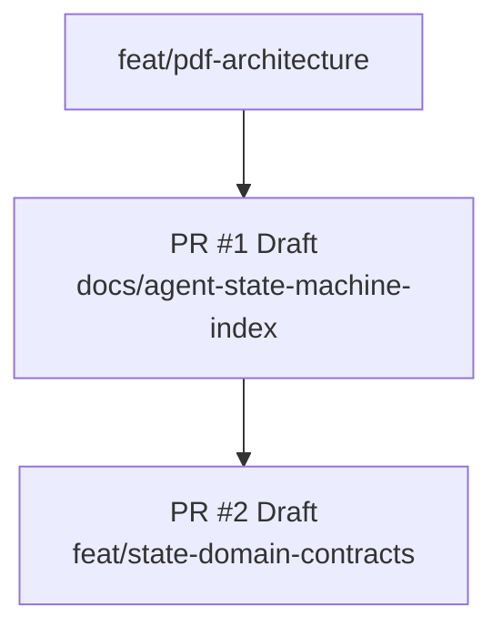
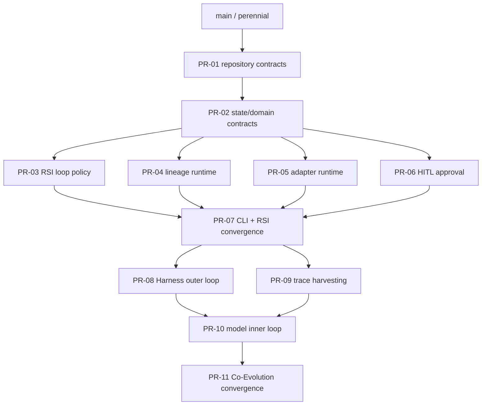

# Molecular stacked PR plan

## Git Town admission status

**State: NOT CONFIGURED / FAIL CLOSED.**

No Git Town repository configuration, exact version pin, verified parent graph, isolated worktree evidence, dry-run rehearsal, or active stack manifest exists. The branch names below are a review/merge plan, not an executable Git Town stack.

Git Town may be enabled only after all gates pass:

- exact Git Town version is pinned and recorded;
- repository config is committed and reviewed;
- perennial branch and each parent relationship are verified, not inferred;
- each branch has an isolated linked worktree and an owner lease;
- automation is non-interactive and cannot auto-resolve conflicts;
- a dry-run/no-push rehearsal succeeds;
- `stack.tsv` contains real verified rows rather than guessed hierarchy;
- semantic conflicts stop for human resolution.

Until then, agents must use ordinary Git/GitHub operations and keep stack metadata descriptive only.

## Active ordinary GitHub stack



| PR | Base | Head | Status | Outcome |
|---|---|---|---|---|
| `#1` | `feat/pdf-architecture` | `docs/agent-state-machine-index` | Draft | Agent contracts, Current/Target truth separation, directory/state/data-flow map, traceability, molecular plan |
| `#2` | `docs/agent-state-machine-index` | `feat/state-domain-contracts` | Draft | Freeze `post-training-rsi.control/v1` state/event/stop/decision/evidence contracts and deterministic schema tests |

This verified parent relationship is recorded for ordinary GitHub review. It does not satisfy the remaining Git Town admission gates.

## Preferred full graph



Sibling PRs are independent only after PR #2 freezes shared interfaces. PR-07 and PR-11 are convergence PRs with one owner each.

## Frozen foundation from PR #2

Successor PRs must import and preserve:

```text
post-training-rsi.control/v1
ControlState
ControlEvent
StopReason
DecisionAction
DecisionSubject
EvidenceKind
EvidenceRecord
DecisionRecord
StateSnapshot
TransitionRecord
```

PR #2 owns representation and strict serialization only. It deliberately does not own:

- legal transition adjacency;
- promotion/rollback score thresholds;
- approval storage or reviewer authority;
- artifact persistence and atomic Peak transactions;
- provider SDK/process invocation;
- CLI composition;
- Harness mutation or trace harvesting behavior.

An incompatible change after successor adoption requires a new schema version, an explicit migration plan, and re-review of all descendants.

## PR index

| PR ID / branch | Base | Independently reviewable outcome | Allowed paths | Required gates | Merge dependency |
|---|---|---|---|---|---|
| `PR-01` `docs/agent-state-machine-index` | `feat/pdf-architecture` | Add AGENTS, current-state truth, state/data-flow map, traceability, fail-closed stack plan | `AGENTS.md`, `README.md`, `docs/**`, scoped `AGENTS.md` | link check, claims match code/CLI, CI | none |
| `PR-02` `feat/state-domain-contracts` | `PR-01` | Freeze schema-v1 states, events, stop reasons, decisions, evidence, snapshots, and transition facts without runtime/provider changes | `src/post_training_rsi/control_plane/**`, `tests/test_control_plane.py`, `AGENTS.md`, `README.md`, `docs/**` | canonical round-trip, malformed/schema/hash/time/cost/evidence tests, mypy, ruff, full CI | PR-01 |
| `PR-03` `feat/rsi-loop-policy` | `PR-02` | Multi-iteration diagnose/hypothesis/Peak/rollback/plateau policy using shared control records | orchestration/engine policy and focused tests; synchronized docs | promote/reject/rollback/plateau/budget E2E | PR-02 |
| `PR-04` `feat/lineage-runtime` | `PR-02` | Persist schema-v1 records plus checkpoint/manifest/Peak/quarantine atomically | `lineage/**`, store integration tests; synchronized docs | artifact/control-record round-trip, parent/hash/atomicity invariants | PR-02 |
| `PR-05` `feat/adapter-runtime` | `PR-02` | Strict adapter selection, idempotency, artifact integrity, endpoint handoff/teardown, and adapter-to-evidence translation | `config.py`, `synthesis/**`, `training/**`, `evaluation/**`, `serving/**`, tests; synchronized docs | command fixtures, stale/mismatch/path-escape/timeout/teardown tests | PR-02 |
| `PR-06` `feat/hitl-approval` | `PR-02` | Immutable fail-closed Dataset/Model/Harness approval request/decision store using shared decision/evidence semantics | new approval module, config, tests; synchronized docs | pending/deny/malformed/replay/path/evidence tests | PR-02 |
| `PR-07` `feat/rsi-convergence` | `PR-03` plus merged siblings | Wire supported `verify`, `audit`, and RSI commands; reconcile policy, persistence, adapters, and approval | CLI/runtime composition, E2E tests, docs | full CI + smoke + exact control/evidence assertions | PR-03/04/05/06 |
| `PR-08` `feat/harness-outer-loop` | `PR-07` | Trace-driven candidate mutation, static validation, benchmark selection, plateau state | `harness/mutator*`, Harness tests; synchronized docs | accept/reject/plateau and no implicit Git mutation | PR-07 |
| `PR-09` `feat/trace-harvesting` | `PR-07` | Convert successful observable traces into verified training records | `harness/trace*`, verification adapters, tests; synchronized docs | target-count, rejection, dataset-hash/evidence tests | PR-07 |
| `PR-10` `feat/model-inner-loop` | `PR-08` plus `PR-09` | Train/evaluate candidate model from harvested traces; promote or rollback | Co-Evolution controller and tests; synchronized docs | model comparison, parent/lineage/control records, rollback | PR-08/09 |
| `PR-11` `feat/coevolution-convergence` | `PR-10` | Add `coevolve`, hot-swap/slim/reset, bounded cycles, complete evidence graph | CLI/runtime integration, docs, E2E | full CI, cycle stop, teardown, HITL gates | PR-10 |

## Parallelism and collision rules

- PR #2 owns shared state/event/stop/action/subject/evidence enums and record schemas. Descendants consume but do not redefine them.
- PR-03 owns RSI adjacency, promotion, rollback, and stop policy.
- PR-04 owns persistence mechanics but not quality decisions.
- PR-05 owns provider process/transport contracts and evidence translation but not orchestration policy.
- PR-06 owns approval storage and validation but not score thresholds.
- PR-03 through PR-06 may proceed as path-disjoint siblings only after PR #2 is stable.
- PR-07 has the only authority to reconcile sibling composition.
- PR-08 owns Harness mutation/selection; PR-09 owns trace extraction/verification.
- PR-11 has the only authority to reconcile outer/middle/inner Co-Evolution loops.

High-collision files require one named owner per convergence window:

```text
AGENTS.md
README.md
docs/README.md
docs/implementation-status.md
docs/state-machine.md
docs/control-plane-contracts.md
docs/traceability-index.md
docs/stacked-pr-plan.md
src/post_training_rsi/__main__.py
src/post_training_rsi/config.py
```

Sibling implementation PRs should avoid editing shared docs concurrently when possible. They may add scoped evidence notes; the convergence owner performs the final synchronized rewrite.

## Required PR metadata

Every PR body must include:

```text
Parent:
Children:
Merge order:
Allowed paths:
Excluded paths:
Collision paths:
Rebase owner:
Required evals:
Evidence produced:
Evidence boundary:
Rollback subject:
Human-owned operations:
```

## Merge and rebase procedure

1. Keep each child PR targeted at its real unmerged parent.
2. Wait for required CI on the exact head SHA.
3. Merge the parent before retargeting/rebasing descendants.
4. Rebase only by the named rebase owner; never force-push a shared branch without coordination.
5. Re-run full CI after parent movement, conflict resolution, schema change, or convergence composition.
6. Do not mark a PR ready merely because its parent is mergeable; its own evidence boundary must be satisfied.
7. Revert the smallest independently reviewable PR when rollback is required; do not rewrite published history.

## Active stack manifest

There is no active Git Town stack. Do not populate or execute stack commands from this plan. Once all admission gates pass, create a machine-readable `stack.tsv` with verified values for:

```text
branch	parent	pr	owner	status	allowed_paths	collision_paths	rebase_owner	required_gates
```

At that point, the manifest must use actual PR numbers and verified parents. Until then, PR #1 and PR #2 remain an ordinary GitHub parent/child stack only.
