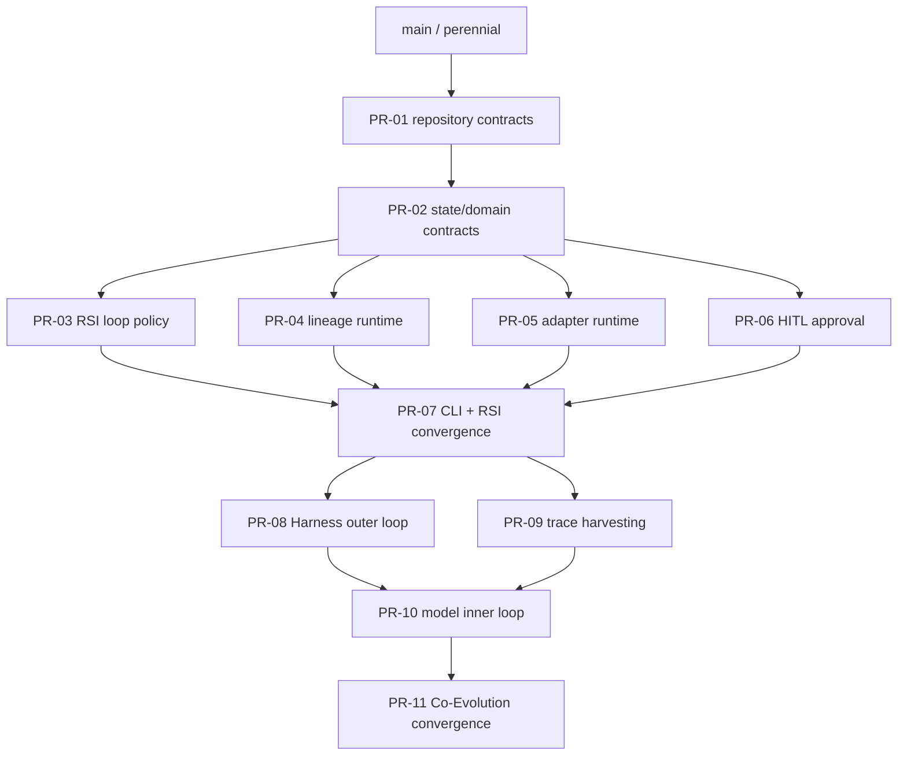

# Molecular stacked PR plan

## Git Town admission status

**State: NOT CONFIGURED / FAIL CLOSED.**

No Git Town repository configuration, exact version pin, parent graph, isolated worktree evidence, or active stack manifest exists on the baseline branch. The branch names below are a review/merge plan, not an active Git Town stack.

Git Town may be enabled only after all gates pass:

- exact Git Town version is pinned and recorded;
- repository config is committed and reviewed;
- perennial branch and each parent relationship are verified, not inferred;
- each branch has an isolated linked worktree and an owner lease;
- automation is non-interactive and cannot auto-resolve conflicts;
- a dry-run/no-push rehearsal succeeds;
- `stack.tsv` contains real verified rows rather than guessed hierarchy;
- semantic conflicts stop for human resolution.

Until then, agents must use ordinary Git/GitHub operations and keep stack metadata descriptive only.

## Preferred graph



Sibling PRs are independent only after `PR-02` freezes shared interfaces. `PR-07` and `PR-11` are convergence PRs with one owner each.

## PR index

| PR ID / proposed branch | Base | Independently reviewable outcome | Allowed paths | Required gates | Merge dependency |
|---|---|---|---|---|---|
| `PR-01` `docs/repository-contracts` | `feat/pdf-architecture` | Add AGENTS, current-state truth, state/data-flow map, traceability, fail-closed stack plan | `AGENTS.md`, `README.md`, `docs/**` | link check, claims match code/CLI | none |
| `PR-02` `feat/state-domain-contracts` | `PR-01` | Define typed states, events, stop reasons, decision/evidence records without changing providers | `models.py` or new `domain.py`, transition tests | mypy, deterministic serialization tests | PR-01 |
| `PR-03` `feat/rsi-loop-policy` | `PR-02` | Multi-iteration diagnose/hypothesis/peak/rollback/plateau policy | orchestration/engine policy and focused tests | promotion/rejection/rollback/plateau E2E | PR-02 |
| `PR-04` `feat/lineage-runtime` | `PR-02` | Connect checkpoint/manifest/peak/quarantine persistence atomically | `lineage/**`, store integration tests | artifact round-trip, parent/hash invariants | PR-02 |
| `PR-05` `feat/adapter-runtime` | `PR-02` | Strict adapter selection, idempotency, artifact integrity, endpoint handoff and teardown | `config.py`, `synthesis/**`, `training/**`, `evaluation/**`, `serving/**` | command fixtures, stale/mismatch/path-escape tests | PR-02 |
| `PR-06` `feat/hitl-approval` | `PR-02` | Immutable fail-closed Dataset/Model/Harness approval request/decision store | new approval module, config, tests | pending/deny/malformed/replay/path tests | PR-02 |
| `PR-07` `feat/rsi-convergence` | `PR-03` plus merged siblings | Wire supported `verify`, `audit`, and RSI commands and reconcile all contracts | CLI/runtime composition, E2E tests, docs | full CI + smoke + evidence assertions | PR-03/04/05/06 |
| `PR-08` `feat/harness-outer-loop` | `PR-07` | Trace-driven candidate mutation, static validation, benchmark selection, plateau state | `harness/mutator*`, harness tests | accept/reject/plateau and no implicit Git mutation | PR-07 |
| `PR-09` `feat/trace-harvesting` | `PR-07` | Convert successful observable traces into verified training records | `harness/trace*`, verification adapters, tests | target-count, rejection, dataset-hash tests | PR-07 |
| `PR-10` `feat/model-inner-loop` | `PR-08` plus `PR-09` | Train/evaluate candidate model from harvested traces; promote or rollback | co-evolution controller and tests | model comparison, parent/lineage, rollback | PR-08/09 |
| `PR-11` `feat/coevolution-convergence` | `PR-10` | Add `coevolve`, hot-swap/slim/reset, bounded cycles, complete evidence graph | CLI/runtime integration, docs, E2E | full CI, cycle stop, teardown, HITL gates | PR-10 |

## Collision and ownership rules

- `PR-02` owns shared state/event interfaces. Siblings consume but do not redefine them.
- `PR-03` owns promotion and stop policy.
- `PR-04` owns persistence mechanics but not quality decisions.
- `PR-05` owns provider process/transport contracts but not orchestration policy.
- `PR-06` owns approval storage and validation but not score thresholds.
- `PR-07` has the only authority to reconcile sibling composition.
- `PR-11` has the only authority to reconcile outer/middle/inner co-evolution loops.

## Required PR metadata

Every PR body must include:

```text
Parent:
Children:
Merge order:
Allowed paths:
Excluded paths:
Collision paths:
Rebase owner:
Required evals:
Evidence produced:
Rollback subject:
Human-owned operations:
```

## Active stack manifest

There is no active Git Town stack. Do not populate or execute stack commands from this plan. Once admitted, create a machine-readable `stack.tsv` with verified values for:

```text
branch	parent	pr	owner	status	allowed_paths	collision_paths	rebase_owner	required_gates
```
