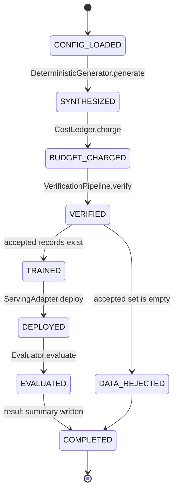
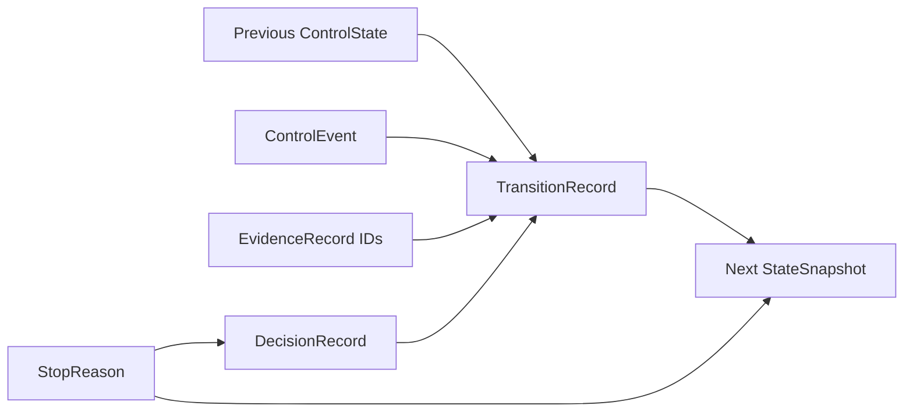
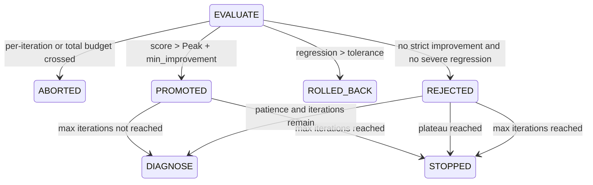
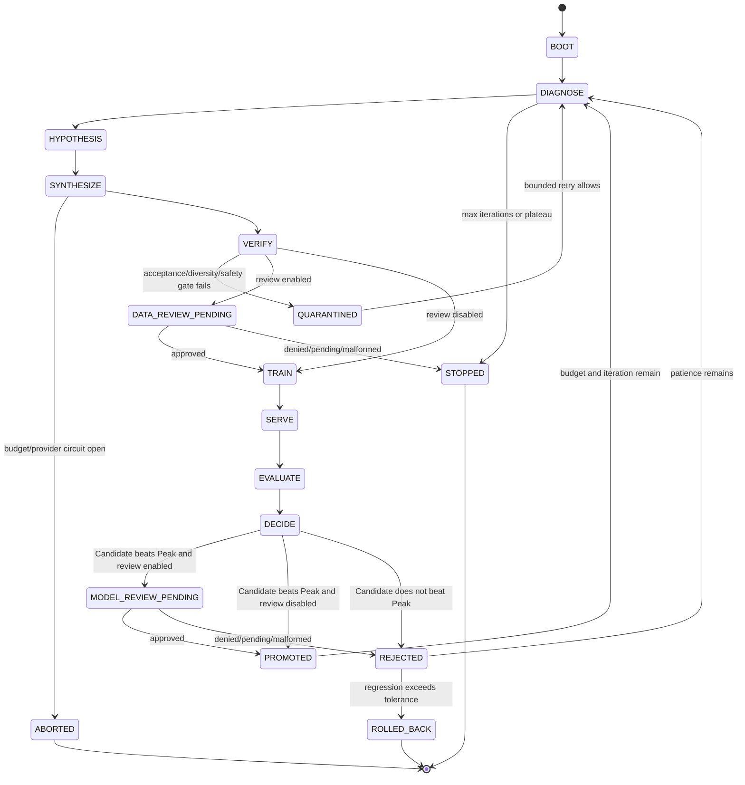
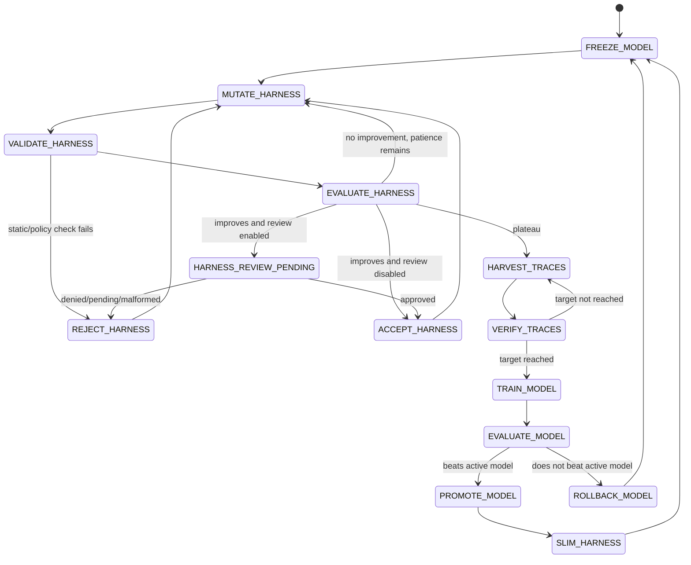
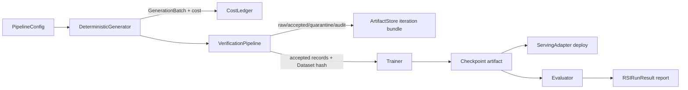
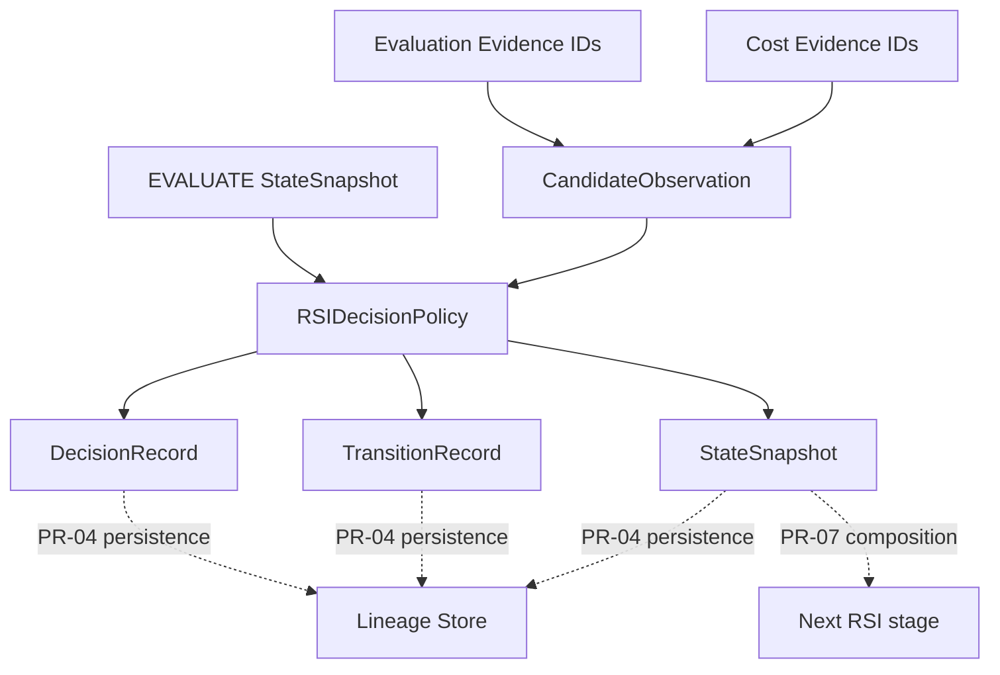
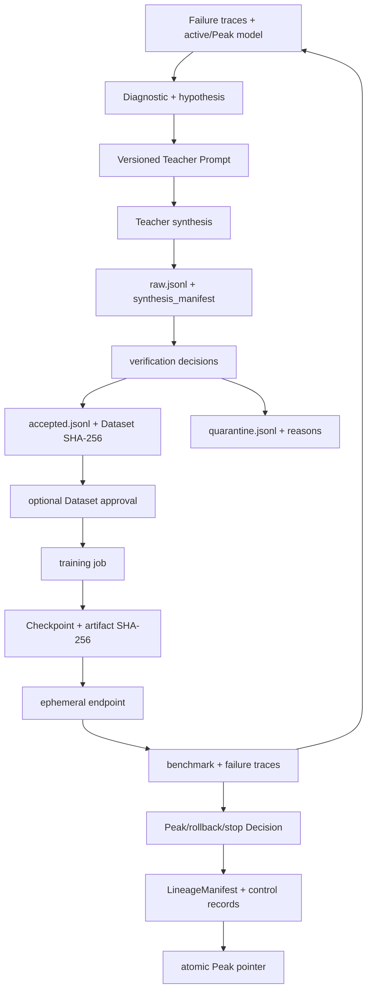

# State-machine ownership and data flow

This document distinguishes four layers:

1. the **current executable State Machine** reached by the supported `demo` command;
2. the **versioned control-plane contract** introduced by PR #2;
3. the **implemented but unwired Candidate decision boundary** introduced by PR #3;
4. the **target RSI and Model/Harness Co-Evolution State Machines** derived from the source architecture.

A State name, record schema, or isolated policy test is not proof that the supported runtime reaches that State.

## 1. Current executable State Machine



### Current transition table

| State | Owner | Input | Guard | Output/evidence | Missing behavior |
|---|---|---|---|---|---|
| `CONFIG_LOADED` | `config.py`, `__main__.py` | JSON config/defaults | numeric validation | `PipelineConfig` | unknown config fields are not rejected |
| `SYNTHESIZED` | `generation.py` | hard-coded hypothesis/count/iteration | none | `GenerationBatch`, synthesis manifest | production Teacher is not selected |
| `BUDGET_CHARGED` | `cost.py` | generation estimate | per-iteration and total caps | ledger event | trainer/evaluator/serving costs are not composed |
| `VERIFIED` | `verification/pipeline.py` | synthetic records | exact, lexical, semantic, benchmark, safety, AST checks | accepted, quarantine, one `VerificationRecord` per input | configured minimum acceptance rate is not enforced by `RSIEngine` |
| `DATA_REJECTED` | `engine.py` | empty accepted set | `not verification.accepted` | legacy `IterationOutcome` | no retry, hypothesis update, or schema-v1 terminal reason |
| `TRAINED` | `training/adapter.py` | accepted JSONL/hash | non-empty Dataset | Checkpoint artifact, `TrainingResult` | parent is always `None` in supported runtime |
| `DEPLOYED` | `serving/adapter.py` | Checkpoint | adapter readiness | endpoint string | endpoint is not supplied to evaluator; no teardown |
| `EVALUATED` | `evaluation/adapter.py` | Checkpoint | finite score assumed | metrics and failure traces | supported runtime does not call strict Peak policy |
| `COMPLETED` | `engine.py`, `lineage/store.py` | one outcome | none | run summary | schema-v1 records, manifest, and Peak pointer are not persisted |

The reachable engine still uses legacy dataclasses and free-form string statuses.

## 2. Versioned control-plane contract

Status: **Contract only** in the supported runtime.

`src/post_training_rsi/control_plane/` freezes the shared language used by later controllers, adapters, approvals, and lineage persistence:



Schema:

```text
post-training-rsi.control/v1
```

### Enum ownership

| Enum | Owns | Does not own |
|---|---|---|
| `ControlState` | exact current, target RSI, and target Co-Evolution State names | reachability or legal adjacency |
| `ControlEvent` | facts that may request transitions | policy sufficiency or side effects |
| `StopReason` | finite terminal taxonomy | free-form diagnosis |
| `DecisionAction` | continue, request approval, accept, promote, reject, quarantine, rollback, stop, abort | thresholds and authority |
| `DecisionSubject` | Run, Dataset, Checkpoint, Harness, Trace Batch, Serving Endpoint | storage location |
| `EvidenceKind` | stable evidence categories | provider payload format |

### Record ownership

| Record | Required content | Fail-closed rule |
|---|---|---|
| `EvidenceRecord` | producer, kind, URI, timestamp, optional SHA-256, JSON metadata | exact fields/schema/type; invalid ID/hash/time/JSON rejected |
| `DecisionRecord` | subject, action, reason, evidence IDs, optional stop reason | at least one evidence ID; STOP/ABORT require a stop reason |
| `StateSnapshot` | State, iteration/cycle, active/Candidate/Peak IDs, scores, counters, cost, evidence IDs | terminal States require stop reason; non-terminal States reject one |
| `TransitionRecord` | previous State, Event, next State, idempotency key, Decision/evidence IDs | only START may omit previous State; every transition requires evidence |

The contract rejects unknown fields, unsupported schemas, unsafe identifiers, duplicate evidence IDs, NaN/infinity, negative counters/costs, malformed timestamps, and non-JSON metadata. JSON is canonicalized for hash/replay comparison.

The contract does not validate adjacency. Ownership is split across PR #3, PR-04/05/06, PR-07, and the later Co-Evolution PRs. See [`control-plane-contracts.md`](control-plane-contracts.md).

## 3. Implemented Candidate decision boundary

Status: **Implemented component / not composed into `RSIEngine`**.

Entry point:

```text
src/post_training_rsi/orchestration/rsi_policy.py
```

Entry State and inputs:

```text
StateSnapshot(state=EVALUATE)
CandidateObservation(
  checkpoint_id,
  parent_checkpoint_id,
  iteration,
  score,
  iteration_cost_usd,
  evaluated_at,
  evidence_ids
)
RSIPolicyLimits(
  max_iterations,
  plateau_patience,
  min_improvement,
  regression_tolerance,
  per_iteration_budget_usd,
  total_budget_usd
)
```

### Implemented State graph



### Entry guards

| Guard | Failure behavior |
|---|---|
| current State is `EVALUATE` | `PolicyInvariantError` |
| Snapshot and Candidate iteration match | `PolicyInvariantError` |
| `active_checkpoint_id == peak_checkpoint_id` | `PolicyInvariantError` |
| Candidate parent equals active accepted Checkpoint | `PolicyInvariantError` |
| Candidate ID matches Snapshot Candidate when supplied | `PolicyInvariantError` |
| existing finite `peak_score` | `PolicyInvariantError` |
| finite score/cost, safe IDs, timezone-aware timestamp, evidence IDs | input validation error |

### Decision precedence

The policy evaluates branches in this order:

1. per-iteration budget crossing;
2. total-budget crossing;
3. strict Peak improvement;
4. regression beyond tolerance;
5. ordinary rejection;
6. plateau stop after Candidate outcome;
7. maximum-iteration stop after Candidate outcome;
8. continue to the next `DIAGNOSE` iteration.

When plateau and maximum iteration become true on the same rejected trial, `PLATEAU` is the terminal reason. This precedence is explicit and tested.

### Strict Peak and parent rules

```text
candidate_score > peak_score + min_improvement
candidate.parent_checkpoint_id == active_checkpoint_id
active_checkpoint_id == peak_checkpoint_id
```

Equality at the score boundary is rejection. A rejected or rolled-back Candidate never changes active/Peak IDs. A valid final-iteration improvement first emits `PROMOTED`, updates Peak, then emits `STOPPED(MAX_ITERATIONS)`.

### Output records per edge

Each policy edge emits exactly one paired set:

```text
DecisionRecord
TransitionRecord(decision_id=<paired Decision>)
StateSnapshot(metadata.decision_id=<paired Decision>)
```

A promotion/rejection may then emit a second paired Run-level set for `CONTINUE` or `STOP`. Record IDs and idempotency keys include Run, iteration, target phase, record type, and Candidate identity. Replaying the same input yields the same records; different Candidates in the same iteration yield different IDs.

### Implemented transition table

| From | Event | To | Decision | StopReason | Active/Peak effect |
|---|---|---|---|---|---|
| `EVALUATE` | `BUDGET_EXCEEDED` | `ABORTED` | `ABORT` | per-iteration or total budget | unchanged |
| `EVALUATE` | `CANDIDATE_IMPROVED` | `PROMOTED` | `PROMOTE` | none | Candidate becomes active Peak |
| `EVALUATE` | `REGRESSION_DETECTED` | `ROLLED_BACK` | `ROLLBACK` | `REGRESSION_ROLLBACK` | previous Peak remains active |
| `EVALUATE` | `CANDIDATE_NOT_IMPROVED` | `REJECTED` | `REJECT` | none | previous Peak remains active |
| `PROMOTED` or `REJECTED` | `NEXT_ITERATION_REQUESTED` | `DIAGNOSE` | `CONTINUE` | none | accepted Peak preserved; Candidate working fields cleared |
| `REJECTED` | `PLATEAU_REACHED` | `STOPPED` | `STOP` | `PLATEAU` | previous Peak retained |
| `PROMOTED` or `REJECTED` | `MAX_ITERATIONS_REACHED` | `STOPPED` | `STOP` | `MAX_ITERATIONS` | current accepted Peak retained |

The supported CLI does not reach this graph yet. PR-04 owns persistence; PR-05 owns upstream adapter evidence; PR-06 owns approval interruption; PR-07 owns supported composition. See [`rsi-loop-policy.md`](rsi-loop-policy.md).

## 4. Target five-stage RSI State Machine



### Target State ownership

| State | Intended owner | Required evidence |
|---|---|---|
| `DIAGNOSE` | orchestration + evaluator traces | diagnostic report, task-family regressions, active/Peak IDs |
| `HYPOTHESIS` | orchestration policy | versioned hypothesis and Prompt hash |
| `SYNTHESIZE` | `synthesis/` | Teacher model/API, request ID, Prompt hash, token/cost usage |
| `VERIFY` | `verification/` | one immutable decision per input, metrics, reject reason |
| `DATA_REVIEW_PENDING` | approval module | content-addressed request and deterministic sample |
| `TRAIN` | `training/` | Dataset hash, parent ID, idempotency key, artifact hash, final loss |
| `SERVE` | `serving/` | deployment/endpoint/readiness and teardown result |
| `EVALUATE` | `evaluation/` | aggregate/task-family scores, failure traces, eval Run ID |
| `DECIDE` | orchestration | Peak before/after, score delta, Decision reason, stop counters |
| `PROMOTED` | orchestration + lineage | atomic Peak pointer and complete lineage |
| `REJECTED` | orchestration + lineage | immutable reason; accepted parent unchanged |
| `QUARANTINED` | verification + lineage | Dataset state and root-cause link |
| `ROLLED_BACK` | orchestration + serving | rollback target, endpoint transition, audit report |
| `STOPPED` / `ABORTED` | orchestration + cost | terminal reason and complete ledger snapshot |

The implemented PR #3 boundary is a subset of `EVALUATE`/`DECIDE` outcomes. Dataset review, Model review, provider circuit, and full stage composition remain outside it.

## 5. Target Model/Harness Co-Evolution State Machine



The control vocabulary contains these names, but the repository does not implement this outer/middle/inner loop. `src/post_training_rsi/harness/` remains a placeholder.

## 6. Directory-to-State map

```text
configs/                                      BOOT policy inputs
src/post_training_rsi/config.py               CONFIG_LOADED / CONFIG_REJECTED
src/post_training_rsi/control_plane/          shared State/Event/Stop/Decision/Evidence representation
src/post_training_rsi/orchestration/          pure adjacency and policy components
src/post_training_rsi/orchestration/rsi_policy.py
                                              EVALUATE → PROMOTED/REJECTED/ROLLED_BACK/ABORTED
                                              PROMOTED/REJECTED → DIAGNOSE/STOPPED
src/post_training_rsi/models.py               current data/result payloads
src/post_training_rsi/engine.py               current supported transition coordinator
src/post_training_rsi/generation.py           current SYNTHESIZED fixture
src/post_training_rsi/synthesis/              target SYNTHESIZE provider boundary
src/post_training_rsi/verification/           VERIFIED / QUARANTINED
src/post_training_rsi/training/               TRAINED
src/post_training_rsi/serving/                DEPLOYED; target SERVE + TEARDOWN
src/post_training_rsi/evaluation/             EVALUATED and failure evidence
src/post_training_rsi/lineage/                current artifacts; target control/Peak persistence
src/post_training_rsi/harness/                target MUTATE/HARVEST States
tests/test_control_plane.py                   schema serialization and fail-closed evidence
tests/test_rsi_policy.py                      Peak/parent/rollback/stop/idempotency evidence
tests/                                        current runtime and adapter assertions
docs/                                         current/component/target traceability
```

`control_plane/` owns representation. `orchestration/` owns policy. Neither owns provider SDK internals or persistence side effects.

## 7. End-to-end data and record flow

### Current supported flow



### Implemented Candidate policy flow



### Target complete evidence flow



## 8. Cross-State invariants

- Every synthesized input receives exactly one verification record.
- Dataset hash covers the exact accepted bytes used by training.
- Active accepted Checkpoint equals historical Peak unless an explicit migration/rollback transaction says otherwise.
- Candidate parent is the active accepted Checkpoint.
- Rejected and rolled-back Candidates never become parents.
- Promotion is strict: `candidate_score > peak_score + min_improvement` plus any required approval.
- A final-iteration valid promotion is preserved before stopping.
- Exact budget limits are allowed; crossed limits abort with evidence.
- Quarantine, rejection, rollback, and stop are durable facts, not deletion.
- Every cross-module Decision/transition references durable evidence IDs.
- Adapter retries are bounded and idempotent.
- Serving teardown runs even when evaluation fails.
- Shared semantics use `post-training-rsi.control/v1`; sibling modules do not create alternate taxonomies.
- Unknown fields, unsupported schemas, malformed evidence, and missing approvals fail closed.
- A contract value or isolated component is not runtime reachability evidence.
