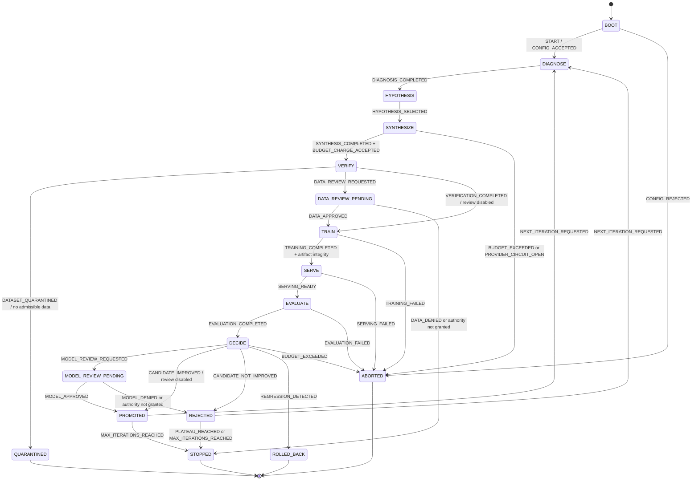
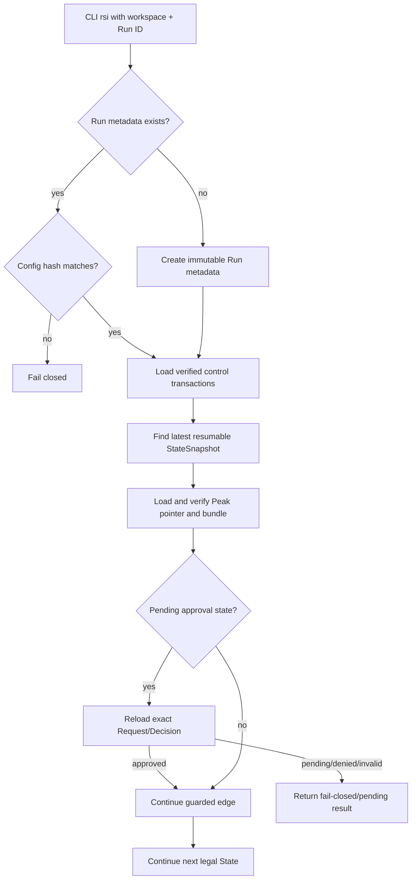
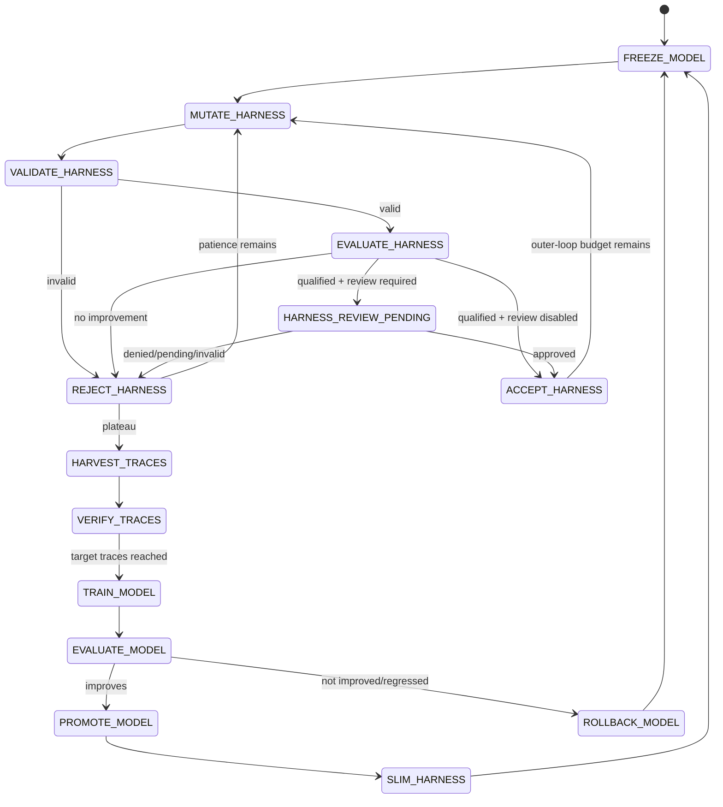

# State Machine contract

Status: **supported on Draft PR #7 branch; Co-Evolution remains target**  
Schema: `post-training-rsi.control/v1`  
Validated code head before the latest documentation commits: `ac334be8411f45196d2522c885ff893cb2d44fda`

This document defines State ownership, transition guards, evidence requirements, terminal precedence, and resume behavior. It does not grant provider, approval, or persistence modules authority to make quality decisions.

## 1. Record model

Every policy-relevant edge is represented by:

```text
EvidenceRecord(s)
  → DecisionRecord
  → TransitionRecord
  → StateSnapshot
  → ControlTransactionManifest written last
```

Not every transition needs a human Decision, but every transition requires durable evidence IDs. A `DecisionRecord` owns the selected action and reason; a `TransitionRecord` owns the edge; a `StateSnapshot` owns the resulting serializable state.

A file under `control/evidence`, `control/decisions`, `control/transitions`, or `control/snapshots` is not committed until a transaction manifest references and verifies it.

## 2. Supported RSI state graph



Implementation may record intermediate component-specific facts, but it must not invent unsupported adjacency. A new edge requires code, tests, documentation, and traceability updates.

## 3. State ownership table

| State | Entry owner | Required evidence | Exit authority |
|---|---|---|---|
| `BOOT` | CLI/composition root | config source/defaults, Run ID | strict config and Run metadata validation |
| `DIAGNOSE` | converged orchestrator | previous scores/failures/Peak IDs | diagnosis completion |
| `HYPOTHESIS` | converged orchestrator | versioned hypothesis record | selected hypothesis |
| `SYNTHESIZE` | synthesis/adapter runtime | Teacher model/API/prompt hash, request/token/cost facts | successful bounded result and budget acceptance |
| `VERIFY` | verification pipeline | raw Dataset, gate audit, accepted/quarantine hashes | admission result only |
| `QUARANTINED` | decision + lineage marker | verification evidence and reason | terminal for that Dataset/Candidate path |
| `DATA_REVIEW_PENDING` | approval service | exact Dataset subject/hash, sample, request | matching immutable human Decision |
| `TRAIN` | trainer/adapter runtime | approved/allowed Dataset hash and parent Checkpoint | successful artifact + controller integrity |
| `SERVE` | serving lifecycle | Checkpoint/artifact identity and deploy result | readiness or failure; teardown remains required |
| `EVALUATE` | evaluator | exact endpoint/Checkpoint/benchmark identity | finite score and failure evidence |
| `DECIDE` | RSI decision policy | EVALUATE Snapshot + CandidateObservation | promote/reject/rollback/abort/continue/stop records |
| `MODEL_REVIEW_PENDING` | approval service | exact Checkpoint subject/hash, evaluation evidence | matching immutable human Decision |
| `PROMOTED` | policy + lineage | committed `PROMOTE` Decision and verified bundle | Peak CAS, then next iteration or stop |
| `REJECTED` | policy + lineage | committed `REJECT` Decision | Peak unchanged; marker + next iteration/stop |
| `ROLLED_BACK` | policy + lineage | committed `ROLLBACK` Decision | accepted Peak remains active; terminal according to policy |
| `STOPPED` | policy | explicit terminal Decision and StopReason | terminal |
| `ABORTED` | composition/policy | failure/budget/circuit evidence and StopReason | terminal |

## 4. Transition guards

### 4.1 BOOT and Run identity

`BOOT → DIAGNOSE` requires:

```text
strict config validation passed
Run ID is valid
Run metadata absent and created atomically
  OR existing Run metadata matches immutable config hash
```

A reused Run ID with a different immutable configuration fails closed. It does not create a new experiment under the old identity.

### 4.2 Synthesis and budget

`SYNTHESIZE → VERIFY` requires:

```text
bounded Teacher/generator result
synthesis manifest
request/token/cost evidence
accepted cost charge
provider circuit closed
```

Per-iteration and total budgets allow equality and reject only an actual crossing, subject to numeric epsilon rules in the policy.

### 4.3 Verification admission

`VERIFY → TRAIN` requires:

```text
at least one accepted record
acceptance/diversity/safety/contamination policy satisfied
accepted.jsonl written
accepted Dataset SHA-256 computed from exact bytes
Dataset review disabled or approved
```

`VerificationPipeline` may admit or quarantine data. It may not promote a model.

### 4.4 Dataset review

`DATA_REVIEW_PENDING → TRAIN` requires an Approval Decision matching:

```text
Request SHA-256
Run ID
iteration
Subject type = DATASET
Subject ID
current Subject SHA-256
requested action
reviewer role
review deadline
```

Missing, pending, denied, expired, malformed, unauthorized, stale-hash, or cross-Subject review does not grant authority.

### 4.5 Training and artifact integrity

`TRAIN → SERVE` requires:

```text
Trainer result echoes Model, parent Checkpoint, Dataset hash, and iteration
artifact path exists
path is allowed and not a symlink
controller recomputes file/directory SHA-256
optional worker hash matches
Checkpoint candidate metadata is finite and valid
```

A Worker path or hash is evidence to verify, not a trust anchor.

### 4.6 Serving and evaluation

`SERVE → EVALUATE` requires endpoint readiness. The exact endpoint returned by deployment is passed to evaluation.

Teardown is attempted in `finally` after deployment, including evaluation failure. If evaluation and teardown both fail, preserve the evaluation failure and attach teardown failure evidence/note; if only teardown fails, teardown failure propagates.

`EVALUATE → DECIDE` requires a finite score inside the configured evaluator range plus durable evaluation evidence. Missing or non-finite score cannot be converted to an ordinary rejection.

### 4.7 Candidate decision

The policy input must satisfy:

```text
current.state == EVALUATE
current.iteration == candidate.iteration
current.active_checkpoint_id == current.peak_checkpoint_id
candidate.parent_checkpoint_id == current.active_checkpoint_id
current.candidate_checkpoint_id is null or equals candidate.checkpoint_id
current.peak_score is finite
candidate.evidence_ids is non-empty
```

Decision precedence:

```text
1. per-iteration budget crossed → ABORTED
2. total budget crossed         → ABORTED
3. strict improvement           → PROMOTED candidate edge
4. regression beyond tolerance  → ROLLED_BACK
5. otherwise                    → REJECTED
6. after promote/reject:
   a. plateau reached           → STOPPED(PLATEAU)
   b. max iterations reached    → STOPPED(MAX_ITERATIONS)
   c. otherwise                 → DIAGNOSE(next iteration)
```

Promotion is strict:

```text
candidate_score > peak_score + min_improvement
```

Equality rejects.

### 4.8 Checkpoint review

A qualified Candidate requiring review enters `MODEL_REVIEW_PENDING`. Promotion authority requires an exact immutable Decision for the Candidate Checkpoint. A Dataset approval cannot authorize a Checkpoint promotion.

Pending/denied/expired/invalid review leaves the historical Peak unchanged.

### 4.9 Transaction and Peak update

The policy records and their evidence are committed before Peak mutation.

Peak compare-and-swap requires:

```text
current pointer == expected_previous_checkpoint_id
pointer.previous_checkpoint_id == expected_previous_checkpoint_id
new Decision is committed
Decision.action == PROMOTE
Decision subject == new Checkpoint
Checkpoint bundle exists and verifies
bundle/model/score/Run/iteration match pointer
new iteration >= current iteration
new score > current score
```

Exact replay is idempotent. A stale writer or different content conflicts.

## 5. Terminal states and StopReason

Terminal `StateSnapshot`s require a `StopReason`. Non-terminal Snapshots must not carry one.

| Terminal state | Typical StopReason |
|---|---|
| `STOPPED` | `MAX_ITERATIONS`, `PLATEAU`, `APPROVAL_NOT_GRANTED`, `COMPLETED` where applicable |
| `ABORTED` | budget exceeded, provider circuit, training/serving/evaluation failure, invalid evidence, internal error |
| `ROLLED_BACK` | `REGRESSION_ROLLBACK` |
| `COMPLETED` | compatibility/legacy path only; recursive policy uses explicit stop semantics |

Free-form prose belongs in `DecisionRecord.reason`; machine routing uses `StopReason`.

## 6. Resume State Machine



Resume must not:

- infer approval from a missing file;
- use an uncommitted orphan record;
- ignore a Peak/bundle hash mismatch;
- reuse a different configuration under the same Run ID;
- repeat an external side effect without idempotency validation;
- silently skip a required teardown.

## 7. Data rejection, quarantine, and rollback

These are different semantics:

- **Data rejection/quarantine** — Dataset failed admission; no training should start.
- **Candidate rejection** — Candidate evaluated but did not strictly beat Peak; Peak remains active.
- **Rollback** — Candidate regressed beyond tolerance; policy emits rollback and accepted Peak remains active.
- **Human denial** — authority was not granted; this does not rewrite the score policy or imply a technical regression.

Each durable marker must match the committed Decision's Run, iteration, Subject, reason code, and evidence IDs.

## 8. Target Model/Harness Co-Evolution State Machine

The following remains target behavior and is not reachable from a supported CLI:



Planned owners:

```text
PR #8  Harness outer loop
PR #9  trace harvesting middle loop
PR #10 model inner loop
PR #11 Co-Evolution convergence and CLI
```

A future Co-Evolution implementation must reuse the same evidence, approval, artifact-integrity, cost, lineage, and fail-closed principles.

## 9. Structural update rule

Changing any State, Event, StopReason, edge, guard, precedence, evidence dependency, resume rule, or owner requires synchronized updates to:

```text
implementation
tests
README.md
AGENTS.md or closest scoped AGENTS.md
docs/implementation-status.md
docs/state-machine.md
docs/rsi-convergence.md
relevant component contract
docs/traceability-index.md
docs/stacked-pr-plan.md when delivery ownership changes
```
