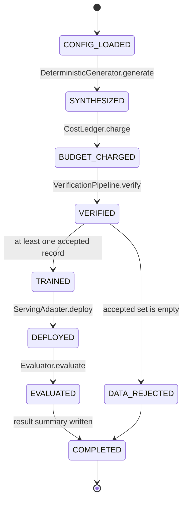
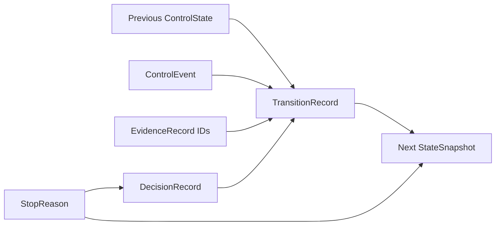
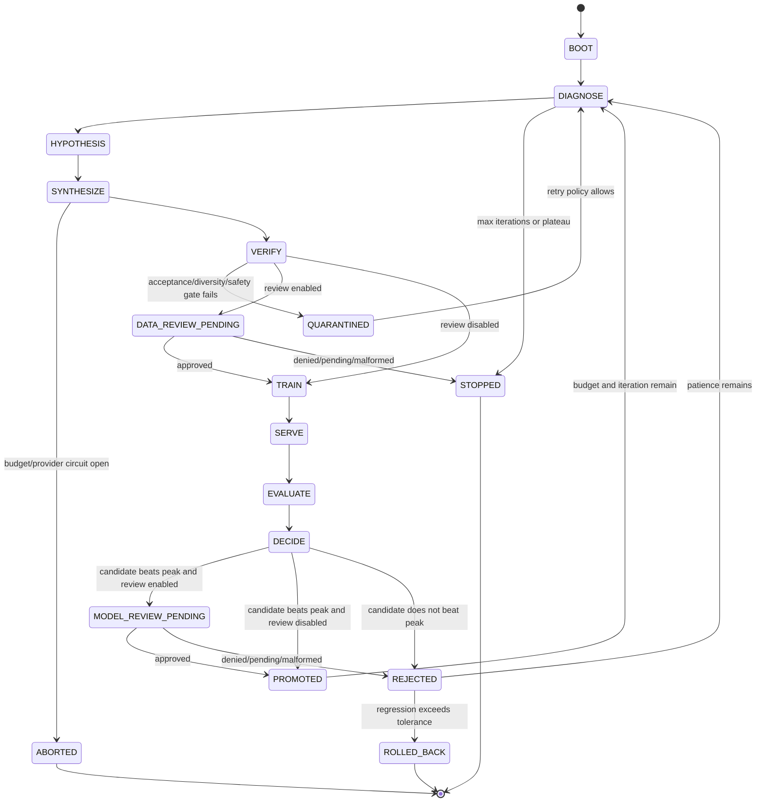
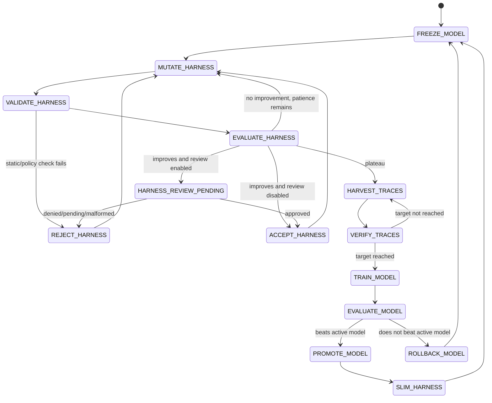
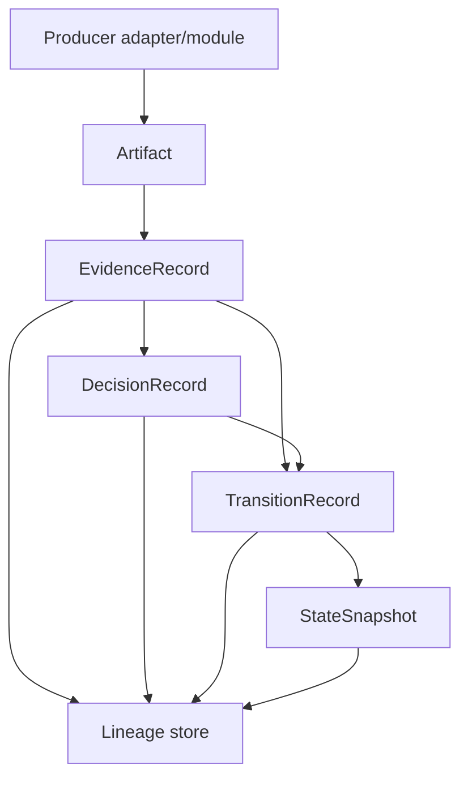
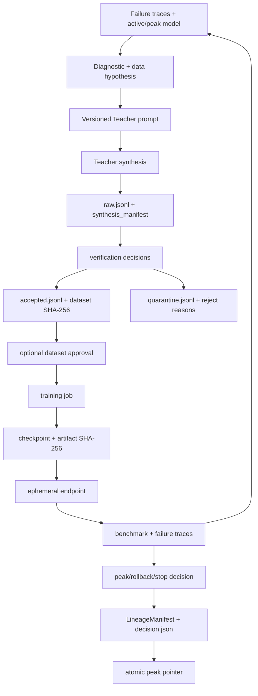

# State-machine ownership and data flow

This document distinguishes the **current executable state machine** from the **versioned control-plane contract** and the **target RSI and Model/Harness Co-Evolution state machines** derived from the source PDF.

## 1. Current executable state machine



### Current transition table

| State | Owner | Input | Guard | Output/evidence | Known missing behavior |
|---|---|---|---|---|---|
| `CONFIG_LOADED` | `config.py`, `__main__.py` | JSON config/defaults | numeric validation | `PipelineConfig` | unknown fields are not rejected |
| `SYNTHESIZED` | `generation.py` | hard-coded hypothesis, count, iteration | none | `GenerationBatch` and synthesis manifest | production Teacher contract is not selected |
| `BUDGET_CHARGED` | `cost.py` | generation estimate | per-iteration and total caps | ledger event | evaluator/trainer/serving costs are not charged |
| `VERIFIED` | `verification/pipeline.py` | synthetic records | exact, lexical, semantic, benchmark, safety, AST checks | accepted, quarantine, one `VerificationRecord` per input | configured minimum acceptance rate is not enforced |
| `DATA_REJECTED` | `engine.py` | empty accepted set | `not verification.accepted` | `IterationOutcome(status=data_rejected)` | no retry, new hypothesis, or terminal reason taxonomy |
| `TRAINED` | `training/adapter.py` | accepted JSONL/hash | non-empty dataset | checkpoint artifact and `TrainingResult` | parent is always `None` in runnable engine |
| `DEPLOYED` | `serving/adapter.py` | checkpoint | adapter readiness | endpoint string | endpoint is not supplied to evaluator; no undeploy |
| `EVALUATED` | `evaluation/adapter.py` | checkpoint | finite score assumed | metrics and failure traces | no comparison against baseline/peak |
| `COMPLETED` | `engine.py`, `lineage/store.py` | one outcome | none | run summary | checkpoint manifest/peak pointer are not persisted |

The reachable engine still uses legacy dataclasses and string statuses. It does not emit the schema-v1 records described next.

## 2. Versioned control-plane contract

Status: **Contract only** on PR #2.

`src/post_training_rsi/control_plane/` freezes the shared language that successor controllers, adapters, approval storage, and lineage persistence must use:



Schema:

```text
post-training-rsi.control/v1
```

### Enum ownership

| Enum | Owns | Does not own |
|---|---|---|
| `ControlState` | exact names for current states, five-stage RSI states, and Co-Evolution states | legal adjacency or reachability |
| `ControlEvent` | facts that may request transitions | policy sufficiency or side effects |
| `StopReason` | finite completion/termination taxonomy | free-form diagnosis text |
| `DecisionAction` | continue, request approval, accept, promote, reject, quarantine, rollback, stop, abort | score thresholds and approval policy |
| `DecisionSubject` | run, Dataset, Checkpoint, Harness, Trace Batch, Serving Endpoint | persistence path |
| `EvidenceKind` | stable artifact/evidence categories | provider payload format |

### Record ownership

| Record | Required content | Fail-closed rule |
|---|---|---|
| `EvidenceRecord` | producer, evidence kind, URI, timestamp, optional SHA-256, JSON metadata | exact fields/schema/type; invalid hash/timestamp/JSON rejected |
| `DecisionRecord` | subject, action, reason code/text, evidence IDs, optional stop reason | at least one evidence ID; STOP/ABORT require stop reason |
| `StateSnapshot` | state, iteration/cycle, active/candidate/Peak IDs, scores, counters, cost, evidence IDs | terminal states require stop reason; non-terminal states reject one |
| `TransitionRecord` | previous state, event, next state, idempotency key, decision/evidence IDs | only START may omit previous state; every transition requires evidence |

The contract layer rejects unknown fields, unsupported schema versions, unsafe identifiers, duplicate evidence IDs, NaN/infinity, negative counters/costs, and non-JSON metadata. Timestamps are normalized to UTC and JSON is canonicalized for hashing and idempotency.

The contract does not validate the adjacency graph. Ownership remains:

- PR-03: RSI transition/promotion/rollback/stop policy;
- PR-04: atomic persistence and evidence lookup;
- PR-05: adapter-to-evidence translation;
- PR-06: immutable approval request/decision behavior;
- PR-08: Harness outer-loop adjacency;
- PR-09: trace-harvest transitions;
- PR-10/11: inner-loop and convergence composition.

See [`control-plane-contracts.md`](control-plane-contracts.md) for exact serialized fields.

## 3. Target five-stage RSI state machine



### Target state ownership

| Target state | Intended owner | Required evidence |
|---|---|---|
| `DIAGNOSE` | future orchestration controller + evaluator traces | diagnostic report, task-family regressions, parent/peak IDs |
| `HYPOTHESIS` | orchestration policy | versioned hypothesis and prompt hash |
| `SYNTHESIZE` | `synthesis/` | Teacher model/API, request ID, prompt hash, token/cost usage |
| `VERIFY` | `verification/` | one immutable decision per input, metrics, reject reason |
| `DATA_REVIEW_PENDING` | future approval module | content-addressed request and deterministic sample |
| `TRAIN` | `training/` | dataset hash, parent ID, idempotency key, artifact hash, final loss |
| `SERVE` | `serving/` | deployment ID/endpoint/readiness and teardown result |
| `EVALUATE` | `evaluation/` | aggregate and task-family scores, failure traces, eval run ID |
| `DECIDE` | orchestration policy | peak before/after, delta, decision reason, stop counters |
| `PROMOTED` | orchestration + lineage | atomic peak pointer and complete lineage manifest |
| `REJECTED` | orchestration + lineage | immutable rejection reason; parent remains prior accepted model |
| `QUARANTINED` | verification + lineage | dataset state and root-cause link |
| `ROLLED_BACK` | orchestration + serving | rollback target, endpoint transition, audit report |
| `STOPPED`/`ABORTED` | orchestration + cost | terminal reason and complete ledger snapshot |

Every target edge must eventually emit one `TransitionRecord`; every policy branch must emit a `DecisionRecord`; referenced artifacts become `EvidenceRecord`s; resumable state becomes a `StateSnapshot`.

## 4. Target Model/Harness Co-Evolution state machine



The enum/event contract now contains these names, but the current repository does not implement these states. `src/post_training_rsi/harness/` remains a placeholder namespace.

## 5. Directory-to-state map

```text
configs/                              BOOT policy inputs
src/post_training_rsi/config.py       CONFIG_LOADED / CONFIG_REJECTED
src/post_training_rsi/control_plane/  shared State/Event/Stop/Decision/Evidence contract
src/post_training_rsi/models.py       current data/result payloads
src/post_training_rsi/engine.py       current transition coordinator
src/post_training_rsi/generation.py   current SYNTHESIZED fixture
src/post_training_rsi/synthesis/      target SYNTHESIZE provider boundary
src/post_training_rsi/verification/   VERIFIED / QUARANTINED
src/post_training_rsi/training/       TRAINED
src/post_training_rsi/serving/        DEPLOYED (target SERVE + TEARDOWN)
src/post_training_rsi/evaluation/     EVALUATED and failure evidence
src/post_training_rsi/lineage/        evidence persistence, peak/checkpoint records
src/post_training_rsi/harness/        target MUTATE/HARVEST states
tests/test_control_plane.py           schema serialization/fail-closed evidence
tests/                                transition and adapter assertions
docs/                                 current/contract/target separation and traceability
```

`control_plane/` owns representation only. It must not import provider adapters, mutate artifacts, or decide whether an edge is legal.

## 6. End-to-end data flow

### Current flow


### Contract flow between future owners



### Target evidence flow



## 7. Cross-state invariants

- Every synthesized input receives exactly one verification record.
- Dataset hash is computed from the exact accepted bytes used by the trainer.
- Parent checkpoint is the last accepted/promoted checkpoint, never the latest rejected candidate.
- Promotion requires `candidate_score > peak_score + min_improvement` and any required approval.
- Quarantine and rejection are durable states, not deletions.
- All terminal states include budget and stop-reason evidence.
- Adapter retries are bounded and idempotent.
- Serving teardown runs even when evaluation fails.
- Shared states/events/reasons use `post-training-rsi.control/v1`; sibling modules must not create alternate taxonomies.
- Unknown record fields, unsupported schema versions, malformed evidence, and missing approvals fail closed.
- A contract enum value is not implementation evidence; reachability requires controller code and deterministic tests.
