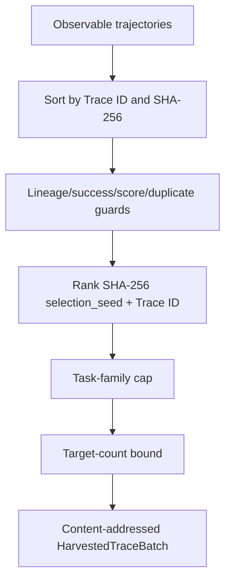
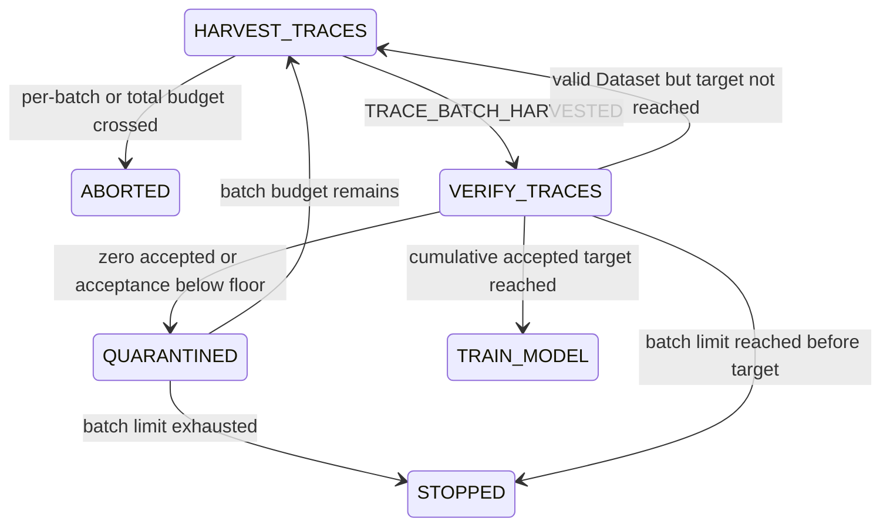

# Successful observable-trace harvesting

Status: **Implemented component on PR #9; not wired to a supported CLI**

Branch: `feat/trace-harvesting`  
Parent: `feat/harness-outer-loop` / PR #8  
Planned model consumer: PR #10  
Planned convergence owner: PR #11

This component consumes the `HARVEST_TRACES` handoff from the frozen-model Harness outer loop, selects successful observable trajectories deterministically, converts them into observable-only training examples, passes them through the same verification gates as synthetic data, writes an immutable Trace Dataset bundle, and emits a typed `TRAIN_MODEL` handoff after the cumulative accepted target is reached.

It does not capture hidden chain-of-thought, train model weights, persist control transactions, authenticate reviewers, expose `coevolve`, or claim production trace quality.

## 1. Directory ownership

```text
src/post_training_rsi/harness/trace_harvesting/
├── AGENTS.md        scoped observable-only and lineage rules
├── contracts.py     steps, trajectories, batches, training examples, Dataset result
├── harvester.py     deterministic successful-trace selection and conversion
├── verification.py  common gates, immutable Dataset bundle, EvidenceRecords
├── policy.py        harvest/verify/quarantine/retry/training-handoff State policy
└── __init__.py      component API
```

| Module | State responsibility | Input | Output | Must not own |
|---|---|---|---|---|
| `contracts.py` | exact observable facts | typed step/trace values | content-addressed values | providers, persistence, policy |
| `harvester.py` | `HARVEST_TRACES` selection | successful/failed task trajectories | selected batch, rejection reasons, training examples | common data admission |
| `verification.py` | `VERIFY_TRACES` data admission | selected training examples | accepted/quarantine/audit bundle + SHA-256 + EvidenceRecords | model training or promotion |
| `policy.py` | middle-loop adjacency | StateSnapshot + batch/Dataset observations | Decisions/Transitions/Snapshots | provider/persistence/model policy |

## 2. Observable-only contract

Allowed step types:

```text
TASK_INPUT
TOOL_CALL
TOOL_RESULT
STATE_OBSERVATION
FINAL_OUTPUT
ERROR
```

The schema intentionally has no reasoning field. It rejects normalized metadata keys associated with hidden internal state:

```text
analysis
chain_of_thought
cot
hidden_reasoning
hidden_state
internal_reasoning
private_reasoning
reasoning
scratchpad
thought
thoughts
```

Nested metadata is checked recursively. A future field is not allowed merely because it uses a different spelling; reviewers must assess whether it represents an externally observable event.

Observable trajectory data may contain:

```text
task and task-family identity
frozen model Checkpoint ID
active Harness ID
success flag and bounded score
public task input
tool call arguments
tool result payloads
observable state assertions
final output or error
timestamps
upstream evidence IDs
non-secret environment/status metadata
```

The component does not request or infer hidden chain-of-thought from a model.

## 3. Content-addressed trace identity

A Trace ID is computed from canonical JSON over:

```text
Run ID
cycle
task ID and family
model Checkpoint ID
Harness ID
success and score
start/completion timestamps
ordered observable steps
upstream evidence IDs
safe metadata
```

```text
trace_id = trace-<first 24 hex of SHA-256>
```

The constructor verifies the ID against content. A content mutation cannot retain the old Trace ID.

Trace steps must:

- use contiguous indexes from zero;
- provide non-empty observable content;
- provide tool name and call ID for tool events;
- omit tool identity for non-tool events;
- include `FINAL_OUTPUT` for a successful trajectory;
- use valid status/identity values;
- contain no forbidden hidden-reasoning metadata.

## 4. Frozen lineage guard

Every eligible trace must match the active Co-Evolution cycle:

```text
trace.run_id == expected Run
trace.cycle == expected cycle
trace.model_checkpoint_id == frozen accepted model
trace.harness_id == active accepted Harness
trace.success == true
trace.score >= configured minimum
```

The policy also requires:

```text
current.active_checkpoint_id == current.peak_checkpoint_id
current.active_harness_id is present
```

Cross-Run, cycle, model, or Harness substitution is rejected before Dataset creation.

## 5. Deterministic selection



Selection is independent of caller input order. The same traces, configuration, seed, timestamp, evidence, and cost produce the same batch ID and selected set.

Rejection reasons include:

```text
DUPLICATE_TRACE
RUN_MISMATCH
CYCLE_MISMATCH
MODEL_MISMATCH
HARNESS_MISMATCH
UNSUCCESSFUL_TRACE
SCORE_BELOW_MINIMUM
TASK_FAMILY_CAP_REACHED
TARGET_COUNT_REACHED
```

The task-family cap prevents one easy family from occupying the whole training batch.

## 6. Observable training conversion

Each selected Trace becomes one `TraceTrainingExample`:

```text
prompt:
  canonical JSON with task ID, task family, and observable TASK_INPUT events

response:
  canonical JSON with observable tool/state/final events and success/score outcome

metadata:
  Run/cycle/model/Harness/Trace hashes and upstream evidence IDs
  observable_only = true
```

No `reasoning`, `analysis`, `scratchpad`, or chain-of-thought field is created.

The conversion is deterministic and content-addressed:

```text
trace-example-<SHA-256 prefix>
```

## 7. Common verification pipeline

The converted examples pass through the existing `VerificationPipeline`:

```text
Exact duplicate
  → Shannon entropy
  → Distinct-2
  → Type-token ratio
  → semantic novelty
  → N-gram benchmark overlap
  → LCS benchmark overlap
  → safety classification
  → Python static/import checks
```

This avoids creating a privileged “successful traces always pass” path. A successful task can still produce low-diversity, contaminated, unsafe, malformed, or duplicate training data and must be quarantined.

## 8. Immutable Trace Dataset bundle

```text
<output-root>/trace-datasets/<batch-id>/
├── raw.jsonl
├── accepted.jsonl
├── quarantine.jsonl
├── filter_audit.jsonl
├── harvest_manifest.json
└── dataset_summary.json
```

The exact accepted JSONL bytes are hashed:

```text
dataset_sha256 = SHA-256(accepted.jsonl bytes)
```

The bundle records:

```text
Run/cycle
frozen model and active Harness
selection seed and target
selected Trace IDs and hashes
harvest rejection reasons
filter config hash
accepted Dataset hash
verification counts and reasons
```

Paths are immutable-or-equal. Exact replay succeeds; different bytes at the same path fail closed. Symlinked output roots/files fail closed.

## 9. EvidenceRecords

The verification service produces in-memory records for later PR #11 persistence:

| Artifact | EvidenceKind |
|---|---|
| `accepted.jsonl` | `TRACE_DATASET` |
| `filter_audit.jsonl` | `VERIFICATION_AUDIT` |
| non-empty `quarantine.jsonl` | `QUARANTINE_DATASET` |

Each record binds Run, cycle, batch/Dataset identity, path URI, SHA-256, model, Harness, counts, and filter hash.

A record existing in memory is not yet a committed control record. PR #11 must persist it through the transactional lineage store before a Transition or model-training side effect relies on it.

## 10. Middle-loop State Machine



`TRAIN_MODEL` is a typed handoff to PR #10, not proof that a training job occurred.

## 11. Policy precedence

At `HARVEST_TRACES`:

```text
1. per-batch budget crossed → ABORTED
2. total budget crossed     → ABORTED
3. otherwise                → VERIFY_TRACES
```

At `VERIFY_TRACES`:

```text
1. zero accepted                        → QUARANTINED
2. acceptance rate below configured min → QUARANTINED
3. cumulative accepted >= target        → TRAIN_MODEL
4. batch limit reached                  → STOPPED(MAX_ITERATIONS)
5. otherwise                            → HARVEST_TRACES next batch
```

After quarantine:

```text
batch limit reached → STOPPED(MAX_ITERATIONS)
otherwise           → HARVEST_TRACES next batch
```

Exact budget equality is allowed. Crossing is required to abort.

## 12. Resume metadata

Snapshots carry:

```text
trace_batch_id
trace_dataset_id
trace Dataset path and SHA-256
audit path
selected/accepted/rejected counts
acceptance rate and reasons
cumulative verified_trace_count
harvest_batch_count
frozen model Checkpoint ID
active Harness ID
```

PR #11 must use these values together with committed evidence and immutable Dataset bytes for durable resume. Process memory and an uncommitted file are not resume truth.

## 13. Test matrix

`tests/test_trace_harvesting.py` covers:

```text
Trace content identity and exact round trip
hidden-reasoning metadata rejection
contiguous indexes/tool identity/final-output requirements
input-order invariant selection
task-family cap and target count
duplicate/unsuccessful/low-score/lineage rejection
observable-only training conversion
common-gate acceptance and exact Dataset hash
immutable replay and tamper conflict
unsafe trace quarantine and EvidenceKind mapping
HARVEST_TRACES → VERIFY_TRACES
cumulative target → TRAIN_MODEL
valid retry for more traces
zero-accepted quarantine and retry
low-acceptance quarantine and batch-limit stop
valid batch-limit stop
exact/crossed per-batch and total budget
frozen model/Harness and batch substitution guards
deterministic paired control records
```

Tests require no network, API key, GPU, Docker daemon, cloud account, or hidden model output.

## 14. PR #10 model handoff contract

PR #10 may consume `TRAIN_MODEL` only after verifying:

```text
State == TRAIN_MODEL
Trace Dataset evidence is committed
accepted.jsonl bytes match dataset_sha256
Dataset model/Harness/Run/cycle lineage matches the frozen cycle
cumulative accepted target was reached
required Dataset approval is granted
parent model Checkpoint equals accepted Peak
budget and provider circuit allow training
```

PR #10 must not read quarantined examples or infer hidden reasoning fields.

## 15. PR #11 convergence obligations

PR #11 must:

1. persist batch, Dataset, audit, Decision, Transition, and Snapshot records transactionally;
2. bind optional Dataset approval to exact Dataset ID/SHA-256/Run/cycle/action;
3. resume from committed Snapshots and immutable Dataset bytes;
4. connect PR #8 `HARVEST_TRACES` handoff to this component;
5. connect `TRAIN_MODEL` only to PR #10 after all guards pass;
6. preserve frozen model/Harness lineage throughout harvesting;
7. retain the observable-only prohibition;
8. charge and persist costs;
9. add interruption, replay, denial, corruption, and resume tests;
10. expose `coevolve` only after outer/middle/inner loops converge;
11. update root README/AGENTS/status/state/traceability/stack documents.

## 16. Explicit non-claims

This component does not prove:

- hidden reasoning was captured or is needed;
- production trajectories are correct or private-data safe;
- real task execution or Harness improvement;
- a production Trace Dataset is unbiased;
- Dataset approval was granted;
- model training, evaluation, promotion, rollback, or hot-swap;
- complete Model/Harness Co-Evolution;
- production readiness.
